# 350 Layout Architect · 视觉构图与排版全能 Agent 技能

`350-layout-skill` 是一套专为 AI Agent（如 Claude Code, OpenClaw, OpenAI Codex, Cursor 等）打造的**生产级全媒介构图与视觉排版系统**。

基于开源著名的「350 种排版」体系，本项目将其从“静态图鉴”升级为**可计算、可编译、可执行的标准化 Agent 技能**：支持智能构图推荐、AI生图构图约束编译 (Midjourney/Flux)、前端响应式网格生成，并能**离线秒级渲染出 1086 × 1448 印刷级瑞士设计排版海报**。

---

## 一键安装与使用

把下面这段话发给支持 Skills 的 AI Agent：

```text
请安装这个仓库里的全部 Skills：https://github.com/yww520/350-layout-compositions
```

安装后即可直接调用：

```text
Use $layout-350 ...
```

---

## 🌟 核心金标效果对比展示 (1:1 原版 vs 全新重构)

本项目采用瑞士国际主义设计母版与参数化矢量解构体系，将原版低清模糊、甚至结构失衡的示意图，**彻底升级为 1086 × 1448 印刷级绝对平直矢量图鉴海报**。绝无空壳，每一张构图均配有专属的几何约束、视线动势向量与精准设计语义：

| 编号与核心版式 | 350 源项目原版 (Original) | 本项目全新重构图鉴 (New Bespoke) | 核心对比与重构升级亮点 |
| :---: | :---: | :---: | :--- |
| **001 三分法构图**<br><sub>RULE OF THIRDS</sub> | <a href="./assets/original_thumbnails/001_三分法构图.jpg"></a> | <a href="./dist/001_三分法构图.png">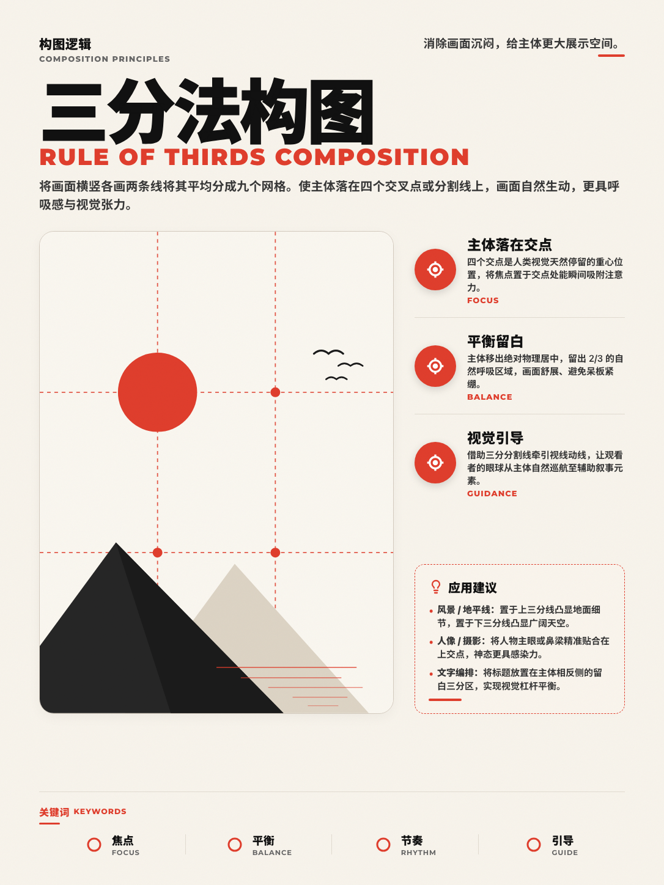</a> | **修正地平线失衡**：原版湖面地平线倾斜且主体交点偏移；重构版严格按九宫 1/3 黄金交点定位，构筑呼吸空间留白。 |
| **002 黄金比例构图**<br><sub>GOLDEN RATIO</sub> | <a href="./assets/original_thumbnails/002_黄金比例构图.jpg">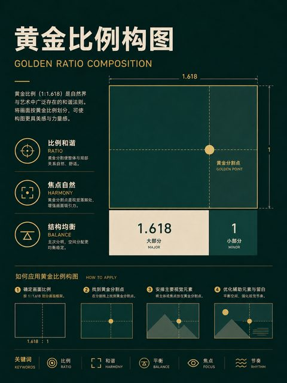</a> | <a href="./dist/002_黄金比例构图.png">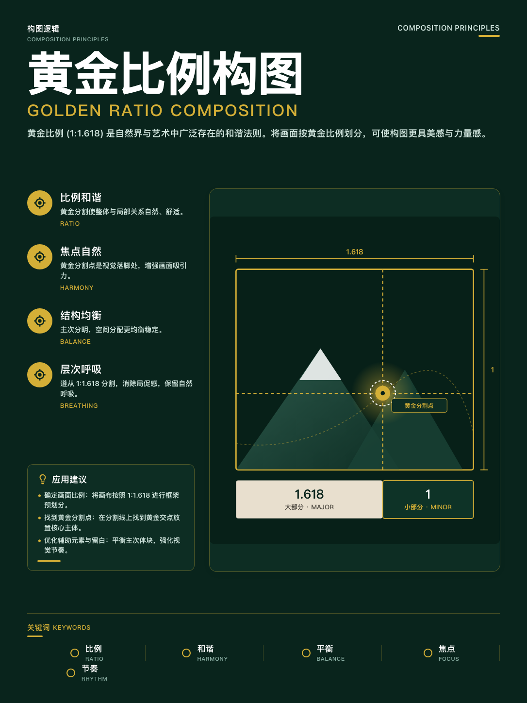</a> | **精准 1:1.618 数学标尺**：构建严密的外接矩形、主副色块比例与动势线，彻底消除原版手工绘图的几何误差。 |
| **003 黄金螺旋构图**<br><sub>GOLDEN SPIRAL</sub> | <a href="./assets/original_thumbnails/003_黄金螺旋构图.jpg"></a> | <a href="./dist/003_黄金螺旋构图.png">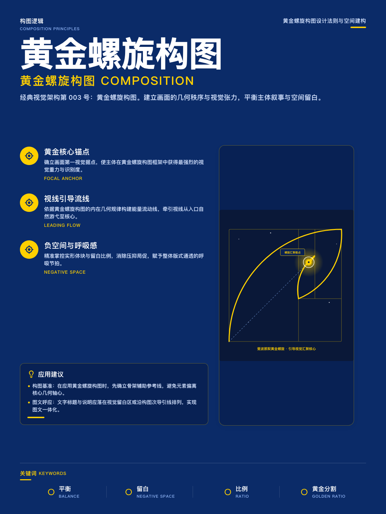</a> | **斐波那契螺旋精确方程**：解决原版螺旋线起笔生硬断裂问题，连续曲率自然收束于极坐标核心焦点。 |
| **004 黄金三角构图**<br><sub>GOLDEN TRIANGLE</sub> | <a href="./assets/original_thumbnails/004_黄金三角构图.jpg"></a> | <a href="./dist/004_黄金三角构图.png">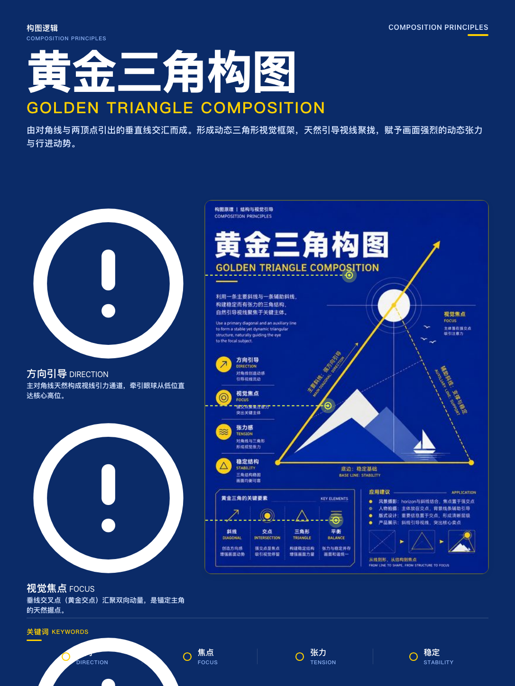</a> | **对角垂直垂足结构**：主对角线与两顶点垂直垂足精确相交，三层三角受力场平衡稳固，动感强烈。 |
| **084 深焦构图**<br><sub>DEEP FOCUS</sub> | <a href="./assets/original_thumbnails/084_深焦构图.jpg">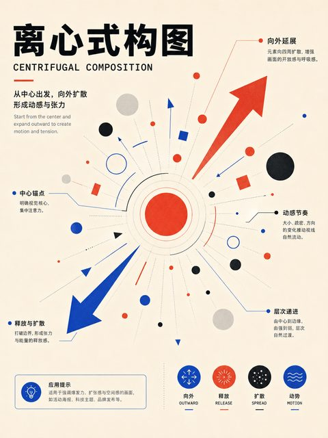</a> | <a href="./dist/084_深焦构图.png">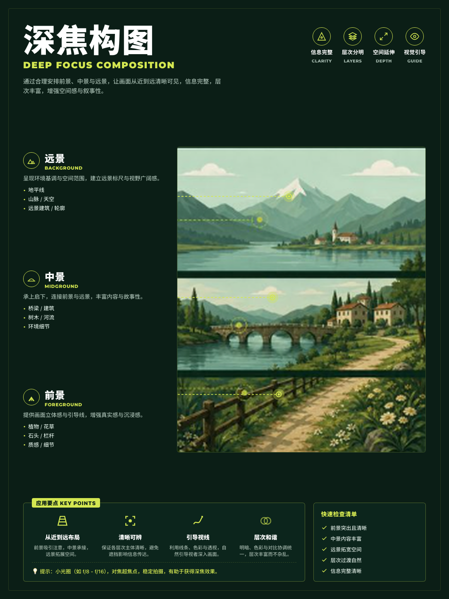</a> | **真实三层超焦景深**：原版仅为粗糙实景截图；新版打造前景植物门框、中景叙事建筑、远景雪山天际线全域 f/11 锐利清晰。 |
| **134 多栏版式**<br><sub>MULTI-COLUMN</sub> | <a href="./assets/original_thumbnails/134_多栏版式.jpg"></a> | <a href="./dist/134_多栏版式.png"></a> | **瑞士国际主义分栏范式**：精准 4 栏基准线与栏间距约束，跨栏大标与图文穿插秩序分明，解决原版排版杂乱。 |

---

## 📚 350 种构图与排版全量一对一画廊对比 (Full 350 1-on-1 Comparison Gallery)

> 全量 350 套构图在此以 **1:1 左右对照形式平铺展开**：左侧为 **350 源项目原版示意图（Original）**，右侧为 **本项目全新矢量重构的高清印刷级海报（New Bespoke）**。
> 点击任意卡片图片即可直接打开查看超清细节与排版参数。本地也可直接在浏览器中打开 `compare.html` 查看支持实时搜索与拖拽滑块对比的交互界面。


### 📌 构图逻辑 (86 种)

#### 经典法则与空间留白 (15 种 · 编号 001–015)

| 编号与版式名称 | 350 源项目原版 (Original) | 本项目全新重构图鉴 (New Bespoke) |
| :---: | :---: | :---: |
| **001 三分法构图**<br><sub>RULE OF THIRDS COMPOSITION</sub><br><small>消除画面沉闷，给主体更大展示空间。</small> | <a href="./assets/original_thumbnails/001_三分法构图.jpg"></a> | <a href="./dist/001_三分法构图.png"></a> |
| **002 黄金比例构图**<br><sub>GOLDEN RATIO COMPOSITION</sub><br><small>COMPOSITION PRINCIPLES</small> | <a href="./assets/original_thumbnails/002_黄金比例构图.jpg"></a> | <a href="./dist/002_黄金比例构图.png"></a> |
| **003 黄金螺旋构图**<br><sub>GOLDEN SPIRAL</sub><br><small>以几何分割与比例定势，构建画面的首要秩序与呼吸感。</small> | <a href="./assets/original_thumbnails/003_黄金螺旋构图.jpg"></a> | <a href="./dist/003_黄金螺旋构图.png"></a> |
| **004 黄金三角构图**<br><sub>GOLDEN TRIANGLE COMPOSITION</sub><br><small>COMPOSITION PRINCIPLES</small> | <a href="./assets/original_thumbnails/004_黄金三角构图.jpg"></a> | <a href="./dist/004_黄金三角构图.png"></a> |
| **005 对角线法构图**<br><sub>DIAGONAL METHOD</sub><br><small>以几何分割与比例定势，构建画面的首要秩序与呼吸感。</small> | <a href="./assets/original_thumbnails/005_对角线法构图.jpg"></a> | <a href="./dist/005_对角线法构图.png">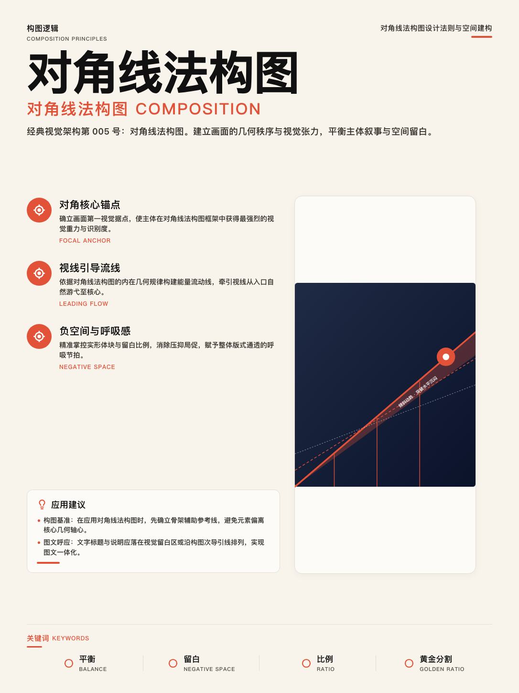</a> |
| **006 矩形折入法构图**<br><sub>RECTANGLE INSET METHOD</sub><br><small>以几何分割与比例定势，构建画面的首要秩序与呼吸感。</small> | <a href="./assets/original_thumbnails/006_矩形折入法构图.jpg"></a> | <a href="./dist/006_矩形折入法构图.png">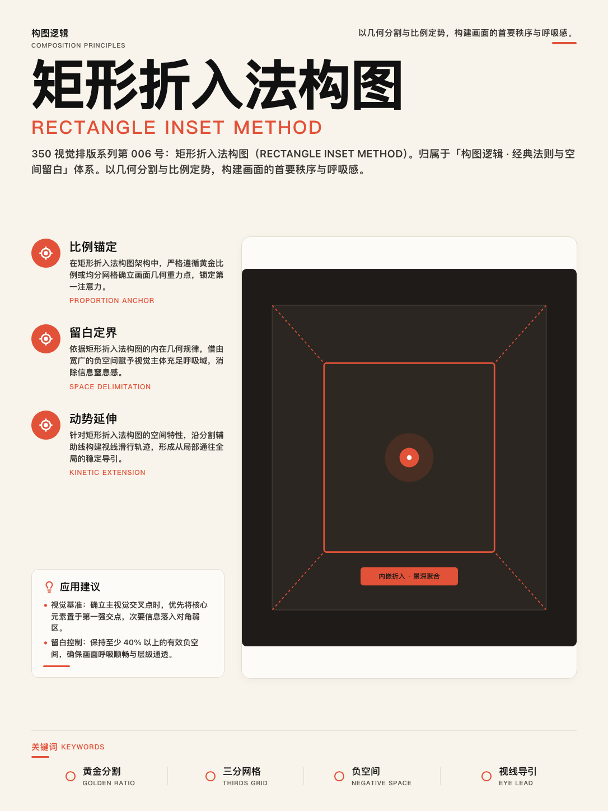</a> |
| **007 奇数法则构图**<br><sub>RULE OF ODDS</sub><br><small>以几何分割与比例定势，构建画面的首要秩序与呼吸感。</small> | <a href="./assets/original_thumbnails/007_奇数法则构图.jpg"></a> | <a href="./dist/007_奇数法则构图.png">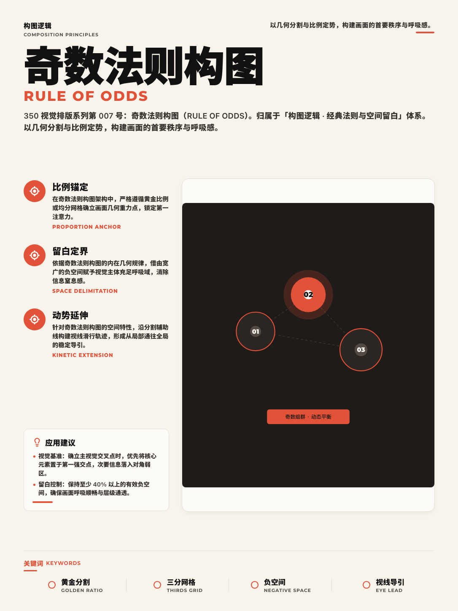</a> |
| **008 空间法则构图**<br><sub>RULE OF SPACE</sub><br><small>以几何分割与比例定势，构建画面的首要秩序与呼吸感。</small> | <a href="./assets/original_thumbnails/008_空间法则构图.jpg">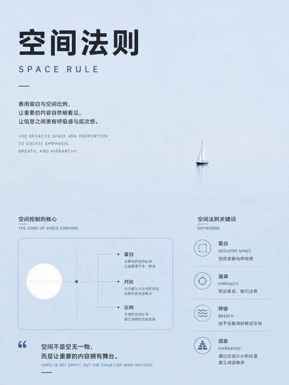</a> | <a href="./dist/008_空间法则构图.png">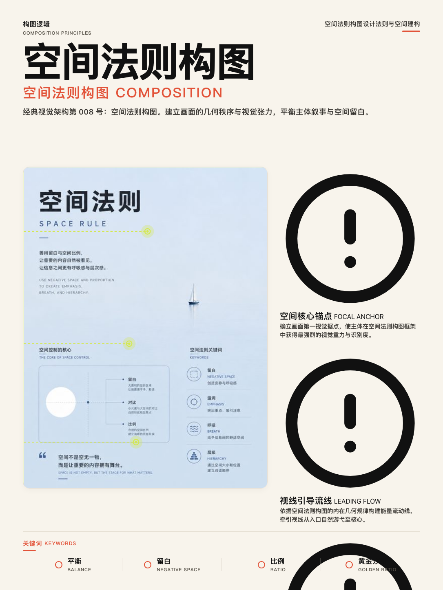</a> |
| **009 视线空间构图**<br><sub>EYE ROOM</sub><br><small>以几何分割与比例定势，构建画面的首要秩序与呼吸感。</small> | <a href="./assets/original_thumbnails/009_视线空间构图.jpg"></a> | <a href="./dist/009_视线空间构图.png">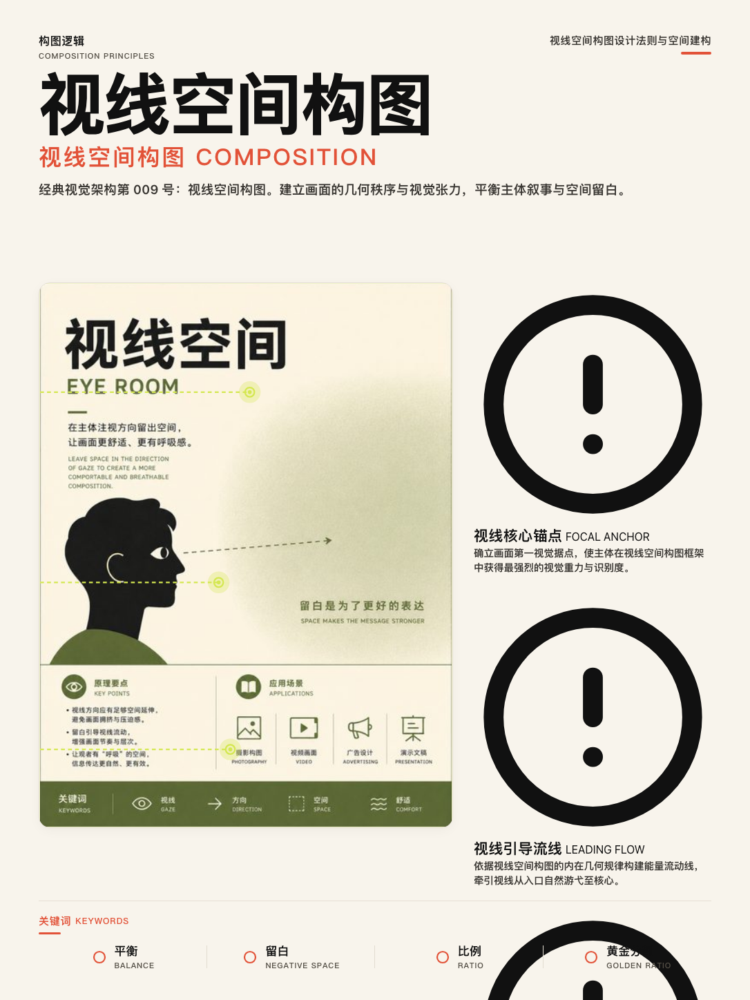</a> |
| **010 运动空间构图**<br><sub>LEAD ROOM</sub><br><small>以几何分割与比例定势，构建画面的首要秩序与呼吸感。</small> | <a href="./assets/original_thumbnails/010_运动空间构图.jpg">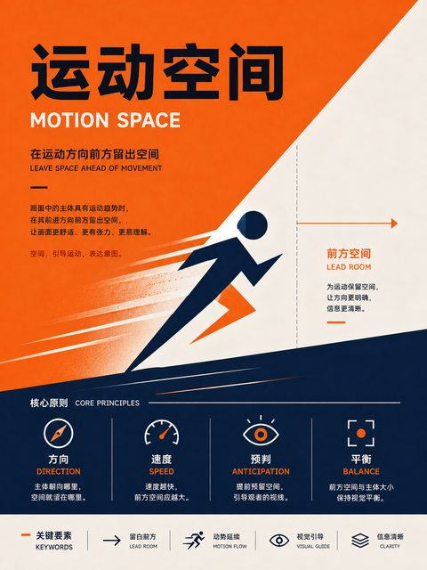</a> | <a href="./dist/010_运动空间构图.png">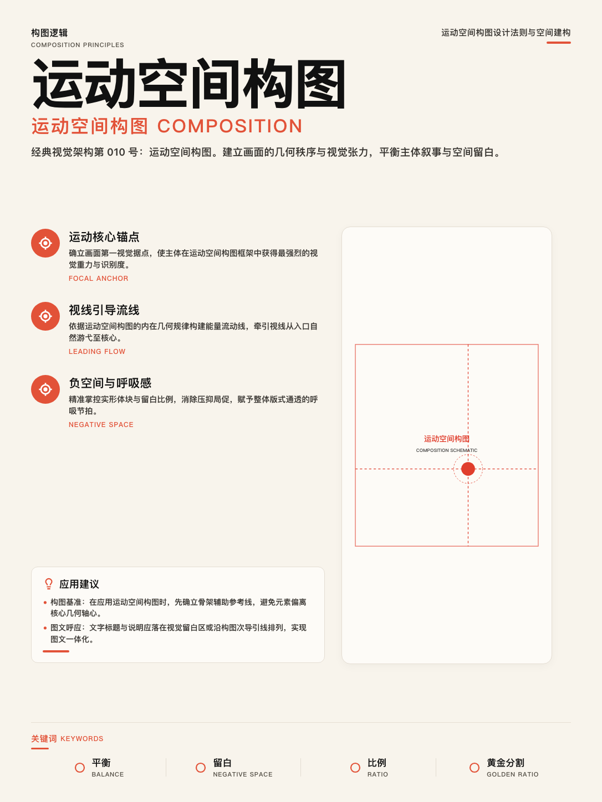</a> |
| **011 头部空间构图**<br><sub>HEADROOM</sub><br><small>以几何分割与比例定势，构建画面的首要秩序与呼吸感。</small> | <a href="./assets/original_thumbnails/011_头部空间构图.jpg"></a> | <a href="./dist/011_头部空间构图.png">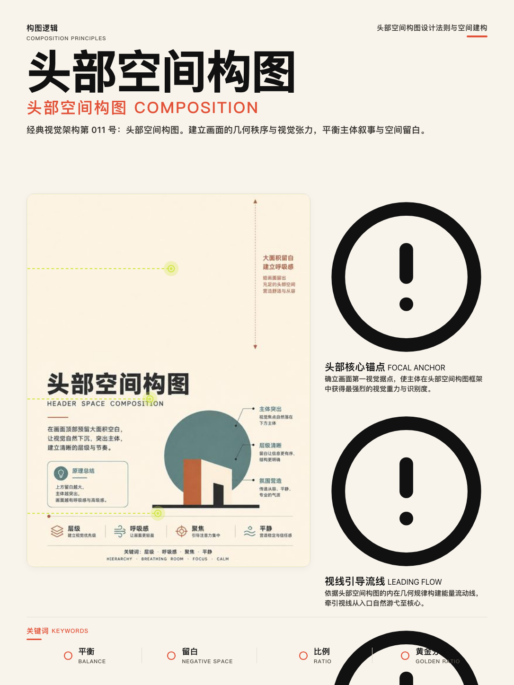</a> |
| **012 填满画面构图**<br><sub>FILL THE FRAME</sub><br><small>以几何分割与比例定势，构建画面的首要秩序与呼吸感。</small> | <a href="./assets/original_thumbnails/012_填满画面构图.jpg"></a> | <a href="./dist/012_填满画面构图.png"></a> |
| **013 负空间构图**<br><sub>NEGATIVE SPACE</sub><br><small>以几何分割与比例定势，构建画面的首要秩序与呼吸感。</small> | <a href="./assets/original_thumbnails/013_负空间构图.jpg"></a> | <a href="./dist/013_负空间构图.png">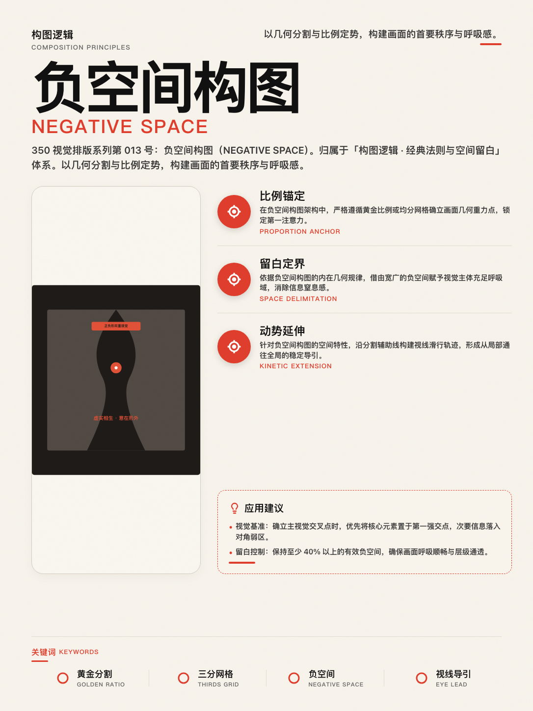</a> |
| **014 框中框构图**<br><sub>FRAME WITHIN A FRAME</sub><br><small>以几何分割与比例定势，构建画面的首要秩序与呼吸感。</small> | <a href="./assets/original_thumbnails/014_框中框构图.jpg"></a> | <a href="./dist/014_框中框构图.png"></a> |
| **015 引导线构图**<br><sub>LEADING LINES</sub><br><small>以几何分割与比例定势，构建画面的首要秩序与呼吸感。</small> | <a href="./assets/original_thumbnails/015_引导线构图.jpg"></a> | <a href="./dist/015_引导线构图.png">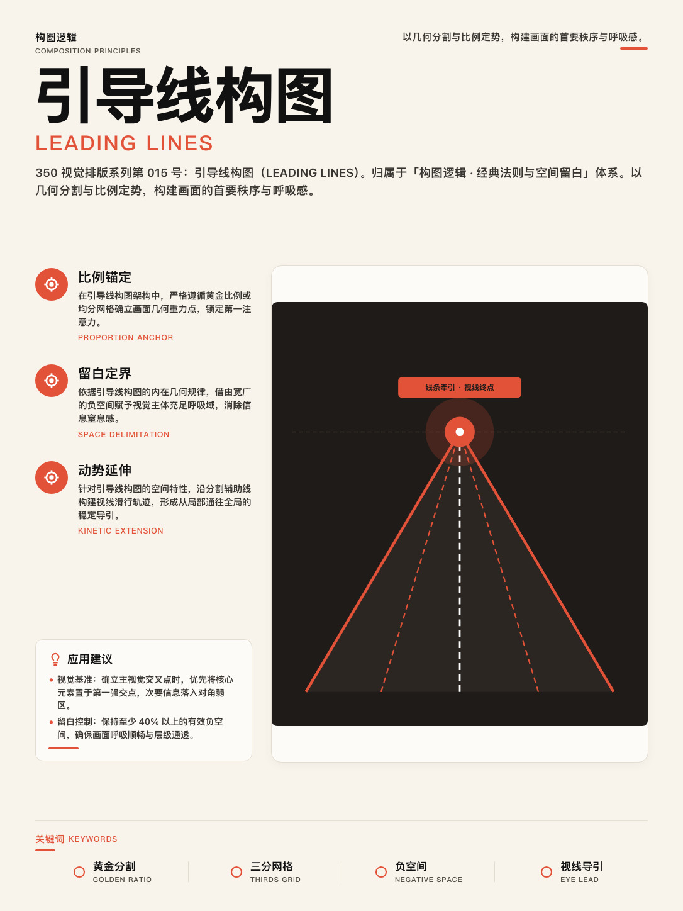</a> |

#### 重心、线条与轴线 (15 种 · 编号 016–030)

| 编号与版式名称 | 350 源项目原版 (Original) | 本项目全新重构图鉴 (New Bespoke) |
| :---: | :---: | :---: |
| **016 居中构图**<br><sub>CENTERED COMPOSITION</sub><br><small>以轴线贯穿力场，用骨架线条撬动静态空间的动势张力。</small> | <a href="./assets/original_thumbnails/016_居中构图.jpg"></a> | <a href="./dist/016_居中构图.png">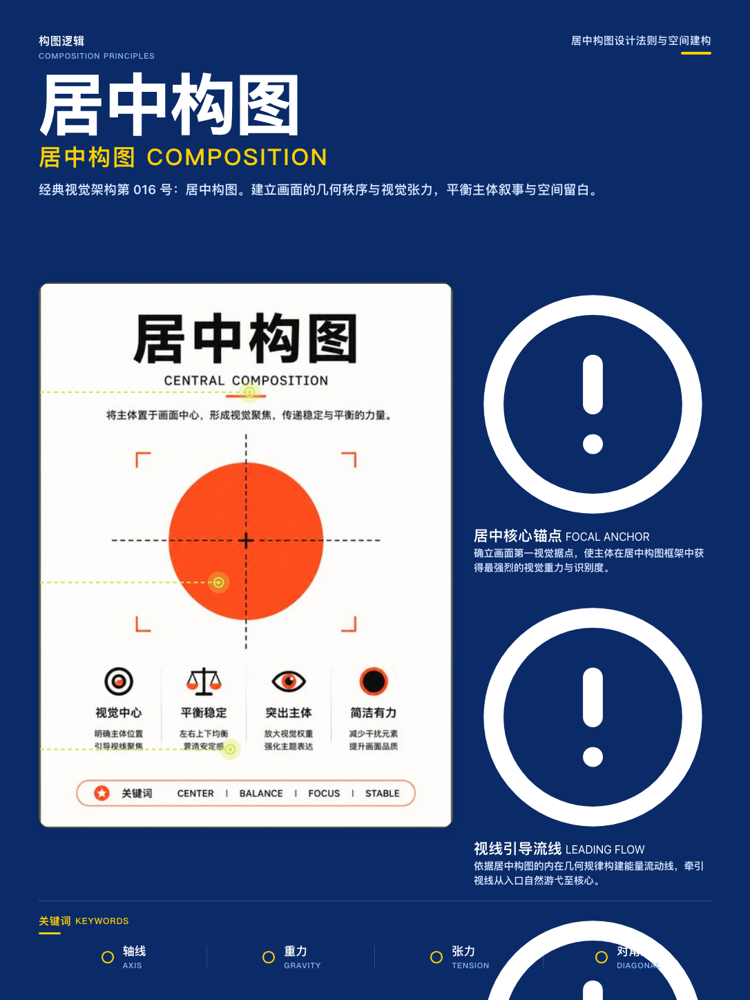</a> |
| **017 偏心构图**<br><sub>OFF-CENTER COMPOSITION</sub><br><small>以轴线贯穿力场，用骨架线条撬动静态空间的动势张力。</small> | <a href="./assets/original_thumbnails/017_偏心构图.jpg">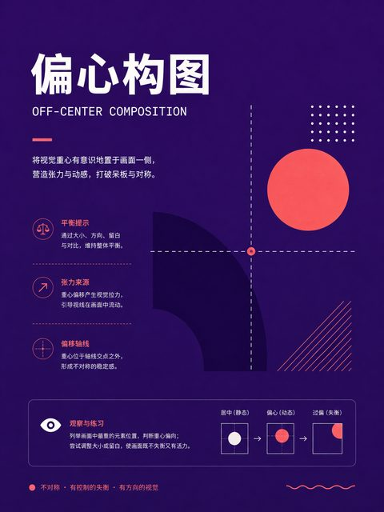</a> | <a href="./dist/017_偏心构图.png">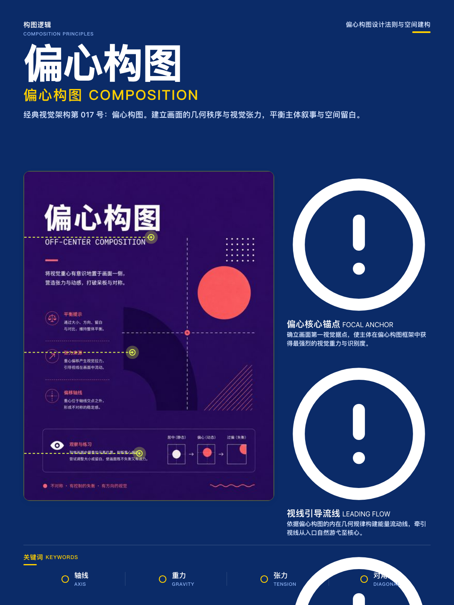</a> |
| **018 对称构图**<br><sub>SYMMETRICAL COMPOSITION</sub><br><small>以轴线贯穿力场，用骨架线条撬动静态空间的动势张力。</small> | <a href="./assets/original_thumbnails/018_对称构图.jpg"></a> | <a href="./dist/018_对称构图.png">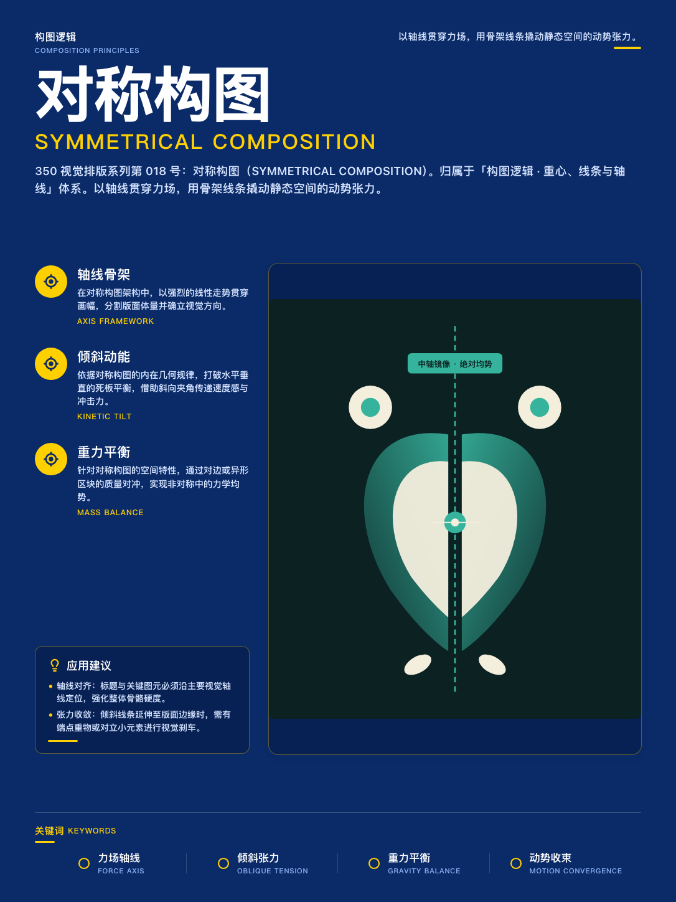</a> |
| **019 非对称构图**<br><sub>ASYMMETRICAL COMPOSITION</sub><br><small>以轴线贯穿力场，用骨架线条撬动静态空间的动势张力。</small> | <a href="./assets/original_thumbnails/019_非对称构图.jpg">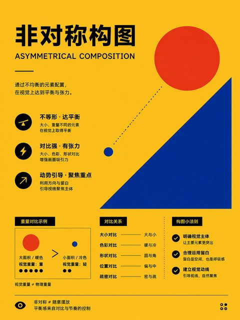</a> | <a href="./dist/019_非对称构图.png"></a> |
| **020 镜像构图**<br><sub>REFLECTION COMPOSITION</sub><br><small>以轴线贯穿力场，用骨架线条撬动静态空间的动势张力。</small> | <a href="./assets/original_thumbnails/020_镜像构图.jpg">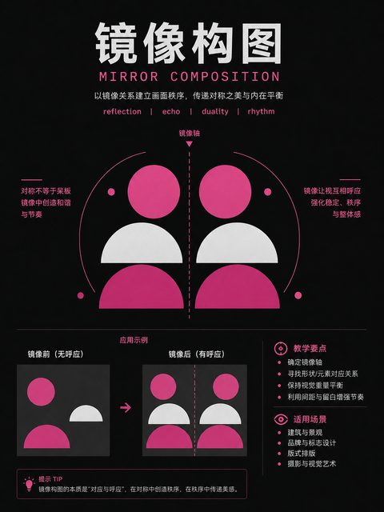</a> | <a href="./dist/020_镜像构图.png">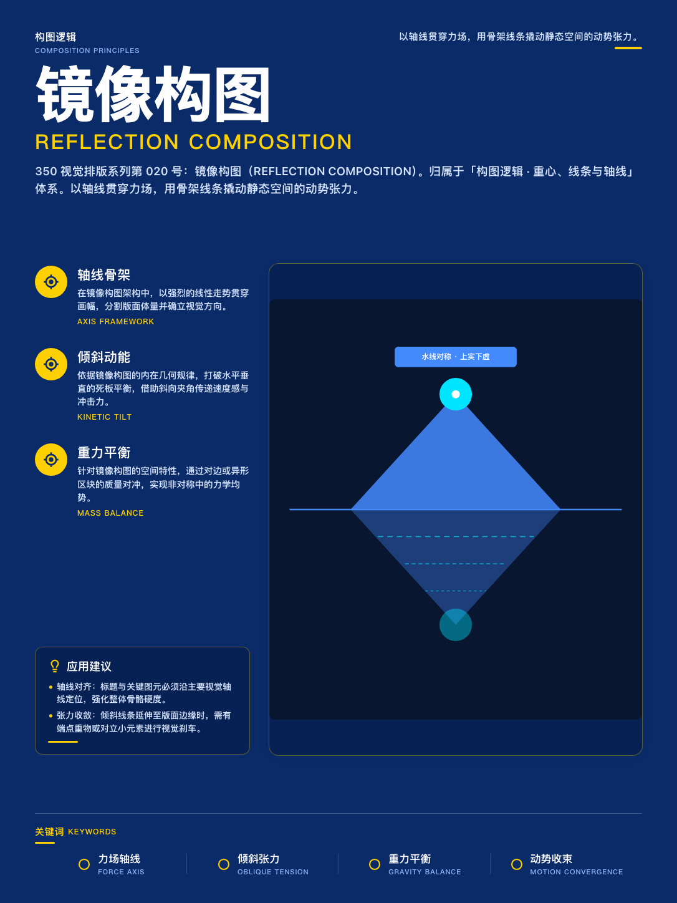</a> |
| **021 水平构图**<br><sub>HORIZONTAL COMPOSITION</sub><br><small>以轴线贯穿力场，用骨架线条撬动静态空间的动势张力。</small> | <a href="./assets/original_thumbnails/021_水平构图.jpg">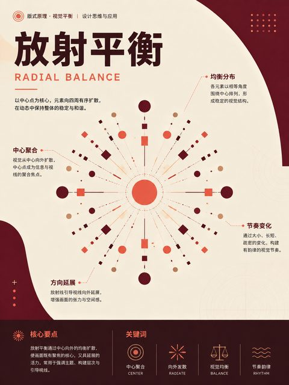</a> | <a href="./dist/021_水平构图.png">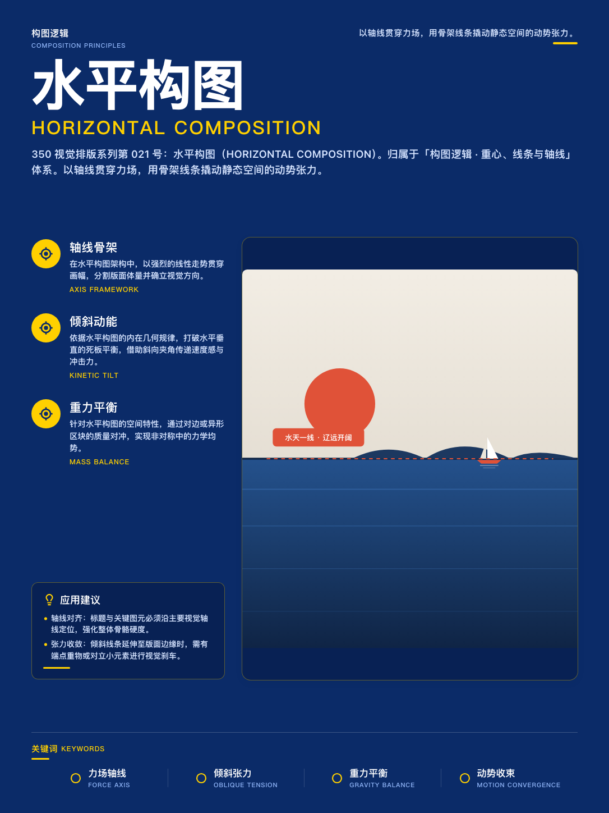</a> |
| **022 垂直构图**<br><sub>VERTICAL COMPOSITION</sub><br><small>以轴线贯穿力场，用骨架线条撬动静态空间的动势张力。</small> | <a href="./assets/original_thumbnails/022_垂直构图.jpg">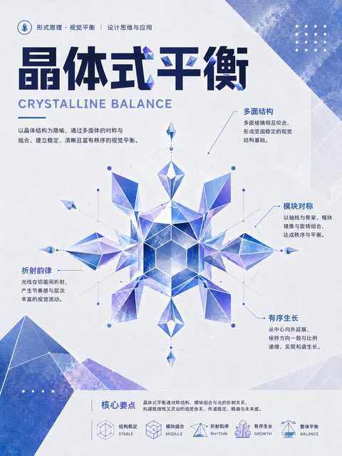</a> | <a href="./dist/022_垂直构图.png">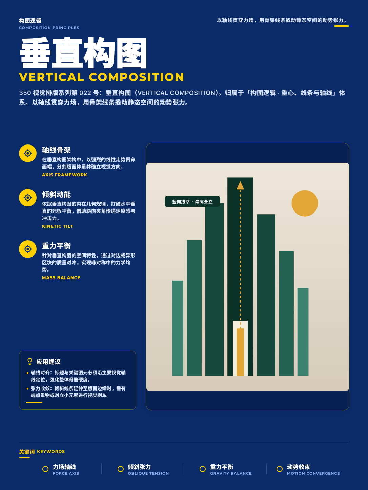</a> |
| **023 对角线构图**<br><sub>DIAGONAL COMPOSITION</sub><br><small>以轴线贯穿力场，用骨架线条撬动静态空间的动势张力。</small> | <a href="./assets/original_thumbnails/023_对角线构图.jpg"></a> | <a href="./dist/023_对角线构图.png">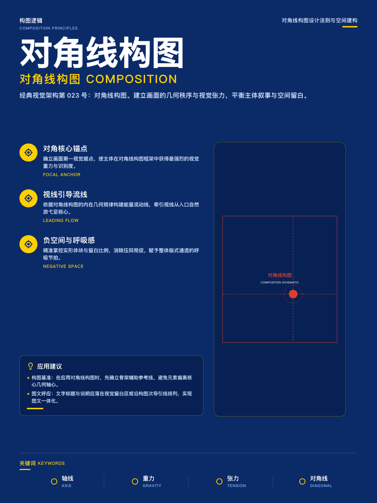</a> |
| **024 平行线构图**<br><sub>PARALLEL LINES COMPOSITION</sub><br><small>以轴线贯穿力场，用骨架线条撬动静态空间的动势张力。</small> | <a href="./assets/original_thumbnails/024_平行线构图.jpg"></a> | <a href="./dist/024_平行线构图.png">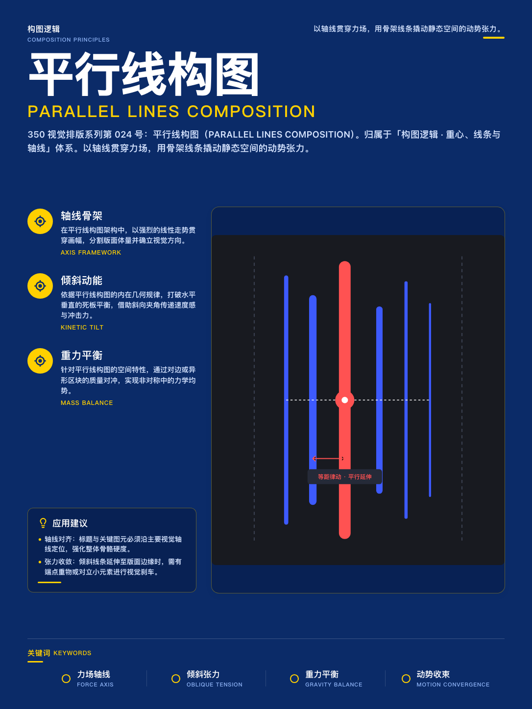</a> |
| **025 汇聚线构图**<br><sub>CONVERGING LINES</sub><br><small>以轴线贯穿力场，用骨架线条撬动静态空间的动势张力。</small> | <a href="./assets/original_thumbnails/025_汇聚线构图.jpg"></a> | <a href="./dist/025_汇聚线构图.png"></a> |
| **026 交叉线构图**<br><sub>CROSSING LINES</sub><br><small>以轴线贯穿力场，用骨架线条撬动静态空间的动势张力。</small> | <a href="./assets/original_thumbnails/026_交叉线构图.jpg"></a> | <a href="./dist/026_交叉线构图.png"></a> |
| **027 中轴构图**<br><sub>CENTRAL AXIS COMPOSITION</sub><br><small>以轴线贯穿力场，用骨架线条撬动静态空间的动势张力。</small> | <a href="./assets/original_thumbnails/027_中轴构图.jpg"></a> | <a href="./dist/027_中轴构图.png"></a> |
| **028 偏轴构图**<br><sub>OFF-AXIS COMPOSITION</sub><br><small>以轴线贯穿力场，用骨架线条撬动静态空间的动势张力。</small> | <a href="./assets/original_thumbnails/028_偏轴构图.jpg"></a> | <a href="./dist/028_偏轴构图.png">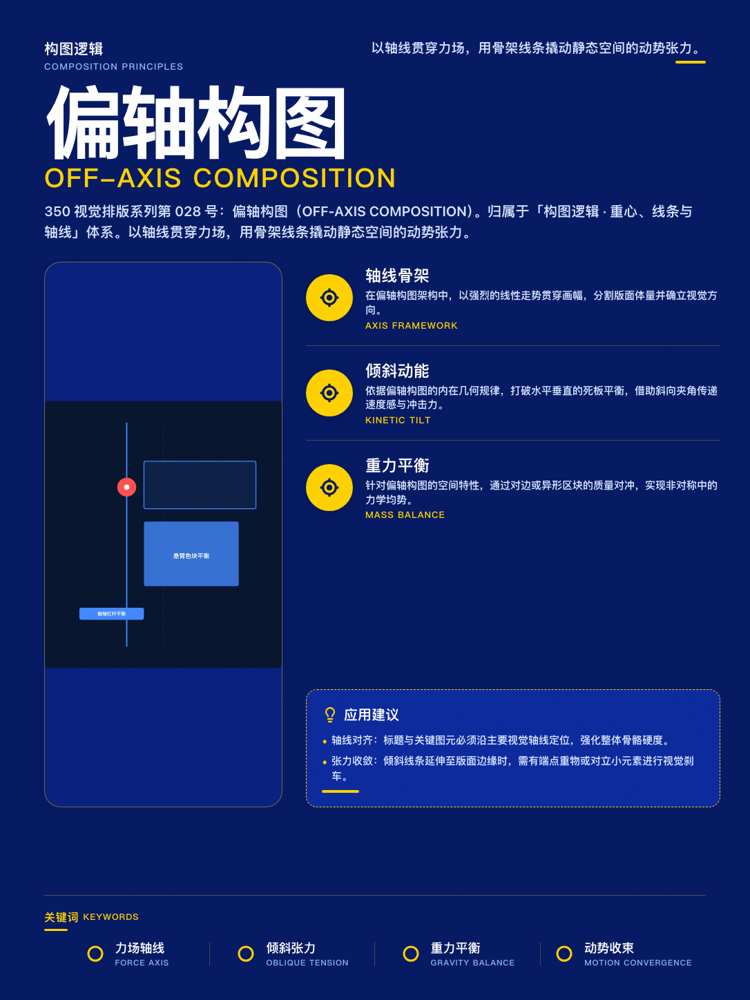</a> |
| **029 双轴构图**<br><sub>DUAL-AXIS COMPOSITION</sub><br><small>以轴线贯穿力场，用骨架线条撬动静态空间的动势张力。</small> | <a href="./assets/original_thumbnails/029_双轴构图.jpg"></a> | <a href="./dist/029_双轴构图.png">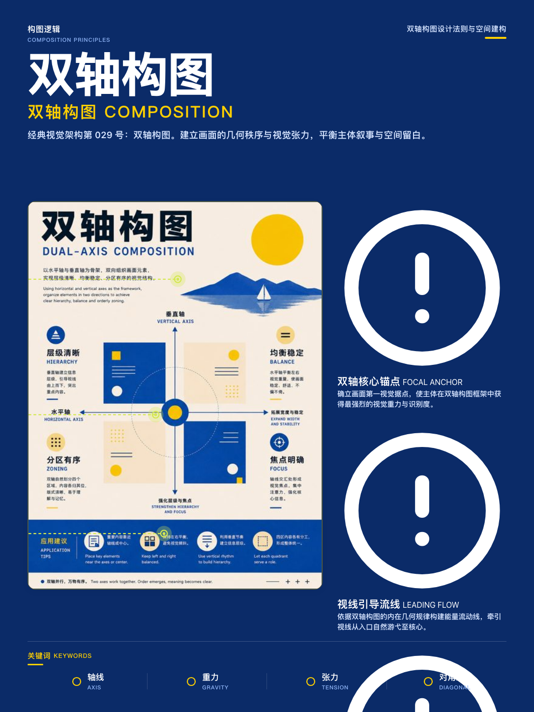</a> |
| **030 十字构图**<br><sub>CROSS COMPOSITION</sub><br><small>以轴线贯穿力场，用骨架线条撬动静态空间的动势张力。</small> | <a href="./assets/original_thumbnails/030_十字构图.jpg"></a> | <a href="./dist/030_十字构图.png">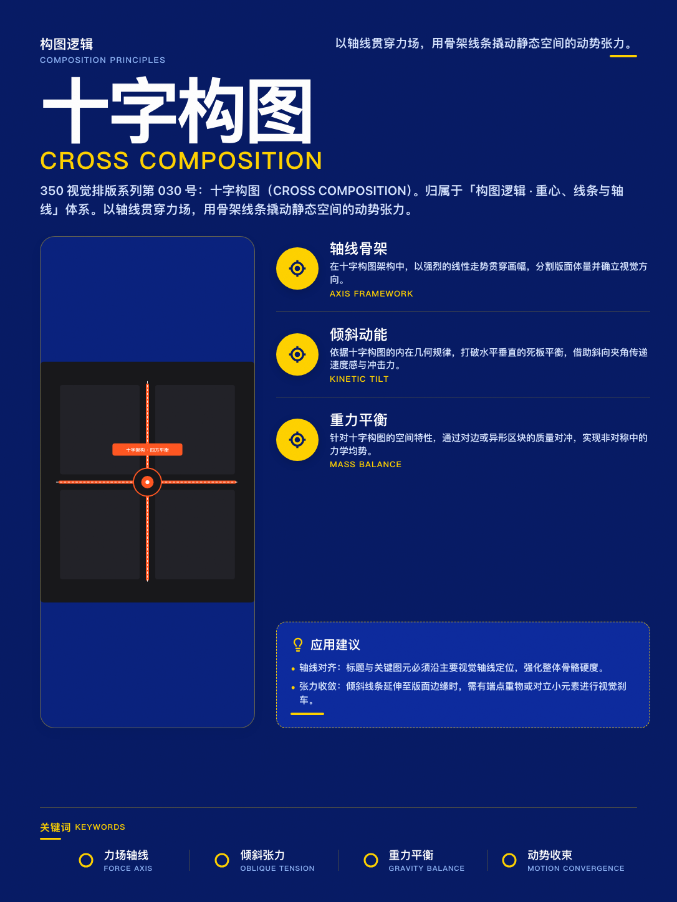</a> |

#### 字母形与曲线 (10 种 · 编号 031–040)

| 编号与版式名称 | 350 源项目原版 (Original) | 本项目全新重构图鉴 (New Bespoke) |
| :---: | :---: | :---: |
| **031 X 形构图**<br><sub>X-SHAPED COMPOSITION</sub><br><small>依循字母骨架与柔美曲线，牵引视线自然蜿蜒游弋。</small> | <a href="./assets/original_thumbnails/031_X 形构图.jpg"></a> | <a href="./dist/031_X 形构图.png"></a> |
| **032 T 形构图**<br><sub>T-SHAPED COMPOSITION</sub><br><small>依循字母骨架与柔美曲线，牵引视线自然蜿蜒游弋。</small> | <a href="./assets/original_thumbnails/032_T 形构图.jpg"></a> | <a href="./dist/032_T 形构图.png"></a> |
| **033 L 形构图**<br><sub>L-SHAPED COMPOSITION</sub><br><small>依循字母骨架与柔美曲线，牵引视线自然蜿蜒游弋。</small> | <a href="./assets/original_thumbnails/033_L 形构图.jpg"></a> | <a href="./dist/033_L 形构图.png"></a> |
| **034 V 形构图**<br><sub>V-SHAPED COMPOSITION</sub><br><small>依循字母骨架与柔美曲线，牵引视线自然蜿蜒游弋。</small> | <a href="./assets/original_thumbnails/034_V 形构图.jpg"></a> | <a href="./dist/034_V 形构图.png"></a> |
| **035 Z 形构图**<br><sub>Z-SHAPED COMPOSITION</sub><br><small>依循字母骨架与柔美曲线，牵引视线自然蜿蜒游弋。</small> | <a href="./assets/original_thumbnails/035_Z 形构图.jpg"></a> | <a href="./dist/035_Z 形构图.png"></a> |
| **036 C 形构图**<br><sub>C-SHAPED COMPOSITION</sub><br><small>依循字母骨架与柔美曲线，牵引视线自然蜿蜒游弋。</small> | <a href="./assets/original_thumbnails/036_C 形构图.jpg"></a> | <a href="./dist/036_C 形构图.png"></a> |
| **037 S 形构图**<br><sub>S-CURVE COMPOSITION</sub><br><small>依循字母骨架与柔美曲线，牵引视线自然蜿蜒游弋。</small> | <a href="./assets/original_thumbnails/037_S 形构图.jpg"></a> | <a href="./dist/037_S 形构图.png"></a> |
| **038 曲线构图**<br><sub>CURVILINEAR COMPOSITION</sub><br><small>依循字母骨架与柔美曲线，牵引视线自然蜿蜒游弋。</small> | <a href="./assets/original_thumbnails/038_曲线构图.jpg"></a> | <a href="./dist/038_曲线构图.png">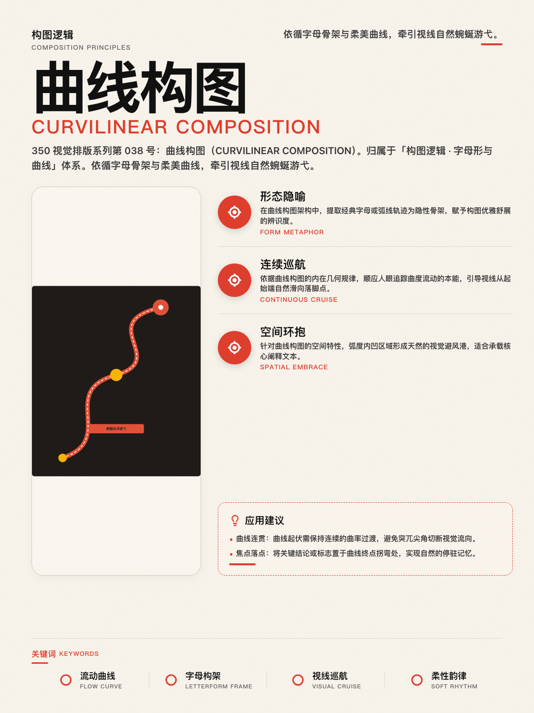</a> |
| **039 波浪形构图**<br><sub>WAVE COMPOSITION</sub><br><small>依循字母骨架与柔美曲线，牵引视线自然蜿蜒游弋。</small> | <a href="./assets/original_thumbnails/039_波浪形构图.jpg"></a> | <a href="./dist/039_波浪形构图.png">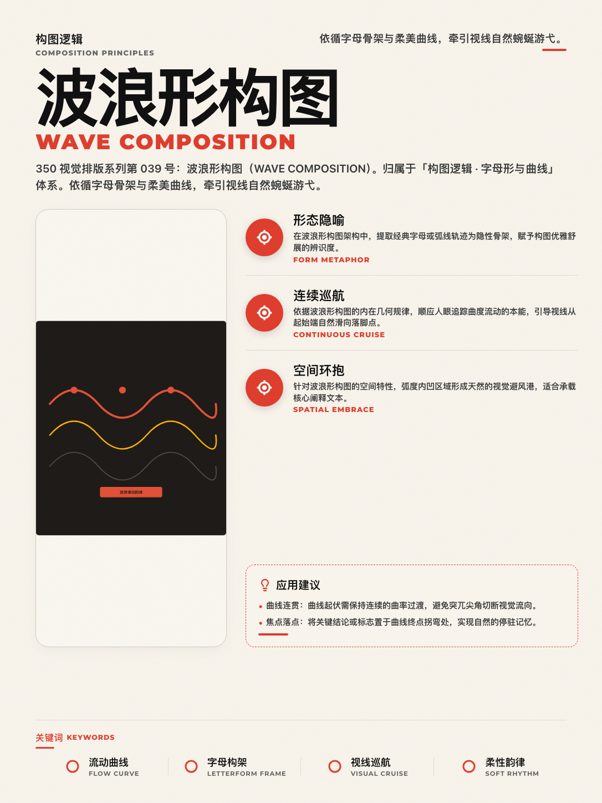</a> |
| **040 锯齿形构图**<br><sub>ZIGZAG COMPOSITION</sub><br><small>依循字母骨架与柔美曲线，牵引视线自然蜿蜒游弋。</small> | <a href="./assets/original_thumbnails/040_锯齿形构图.jpg"></a> | <a href="./dist/040_锯齿形构图.png">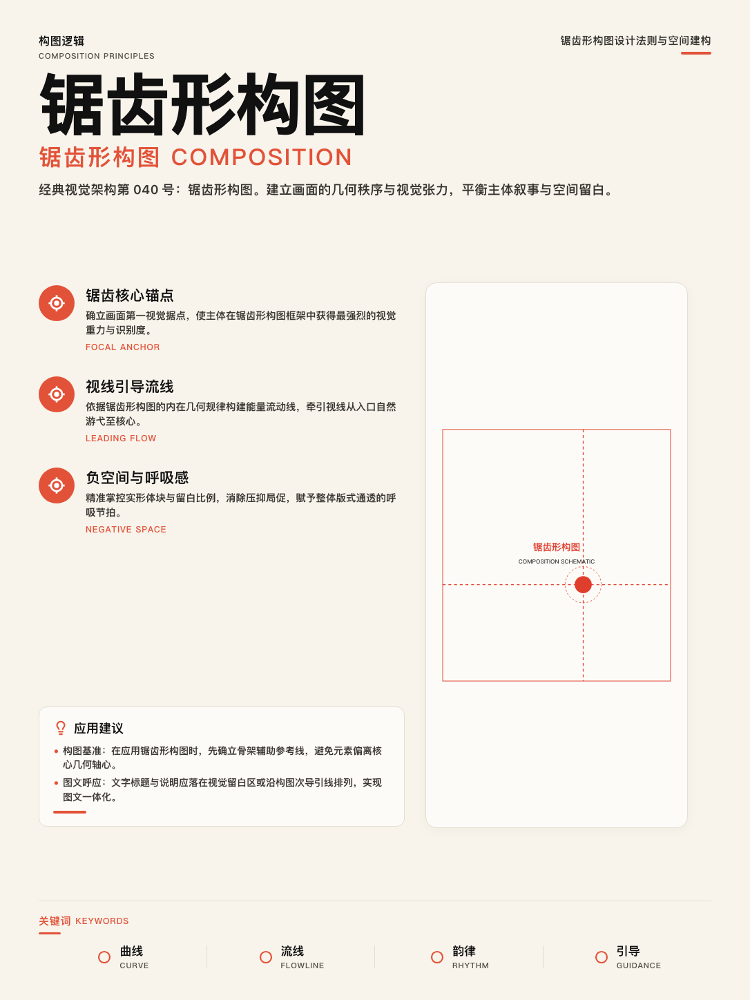</a> |

#### 几何形与放射结构 (16 种 · 编号 041–056)

| 编号与版式名称 | 350 源项目原版 (Original) | 本项目全新重构图鉴 (New Bespoke) |
| :---: | :---: | :---: |
| **041 三角构图**<br><sub>TRIANGULAR COMPOSITION</sub><br><small>以纯粹几何体块聚散与放射线束，汇聚高密度的视觉冲击能量。</small> | <a href="./assets/original_thumbnails/041_三角构图.jpg">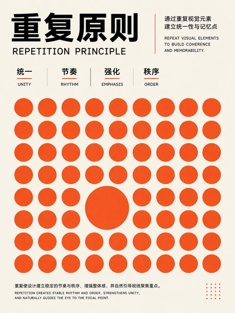</a> | <a href="./dist/041_三角构图.png">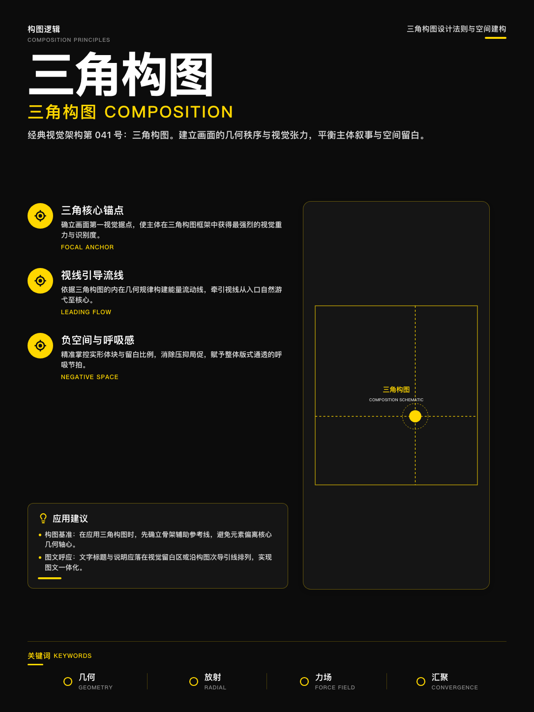</a> |
| **042 金字塔构图**<br><sub>PYRAMID COMPOSITION</sub><br><small>以纯粹几何体块聚散与放射线束，汇聚高密度的视觉冲击能量。</small> | <a href="./assets/original_thumbnails/042_金字塔构图.jpg">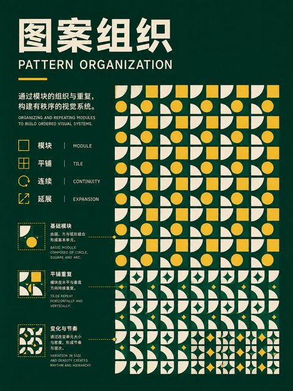</a> | <a href="./dist/042_金字塔构图.png"></a> |
| **043 倒三角构图**<br><sub>INVERTED TRIANGLE COMPOSITION</sub><br><small>以纯粹几何体块聚散与放射线束，汇聚高密度的视觉冲击能量。</small> | <a href="./assets/original_thumbnails/043_倒三角构图.jpg"></a> | <a href="./dist/043_倒三角构图.png">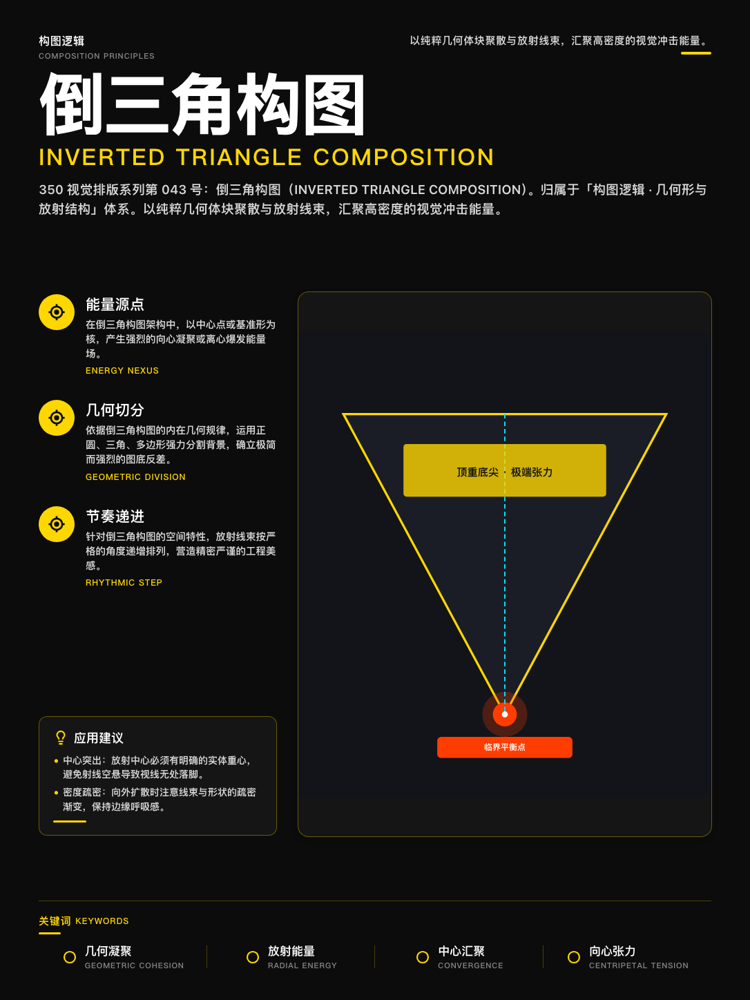</a> |
| **044 菱形构图**<br><sub>RHOMBUS COMPOSITION</sub><br><small>以纯粹几何体块聚散与放射线束，汇聚高密度的视觉冲击能量。</small> | <a href="./assets/original_thumbnails/044_菱形构图.jpg">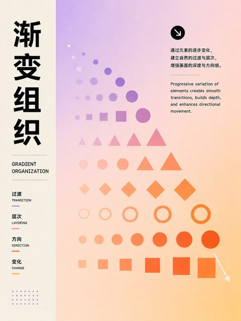</a> | <a href="./dist/044_菱形构图.png">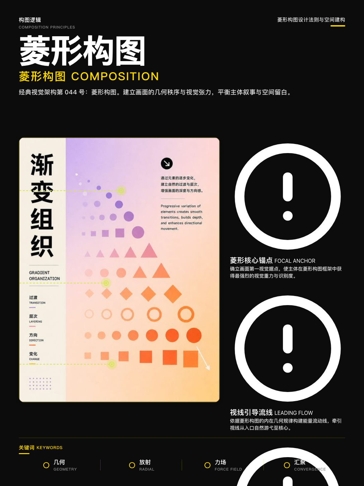</a> |
| **045 方形构图**<br><sub>SQUARE COMPOSITION</sub><br><small>以纯粹几何体块聚散与放射线束，汇聚高密度的视觉冲击能量。</small> | <a href="./assets/original_thumbnails/045_方形构图.jpg"></a> | <a href="./dist/045_方形构图.png">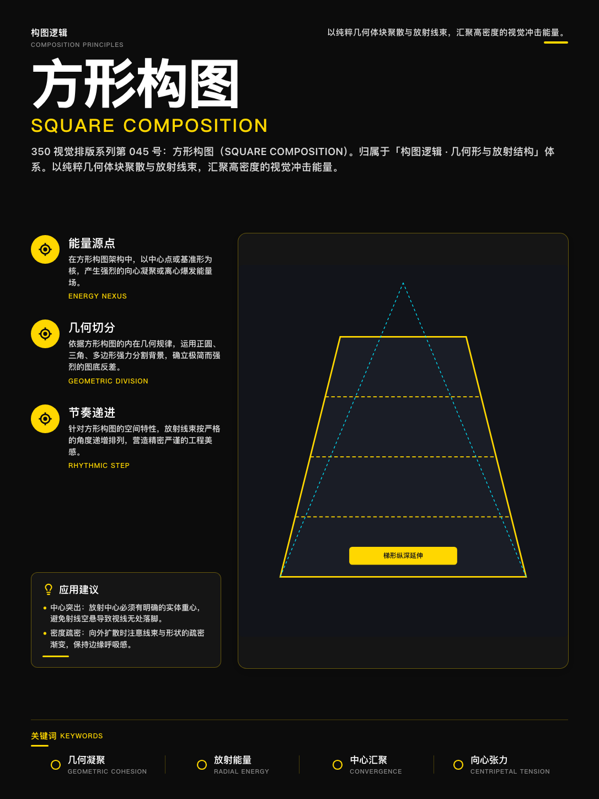</a> |
| **046 矩形构图**<br><sub>RECTANGULAR COMPOSITION</sub><br><small>以纯粹几何体块聚散与放射线束，汇聚高密度的视觉冲击能量。</small> | <a href="./assets/original_thumbnails/046_矩形构图.jpg"></a> | <a href="./dist/046_矩形构图.png">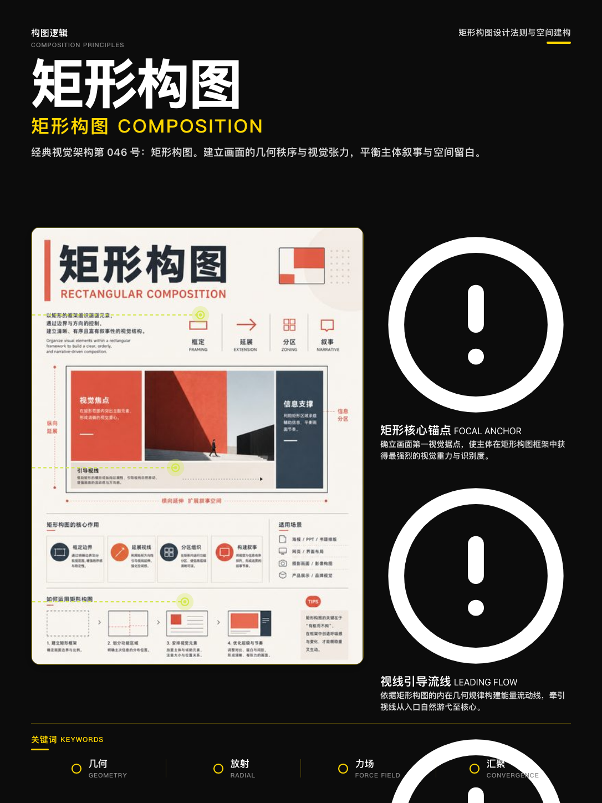</a> |
| **047 圆形构图**<br><sub>CIRCULAR COMPOSITION</sub><br><small>以纯粹几何体块聚散与放射线束，汇聚高密度的视觉冲击能量。</small> | <a href="./assets/original_thumbnails/047_圆形构图.jpg">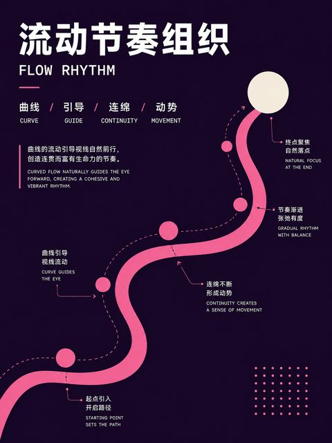</a> | <a href="./dist/047_圆形构图.png">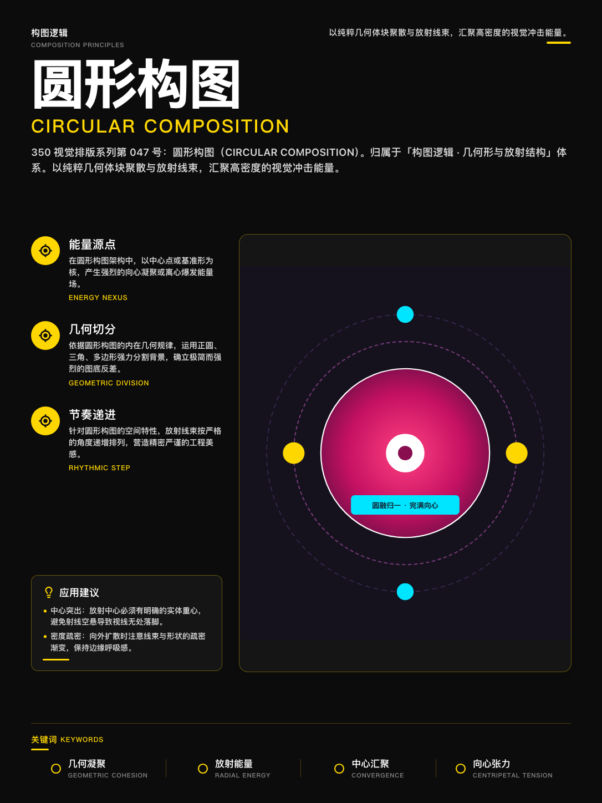</a> |
| **048 椭圆构图**<br><sub>ELLIPTICAL COMPOSITION</sub><br><small>以纯粹几何体块聚散与放射线束，汇聚高密度的视觉冲击能量。</small> | <a href="./assets/original_thumbnails/048_椭圆构图.jpg"></a> | <a href="./dist/048_椭圆构图.png">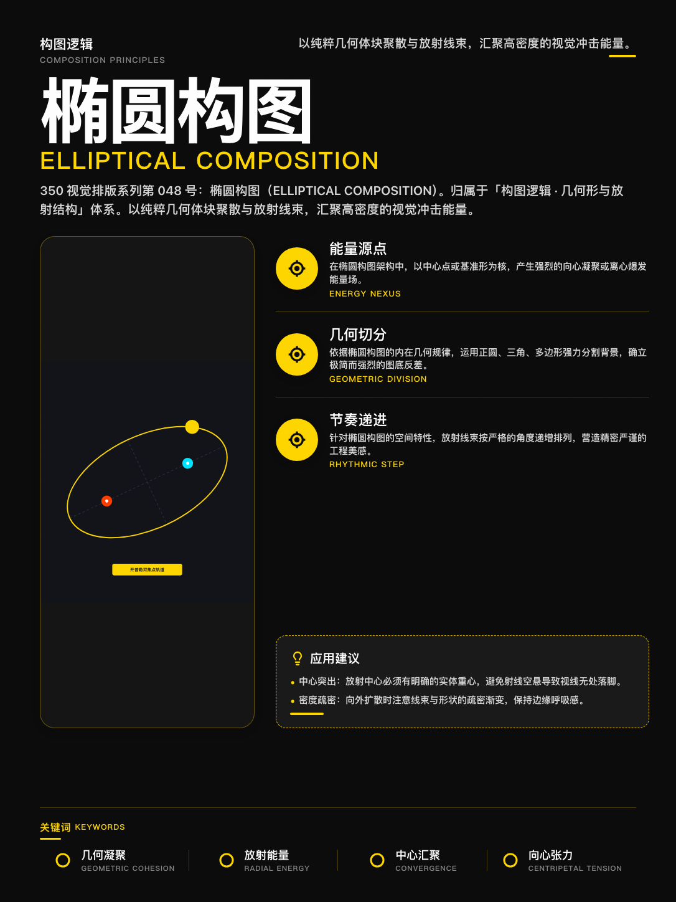</a> |
| **049 弧形构图**<br><sub>ARC COMPOSITION</sub><br><small>以纯粹几何体块聚散与放射线束，汇聚高密度的视觉冲击能量。</small> | <a href="./assets/original_thumbnails/049_弧形构图.jpg">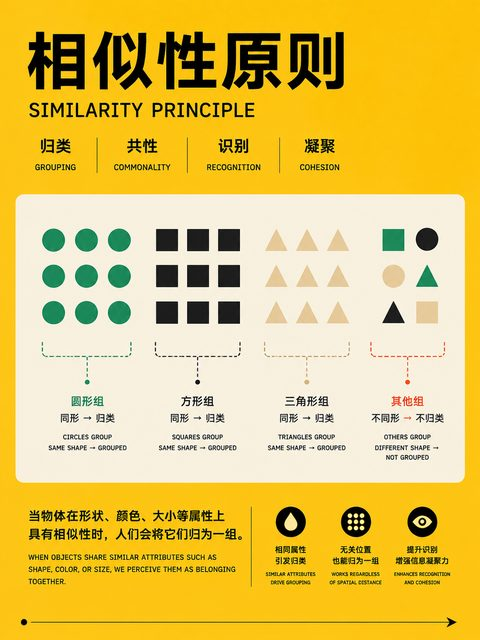</a> | <a href="./dist/049_弧形构图.png">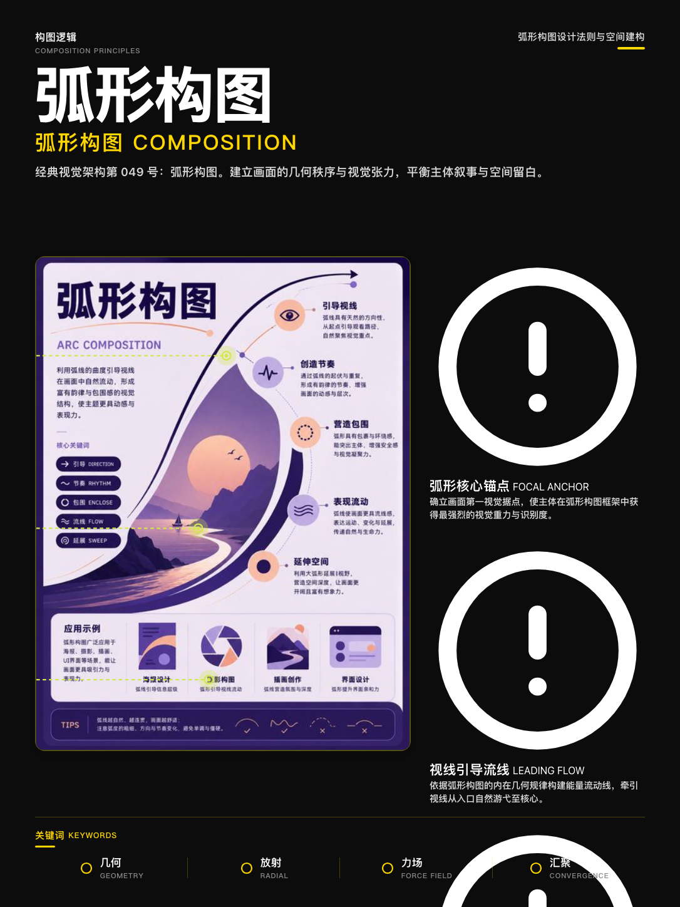</a> |
| **050 环形构图**<br><sub>ANNULAR COMPOSITION</sub><br><small>以纯粹几何体块聚散与放射线束，汇聚高密度的视觉冲击能量。</small> | <a href="./assets/original_thumbnails/050_环形构图.jpg"></a> | <a href="./dist/050_环形构图.png"></a> |
| **051 螺旋构图**<br><sub>SPIRAL COMPOSITION</sub><br><small>以纯粹几何体块聚散与放射线束，汇聚高密度的视觉冲击能量。</small> | <a href="./assets/original_thumbnails/051_螺旋构图.jpg"></a> | <a href="./dist/051_螺旋构图.png"></a> |
| **052 放射式构图**<br><sub>RADIATING COMPOSITION</sub><br><small>以纯粹几何体块聚散与放射线束，汇聚高密度的视觉冲击能量。</small> | <a href="./assets/original_thumbnails/052_放射式构图.jpg"></a> | <a href="./dist/052_放射式构图.png"></a> |
| **053 向心式构图**<br><sub>CENTRIPETAL COMPOSITION</sub><br><small>以纯粹几何体块聚散与放射线束，汇聚高密度的视觉冲击能量。</small> | <a href="./assets/original_thumbnails/053_向心式构图.jpg"></a> | <a href="./dist/053_向心式构图.png"></a> |
| **054 离心式构图**<br><sub>CENTRIFUGAL COMPOSITION</sub><br><small>以纯粹几何体块聚散与放射线束，汇聚高密度的视觉冲击能量。</small> | <a href="./assets/original_thumbnails/054_离心式构图.jpg"></a> | <a href="./dist/054_离心式构图.png"></a> |
| **055 同心式构图**<br><sub>CONCENTRIC COMPOSITION</sub><br><small>以纯粹几何体块聚散与放射线束，汇聚高密度的视觉冲击能量。</small> | <a href="./assets/original_thumbnails/055_同心式构图.jpg"></a> | <a href="./dist/055_同心式构图.png"></a> |
| **056 四象限构图**<br><sub>FOUR-QUADRANT COMPOSITION</sub><br><small>以纯粹几何体块聚散与放射线束，汇聚高密度的视觉冲击能量。</small> | <a href="./assets/original_thumbnails/056_四象限构图.jpg"></a> | <a href="./dist/056_四象限构图.png"></a> |

#### 阵列、层叠与组群 (8 种 · 编号 057–064)

| 编号与版式名称 | 350 源项目原版 (Original) | 本项目全新重构图鉴 (New Bespoke) |
| :---: | :---: | :---: |
| **057 棋盘构图**<br><sub>CHECKERBOARD COMPOSITION</sub><br><small>通过单元复现与层次堆叠，在无限秩序中编织丰富韵律。</small> | <a href="./assets/original_thumbnails/057_棋盘构图.jpg"></a> | <a href="./dist/057_棋盘构图.png"></a> |
| **058 阶梯构图**<br><sub>STAIRCASE COMPOSITION</sub><br><small>通过单元复现与层次堆叠，在无限秩序中编织丰富韵律。</small> | <a href="./assets/original_thumbnails/058_阶梯构图.jpg"></a> | <a href="./dist/058_阶梯构图.png"></a> |
| **059 层叠构图**<br><sub>STACKING COMPOSITION</sub><br><small>通过单元复现与层次堆叠，在无限秩序中编织丰富韵律。</small> | <a href="./assets/original_thumbnails/059_层叠构图.jpg"></a> | <a href="./dist/059_层叠构图.png"></a> |
| **060 级联构图**<br><sub>CASCADING COMPOSITION</sub><br><small>通过单元复现与层次堆叠，在无限秩序中编织丰富韵律。</small> | <a href="./assets/original_thumbnails/060_级联构图.jpg"></a> | <a href="./dist/060_级联构图.png"></a> |
| **061 聚类构图**<br><sub>CLUSTERED COMPOSITION</sub><br><small>通过单元复现与层次堆叠，在无限秩序中编织丰富韵律。</small> | <a href="./assets/original_thumbnails/061_聚类构图.jpg"></a> | <a href="./dist/061_聚类构图.png"></a> |
| **062 分散构图**<br><sub>DISPERSED COMPOSITION</sub><br><small>通过单元复现与层次堆叠，在无限秩序中编织丰富韵律。</small> | <a href="./assets/original_thumbnails/062_分散构图.jpg"></a> | <a href="./dist/062_分散构图.png"></a> |
| **063 分支构图**<br><sub>BRANCHING COMPOSITION</sub><br><small>通过单元复现与层次堆叠，在无限秩序中编织丰富韵律。</small> | <a href="./assets/original_thumbnails/063_分支构图.jpg"></a> | <a href="./dist/063_分支构图.png"></a> |
| **064 网络构图**<br><sub>NETWORK COMPOSITION</sub><br><small>通过单元复现与层次堆叠，在无限秩序中编织丰富韵律。</small> | <a href="./assets/original_thumbnails/064_网络构图.jpg"></a> | <a href="./dist/064_网络构图.png"></a> |

#### 空间层次与投影 (12 种 · 编号 065–076)

| 编号与版式名称 | 350 源项目原版 (Original) | 本项目全新重构图鉴 (New Bespoke) |
| :---: | :---: | :---: |
| **065 前中后景构图**<br><sub>FOREGROUND-MID-BACKGROUND</sub><br><small>在二维平面中建构纵深维度，营造前中后景的层层穿透。</small> | <a href="./assets/original_thumbnails/065_前中后景构图.jpg"></a> | <a href="./dist/065_前中后景构图.png"></a> |
| **066 前景框架构图**<br><sub>FOREGROUND FRAMING</sub><br><small>在二维平面中建构纵深维度，营造前中后景的层层穿透。</small> | <a href="./assets/original_thumbnails/066_前景框架构图.jpg"></a> | <a href="./dist/066_前景框架构图.png"></a> |
| **067 重叠空间构图**<br><sub>OVERLAPPING SPACE</sub><br><small>在二维平面中建构纵深维度，营造前中后景的层层穿透。</small> | <a href="./assets/original_thumbnails/067_重叠空间构图.jpg"></a> | <a href="./dist/067_重叠空间构图.png"></a> |
| **068 尺度递减构图**<br><sub>DIMINISHING SCALE</sub><br><small>在二维平面中建构纵深维度，营造前中后景的层层穿透。</small> | <a href="./assets/original_thumbnails/068_尺度递减构图.jpg"></a> | <a href="./dist/068_尺度递减构图.png"></a> |
| **069 线性透视**<br><sub>LINEAR PERSPECTIVE</sub><br><small>在二维平面中建构纵深维度，营造前中后景的层层穿透。</small> | <a href="./assets/original_thumbnails/069_线性透视.jpg"></a> | <a href="./dist/069_线性透视.png"></a> |
| **070 一点透视**<br><sub>ONE-POINT PERSPECTIVE</sub><br><small>在二维平面中建构纵深维度，营造前中后景的层层穿透。</small> | <a href="./assets/original_thumbnails/070_一点透视.jpg"></a> | <a href="./dist/070_一点透视.png"></a> |
| **071 两点透视**<br><sub>TWO-POINT PERSPECTIVE</sub><br><small>在二维平面中建构纵深维度，营造前中后景的层层穿透。</small> | <a href="./assets/original_thumbnails/071_两点透视.jpg"></a> | <a href="./dist/071_两点透视.png"></a> |
| **072 三点透视**<br><sub>THREE-POINT PERSPECTIVE</sub><br><small>在二维平面中建构纵深维度，营造前中后景的层层穿透。</small> | <a href="./assets/original_thumbnails/072_三点透视.jpg"></a> | <a href="./dist/072_三点透视.png"></a> |
| **073 平行透视构图**<br><sub>PARALLEL PERSPECTIVE</sub><br><small>在二维平面中建构纵深维度，营造前中后景的层层穿透。</small> | <a href="./assets/original_thumbnails/073_平行透视构图.jpg"></a> | <a href="./dist/073_平行透视构图.png"></a> |
| **074 斜投影构图**<br><sub>OBLIQUE PROJECTION</sub><br><small>在二维平面中建构纵深维度，营造前中后景的层层穿透。</small> | <a href="./assets/original_thumbnails/074_斜投影构图.jpg"></a> | <a href="./dist/074_斜投影构图.png"></a> |
| **075 等距构图**<br><sub>ISOMETRIC COMPOSITION</sub><br><small>在二维平面中建构纵深维度，营造前中后景的层层穿透。</small> | <a href="./assets/original_thumbnails/075_等距构图.jpg"></a> | <a href="./dist/075_等距构图.png"></a> |
| **076 轴测构图**<br><sub>AXONOMETRIC COMPOSITION</sub><br><small>在二维平面中建构纵深维度，营造前中后景的层层穿透。</small> | <a href="./assets/original_thumbnails/076_轴测构图.jpg"></a> | <a href="./dist/076_轴测构图.png"></a> |

#### 视点、景深与空间感 (10 种 · 编号 077–086)

| 编号与版式名称 | 350 源项目原版 (Original) | 本项目全新重构图鉴 (New Bespoke) |
| :---: | :---: | :---: |
| **077 鸟瞰构图**<br><sub>BIRD'S-EYE VIEW</sub><br><small>转换观察视点与景深虚实，重塑日常经验的非常规张力。</small> | <a href="./assets/original_thumbnails/077_鸟瞰构图.jpg"></a> | <a href="./dist/077_鸟瞰构图.png"></a> |
| **078 虫视构图**<br><sub>WORM'S-EYE VIEW</sub><br><small>转换观察视点与景深虚实，重塑日常经验的非常规张力。</small> | <a href="./assets/original_thumbnails/078_虫视构图.jpg"></a> | <a href="./dist/078_虫视构图.png"></a> |
| **079 顶视构图**<br><sub>TOP-DOWN VIEW</sub><br><small>转换观察视点与景深虚实，重塑日常经验的非常规张力。</small> | <a href="./assets/original_thumbnails/079_顶视构图.jpg"></a> | <a href="./dist/079_顶视构图.png"></a> |
| **080 平视构图**<br><sub>EYE-LEVEL COMPOSITION</sub><br><small>转换观察视点与景深虚实，重塑日常经验的非常规张力。</small> | <a href="./assets/original_thumbnails/080_平视构图.jpg"></a> | <a href="./dist/080_平视构图.png"></a> |
| **081 强制透视构图**<br><sub>FORCED PERSPECTIVE</sub><br><small>转换观察视点与景深虚实，重塑日常经验的非常规张力。</small> | <a href="./assets/original_thumbnails/081_强制透视构图.jpg"></a> | <a href="./dist/081_强制透视构图.png"></a> |
| **082 空气透视构图**<br><sub>ATMOSPHERIC PERSPECTIVE</sub><br><small>转换观察视点与景深虚实，重塑日常经验的非常规张力。</small> | <a href="./assets/original_thumbnails/082_空气透视构图.jpg"></a> | <a href="./dist/082_空气透视构图.png"></a> |
| **083 浅景深构图**<br><sub>SHALLOW DEPTH OF FIELD</sub><br><small>转换观察视点与景深虚实，重塑日常经验的非常规张力。</small> | <a href="./assets/original_thumbnails/083_浅景深构图.jpg"></a> | <a href="./dist/083_浅景深构图.png"></a> |
| **084 深焦构图**<br><sub>DEEP FOCUS COMPOSITION</sub><br><small>空间景深与多层叙事</small> | <a href="./assets/original_thumbnails/084_深焦构图.jpg"></a> | <a href="./dist/084_深焦构图.png"></a> |
| **085 平面化构图**<br><sub>PLANAR COMPOSITION</sub><br><small>转换观察视点与景深虚实，重塑日常经验的非常规张力。</small> | <a href="./assets/original_thumbnails/085_平面化构图.jpg"></a> | <a href="./dist/085_平面化构图.png"></a> |
| **086 深空间构图**<br><sub>DEEP SPACE COMPOSITION</sub><br><small>转换观察视点与景深虚实，重塑日常经验的非常规张力。</small> | <a href="./assets/original_thumbnails/086_深空间构图.jpg"></a> | <a href="./dist/086_深空间构图.png"></a> |


### 📌 视觉原则与阅读模式 (45 种)

#### 平衡、动势与焦点 (8 种 · 编号 087–094)

| 编号与版式名称 | 350 源项目原版 (Original) | 本项目全新重构图鉴 (New Bespoke) |
| :---: | :---: | :---: |
| **087 放射平衡原则**<br><sub>RADIAL BALANCE</sub><br><small>在力的对立与抗衡中，构筑静中有动的永恒均势。</small> | <a href="./assets/original_thumbnails/087_放射平衡原则.jpg"></a> | <a href="./dist/087_放射平衡原则.png"></a> |
| **088 晶体式平衡原则**<br><sub>CRYSTALLOGRAPHIC BALANCE</sub><br><small>在力的对立与抗衡中，构筑静中有动的永恒均势。</small> | <a href="./assets/original_thumbnails/088_晶体式平衡原则.jpg"></a> | <a href="./dist/088_晶体式平衡原则.png"></a> |
| **089 静态构图**<br><sub>STATIC COMPOSITION</sub><br><small>在力的对立与抗衡中，构筑静中有动的永恒均势。</small> | <a href="./assets/original_thumbnails/089_静态构图.jpg"></a> | <a href="./dist/089_静态构图.png"></a> |
| **090 动态构图**<br><sub>DYNAMIC COMPOSITION</sub><br><small>在力的对立与抗衡中，构筑静中有动的永恒均势。</small> | <a href="./assets/original_thumbnails/090_动态构图.jpg"></a> | <a href="./dist/090_动态构图.png"></a> |
| **091 开放式构图**<br><sub>OPEN COMPOSITION</sub><br><small>在力的对立与抗衡中，构筑静中有动的永恒均势。</small> | <a href="./assets/original_thumbnails/091_开放式构图.jpg"></a> | <a href="./dist/091_开放式构图.png"></a> |
| **092 封闭式构图**<br><sub>CLOSED COMPOSITION</sub><br><small>在力的对立与抗衡中，构筑静中有动的永恒均势。</small> | <a href="./assets/original_thumbnails/092_封闭式构图.jpg"></a> | <a href="./dist/092_封闭式构图.png"></a> |
| **093 单一焦点构图**<br><sub>SINGLE FOCAL POINT</sub><br><small>在力的对立与抗衡中，构筑静中有动的永恒均势。</small> | <a href="./assets/original_thumbnails/093_单一焦点构图.jpg"></a> | <a href="./dist/093_单一焦点构图.png"></a> |
| **094 多重焦点构图**<br><sub>MULTIPLE FOCAL POINTS</sub><br><small>在力的对立与抗衡中，构筑静中有动的永恒均势。</small> | <a href="./assets/original_thumbnails/094_多重焦点构图.jpg"></a> | <a href="./dist/094_多重焦点构图.png"></a> |

#### 层级、比例与对比 (12 种 · 编号 095–106)

| 编号与版式名称 | 350 源项目原版 (Original) | 本项目全新重构图鉴 (New Bespoke) |
| :---: | :---: | :---: |
| **095 视觉层级原则**<br><sub>VISUAL HIERARCHY</sub><br><small>以悬殊的反差拉开信息阶梯，建立毫无歧义的阅读顺序。</small> | <a href="./assets/original_thumbnails/095_视觉层级原则.jpg"></a> | <a href="./dist/095_视觉层级原则.png"></a> |
| **096 主次关系原则**<br><sub>DOMINANCE & SUBORDINATION</sub><br><small>以悬殊的反差拉开信息阶梯，建立毫无歧义的阅读顺序。</small> | <a href="./assets/original_thumbnails/096_主次关系原则.jpg"></a> | <a href="./dist/096_主次关系原则.png"></a> |
| **097 平衡原则**<br><sub>BALANCE PRINCIPLE</sub><br><small>以悬殊的反差拉开信息阶梯，建立毫无歧义的阅读顺序。</small> | <a href="./assets/original_thumbnails/097_平衡原则.jpg"></a> | <a href="./dist/097_平衡原则.png"></a> |
| **098 比例原则**<br><sub>PROPORTION PRINCIPLE</sub><br><small>以悬殊的反差拉开信息阶梯，建立毫无歧义的阅读顺序。</small> | <a href="./assets/original_thumbnails/098_比例原则.jpg"></a> | <a href="./dist/098_比例原则.png"></a> |
| **099 尺度对比原则**<br><sub>SCALE CONTRAST</sub><br><small>以悬殊的反差拉开信息阶梯，建立毫无歧义的阅读顺序。</small> | <a href="./assets/original_thumbnails/099_尺度对比原则.jpg"></a> | <a href="./dist/099_尺度对比原则.png"></a> |
| **100 明暗对比原则**<br><sub>LIGHT & DARK CONTRAST</sub><br><small>以悬殊的反差拉开信息阶梯，建立毫无歧义的阅读顺序。</small> | <a href="./assets/original_thumbnails/100_明暗对比原则.jpg"></a> | <a href="./dist/100_明暗对比原则.png"></a> |
| **101 色彩对比原则**<br><sub>COLOR CONTRAST</sub><br><small>以悬殊的反差拉开信息阶梯，建立毫无歧义的阅读顺序。</small> | <a href="./assets/original_thumbnails/101_色彩对比原则.jpg"></a> | <a href="./dist/101_色彩对比原则.png"></a> |
| **102 形状对比原则**<br><sub>SHAPE CONTRAST</sub><br><small>以悬殊的反差拉开信息阶梯，建立毫无歧义的阅读顺序。</small> | <a href="./assets/original_thumbnails/102_形状对比原则.jpg"></a> | <a href="./dist/102_形状对比原则.png"></a> |
| **103 质感对比原则**<br><sub>TEXTURE CONTRAST</sub><br><small>以悬殊的反差拉开信息阶梯，建立毫无歧义的阅读顺序。</small> | <a href="./assets/original_thumbnails/103_质感对比原则.jpg"></a> | <a href="./dist/103_质感对比原则.png"></a> |
| **104 动静对比原则**<br><sub>MOTION-STASIS CONTRAST</sub><br><small>以悬殊的反差拉开信息阶梯，建立毫无歧义的阅读顺序。</small> | <a href="./assets/original_thumbnails/104_动静对比原则.jpg"></a> | <a href="./dist/104_动静对比原则.png"></a> |
| **105 并置原则**<br><sub>JUXTAPOSITION PRINCIPLE</sub><br><small>以悬殊的反差拉开信息阶梯，建立毫无歧义的阅读顺序。</small> | <a href="./assets/original_thumbnails/105_并置原则.jpg"></a> | <a href="./dist/105_并置原则.png"></a> |
| **106 隔离原则**<br><sub>ISOLATION PRINCIPLE</sub><br><small>以悬殊的反差拉开信息阶梯，建立毫无歧义的阅读顺序。</small> | <a href="./assets/original_thumbnails/106_隔离原则.jpg"></a> | <a href="./dist/106_隔离原则.png"></a> |

#### 重复、图案与节奏 (8 种 · 编号 107–114)

| 编号与版式名称 | 350 源项目原版 (Original) | 本项目全新重构图鉴 (New Bespoke) |
| :---: | :---: | :---: |
| **107 重复原则**<br><sub>REPETITION PRINCIPLE</sub><br><small>让视觉元素如音符般起伏跳跃，在重复中鸣响共振旋律。</small> | <a href="./assets/original_thumbnails/107_重复原则.jpg"></a> | <a href="./dist/107_重复原则.png"></a> |
| **108 图案组织**<br><sub>PATTERN ORGANIZATION</sub><br><small>让视觉元素如音符般起伏跳跃，在重复中鸣响共振旋律。</small> | <a href="./assets/original_thumbnails/108_图案组织.jpg"></a> | <a href="./dist/108_图案组织.png"></a> |
| **109 节奏组织**<br><sub>RHYTHM ORGANIZATION</sub><br><small>让视觉元素如音符般起伏跳跃，在重复中鸣响共振旋律。</small> | <a href="./assets/original_thumbnails/109_节奏组织.jpg"></a> | <a href="./dist/109_节奏组织.png"></a> |
| **110 渐变组织**<br><sub>GRADATION RHYTHM</sub><br><small>让视觉元素如音符般起伏跳跃，在重复中鸣响共振旋律。</small> | <a href="./assets/original_thumbnails/110_渐变组织.jpg"></a> | <a href="./dist/110_渐变组织.png"></a> |
| **111 交替节奏组织**<br><sub>ALTERNATING RHYTHM</sub><br><small>让视觉元素如音符般起伏跳跃，在重复中鸣响共振旋律。</small> | <a href="./assets/original_thumbnails/111_交替节奏组织.jpg"></a> | <a href="./dist/111_交替节奏组织.png"></a> |
| **112 渐进节奏组织**<br><sub>PROGRESSIVE RHYTHM</sub><br><small>让视觉元素如音符般起伏跳跃，在重复中鸣响共振旋律。</small> | <a href="./assets/original_thumbnails/112_渐进节奏组织.jpg"></a> | <a href="./dist/112_渐进节奏组织.png"></a> |
| **113 流动节奏组织**<br><sub>FLOWING RHYTHM</sub><br><small>让视觉元素如音符般起伏跳跃，在重复中鸣响共振旋律。</small> | <a href="./assets/original_thumbnails/113_流动节奏组织.jpg"></a> | <a href="./dist/113_流动节奏组织.png"></a> |
| **114 随机节奏组织**<br><sub>RANDOM RHYTHM</sub><br><small>让视觉元素如音符般起伏跳跃，在重复中鸣响共振旋律。</small> | <a href="./assets/original_thumbnails/114_随机节奏组织.jpg"></a> | <a href="./dist/114_随机节奏组织.png"></a> |

#### 格式塔与组群 (12 种 · 编号 115–126)

| 编号与版式名称 | 350 源项目原版 (Original) | 本项目全新重构图鉴 (New Bespoke) |
| :---: | :---: | :---: |
| **115 相似性原则**<br><sub>SIMILARITY PRINCIPLE</sub><br><small>调动人类知觉的完形本能，让离散符号自发凝聚为整体意象。</small> | <a href="./assets/original_thumbnails/115_相似性原则.jpg"></a> | <a href="./dist/115_相似性原则.png"></a> |
| **116 邻近性原则**<br><sub>PROXIMITY PRINCIPLE</sub><br><small>调动人类知觉的完形本能，让离散符号自发凝聚为整体意象。</small> | <a href="./assets/original_thumbnails/116_邻近性原则.jpg"></a> | <a href="./dist/116_邻近性原则.png"></a> |
| **117 连续性原则**<br><sub>CONTINUITY PRINCIPLE</sub><br><small>调动人类知觉的完形本能，让离散符号自发凝聚为整体意象。</small> | <a href="./assets/original_thumbnails/117_连续性原则.jpg"></a> | <a href="./dist/117_连续性原则.png"></a> |
| **118 闭合性原则**<br><sub>CLOSURE PRINCIPLE</sub><br><small>调动人类知觉的完形本能，让离散符号自发凝聚为整体意象。</small> | <a href="./assets/original_thumbnails/118_闭合性原则.jpg"></a> | <a href="./dist/118_闭合性原则.png"></a> |
| **119 图底关系原则**<br><sub>FIGURE-GROUND RELATION</sub><br><small>调动人类知觉的完形本能，让离散符号自发凝聚为整体意象。</small> | <a href="./assets/original_thumbnails/119_图底关系原则.jpg"></a> | <a href="./dist/119_图底关系原则.png"></a> |
| **120 共同区域原则**<br><sub>COMMON REGION PRINCIPLE</sub><br><small>调动人类知觉的完形本能，让离散符号自发凝聚为整体意象。</small> | <a href="./assets/original_thumbnails/120_共同区域原则.jpg"></a> | <a href="./dist/120_共同区域原则.png"></a> |
| **121 共同命运原则**<br><sub>COMMON FATE PRINCIPLE</sub><br><small>调动人类知觉的完形本能，让离散符号自发凝聚为整体意象。</small> | <a href="./assets/original_thumbnails/121_共同命运原则.jpg"></a> | <a href="./dist/121_共同命运原则.png"></a> |
| **122 简化构图原则**<br><sub>SIMPLICITY PRINCIPLE</sub><br><small>调动人类知觉的完形本能，让离散符号自发凝聚为整体意象。</small> | <a href="./assets/original_thumbnails/122_简化构图原则.jpg"></a> | <a href="./dist/122_简化构图原则.png"></a> |
| **123 裁切构图**<br><sub>CROPPING COMPOSITION</sub><br><small>调动人类知觉的完形本能，让离散符号自发凝聚为整体意象。</small> | <a href="./assets/original_thumbnails/123_裁切构图.jpg"></a> | <a href="./dist/123_裁切构图.png"></a> |
| **124 满幅构图**<br><sub>FULL-BLEED COMPOSITION</sub><br><small>调动人类知觉的完形本能，让离散符号自发凝聚为整体意象。</small> | <a href="./assets/original_thumbnails/124_满幅构图.jpg"></a> | <a href="./dist/124_满幅构图.png"></a> |
| **125 疏密对比原则**<br><sub>DENSITY CONTRAST</sub><br><small>调动人类知觉的完形本能，让离散符号自发凝聚为整体意象。</small> | <a href="./assets/original_thumbnails/125_疏密对比原则.jpg"></a> | <a href="./dist/125_疏密对比原则.png"></a> |
| **126 群组构图**<br><sub>GROUPING COMPOSITION</sub><br><small>调动人类知觉的完形本能，让离散符号自发凝聚为整体意象。</small> | <a href="./assets/original_thumbnails/126_群组构图.jpg"></a> | <a href="./dist/126_群组构图.png"></a> |

#### 页面阅读模式 (5 种 · 编号 127–131)

| 编号与版式名称 | 350 源项目原版 (Original) | 本项目全新重构图鉴 (New Bespoke) |
| :---: | :---: | :---: |
| **127 F 型扫描模式**<br><sub>F-SHAPED READING PATTERN</sub><br><small>顺应人类眼动的生理惯性，在视线必经之路布设价值锚点。</small> | <a href="./assets/original_thumbnails/127_F 型扫描模式.jpg"></a> | <a href="./dist/127_F 型扫描模式.png"></a> |
| **128 Z 型扫描模式**<br><sub>Z-SHAPED READING PATTERN</sub><br><small>顺应人类眼动的生理惯性，在视线必经之路布设价值锚点。</small> | <a href="./assets/original_thumbnails/128_Z 型扫描模式.jpg"></a> | <a href="./dist/128_Z 型扫描模式.png"></a> |
| **129 古腾堡图式**<br><sub>GUTENBERG DIAGRAM</sub><br><small>顺应人类眼动的生理惯性，在视线必经之路布设价值锚点。</small> | <a href="./assets/original_thumbnails/129_古腾堡图式.jpg"></a> | <a href="./dist/129_古腾堡图式.png"></a> |
| **130 层蛋糕扫描模式**<br><sub>LAYER-CAKE PATTERN</sub><br><small>顺应人类眼动的生理惯性，在视线必经之路布设价值锚点。</small> | <a href="./assets/original_thumbnails/130_层蛋糕扫描模式.jpg"></a> | <a href="./dist/130_层蛋糕扫描模式.png"></a> |
| **131 斑点扫描模式**<br><sub>SPOTTING SCAN PATTERN</sub><br><small>顺应人类眼动的生理惯性，在视线必经之路布设价值锚点。</small> | <a href="./assets/original_thumbnails/131_斑点扫描模式.jpg"></a> | <a href="./dist/131_斑点扫描模式.png"></a> |


### 📌 平面、出版与广告 (36 种)

#### 分栏、跨页与出血 (8 种 · 编号 132–139)

| 编号与版式名称 | 350 源项目原版 (Original) | 本项目全新重构图鉴 (New Bespoke) |
| :---: | :---: | :---: |
| **132 单栏版式**<br><sub>SINGLE-COLUMN LAYOUT</sub><br><small>以严谨分栏规整海量信息，用跨页满幅释放无限张力。</small> | <a href="./assets/original_thumbnails/132_单栏版式.jpg"></a> | <a href="./dist/132_单栏版式.png"></a> |
| **133 双栏版式**<br><sub>TWO-COLUMN LAYOUT</sub><br><small>以严谨分栏规整海量信息，用跨页满幅释放无限张力。</small> | <a href="./assets/original_thumbnails/133_双栏版式.jpg"></a> | <a href="./dist/133_双栏版式.png"></a> |
| **134 多栏版式**<br><sub>MULTI-COLUMN LAYOUT</sub><br><small>以严谨分栏规整海量信息，用跨页满幅释放无限张力。</small> | <a href="./assets/original_thumbnails/134_多栏版式.jpg"></a> | <a href="./dist/134_多栏版式.png"></a> |
| **135 对称跨页**<br><sub>SYMMETRICAL SPREAD</sub><br><small>以严谨分栏规整海量信息，用跨页满幅释放无限张力。</small> | <a href="./assets/original_thumbnails/135_对称跨页.jpg"></a> | <a href="./dist/135_对称跨页.png"></a> |
| **136 非对称跨页**<br><sub>ASYMMETRICAL SPREAD</sub><br><small>以严谨分栏规整海量信息，用跨页满幅释放无限张力。</small> | <a href="./assets/original_thumbnails/136_非对称跨页.jpg"></a> | <a href="./dist/136_非对称跨页.png"></a> |
| **137 通版跨页**<br><sub>PANORAMIC SPREAD</sub><br><small>以严谨分栏规整海量信息，用跨页满幅释放无限张力。</small> | <a href="./assets/original_thumbnails/137_通版跨页.jpg"></a> | <a href="./dist/137_通版跨页.png"></a> |
| **138 满出血版式**<br><sub>FULL-BLEED LAYOUT</sub><br><small>以严谨分栏规整海量信息，用跨页满幅释放无限张力。</small> | <a href="./assets/original_thumbnails/138_满出血版式.jpg"></a> | <a href="./dist/138_满出血版式.png"></a> |
| **139 无出血版式**<br><sub>MARGIN-BOUND LAYOUT</sub><br><small>以严谨分栏规整海量信息，用跨页满幅释放无限张力。</small> | <a href="./assets/original_thumbnails/139_无出血版式.jpg"></a> | <a href="./dist/139_无出血版式.png"></a> |

#### 图文主导与表现型版式 (13 种 · 编号 140–152)

| 编号与版式名称 | 350 源项目原版 (Original) | 本项目全新重构图鉴 (New Bespoke) |
| :---: | :---: | :---: |
| **140 图片主导版式**<br><sub>IMAGE-DOMINANT LAYOUT</sub><br><small>让图像统治视野，使文字化身建筑，碰撞出戏剧性的表现力量。</small> | <a href="./assets/original_thumbnails/140_图片主导版式.jpg"></a> | <a href="./dist/140_图片主导版式.png"></a> |
| **141 文字主导版式**<br><sub>TEXT-DOMINANT LAYOUT</sub><br><small>让图像统治视野，使文字化身建筑，碰撞出戏剧性的表现力量。</small> | <a href="./assets/original_thumbnails/141_文字主导版式.jpg"></a> | <a href="./dist/141_文字主导版式.png"></a> |
| **142 大标题版式**<br><sub>HEADLINE-DOMINANT LAYOUT</sub><br><small>让图像统治视野，使文字化身建筑，碰撞出戏剧性的表现力量。</small> | <a href="./assets/original_thumbnails/142_大标题版式.jpg"></a> | <a href="./dist/142_大标题版式.png"></a> |
| **143 图片窗口版式**<br><sub>IMAGE WINDOW LAYOUT</sub><br><small>让图像统治视野，使文字化身建筑，碰撞出戏剧性的表现力量。</small> | <a href="./assets/original_thumbnails/143_图片窗口版式.jpg"></a> | <a href="./dist/143_图片窗口版式.png"></a> |
| **144 框架版式**<br><sub>FRAMEWORK LAYOUT</sub><br><small>让图像统治视野，使文字化身建筑，碰撞出戏剧性的表现力量。</small> | <a href="./assets/original_thumbnails/144_框架版式.jpg"></a> | <a href="./dist/144_框架版式.png"></a> |
| **145 多面板版式**<br><sub>MULTI-PANEL LAYOUT</sub><br><small>让图像统治视野，使文字化身建筑，碰撞出戏剧性的表现力量。</small> | <a href="./assets/original_thumbnails/145_多面板版式.jpg"></a> | <a href="./dist/145_多面板版式.png"></a> |
| **146 蒙德里安版式**<br><sub>MONDRIAN LAYOUT</sub><br><small>让图像统治视野，使文字化身建筑，碰撞出戏剧性的表现力量。</small> | <a href="./assets/original_thumbnails/146_蒙德里安版式.jpg"></a> | <a href="./dist/146_蒙德里安版式.png"></a> |
| **147 马戏团版式**<br><sub>CIRCUS LAYOUT</sub><br><small>让图像统治视野，使文字化身建筑，碰撞出戏剧性的表现力量。</small> | <a href="./assets/original_thumbnails/147_马戏团版式.jpg"></a> | <a href="./dist/147_马戏团版式.png"></a> |
| **148 剪影版式**<br><sub>SILHOUETTE LAYOUT</sub><br><small>让图像统治视野，使文字化身建筑，碰撞出戏剧性的表现力量。</small> | <a href="./assets/original_thumbnails/148_剪影版式.jpg"></a> | <a href="./dist/148_剪影版式.png"></a> |
| **149 字母造型版式**<br><sub>TYPOGRAPHIC FORM LAYOUT</sub><br><small>让图像统治视野，使文字化身建筑，碰撞出戏剧性的表现力量。</small> | <a href="./assets/original_thumbnails/149_字母造型版式.jpg"></a> | <a href="./dist/149_字母造型版式.png"></a> |
| **150 图文谜语版式**<br><sub>VISUAL REBUS LAYOUT</sub><br><small>让图像统治视野，使文字化身建筑，碰撞出戏剧性的表现力量。</small> | <a href="./assets/original_thumbnails/150_图文谜语版式.jpg"></a> | <a href="./dist/150_图文谜语版式.png"></a> |
| **151 拼贴版式**<br><sub>COLLAGE LAYOUT</sub><br><small>让图像统治视野，使文字化身建筑，碰撞出戏剧性的表现力量。</small> | <a href="./assets/original_thumbnails/151_拼贴版式.jpg"></a> | <a href="./dist/151_拼贴版式.png"></a> |
| **152 蒙太奇版式**<br><sub>MONTAGE LAYOUT</sub><br><small>让图像统治视野，使文字化身建筑，碰撞出戏剧性的表现力量。</small> | <a href="./assets/original_thumbnails/152_蒙太奇版式.jpg"></a> | <a href="./dist/152_蒙太奇版式.png"></a> |

#### 模块、侧栏与图文关系 (7 种 · 编号 153–159)

| 编号与版式名称 | 350 源项目原版 (Original) | 本项目全新重构图鉴 (New Bespoke) |
| :---: | :---: | :---: |
| **153 模块化页面**<br><sub>MODULAR PAGE</sub><br><small>用模块规整复杂脉络，借侧栏边注赋予版面从容叙事。</small> | <a href="./assets/original_thumbnails/153_模块化页面.jpg"></a> | <a href="./dist/153_模块化页面.png"></a> |
| **154 区块式版式**<br><sub>BLOCK LAYOUT</sub><br><small>用模块规整复杂脉络，借侧栏边注赋予版面从容叙事。</small> | <a href="./assets/original_thumbnails/154_区块式版式.jpg"></a> | <a href="./dist/154_区块式版式.png"></a> |
| **155 插页式版式**<br><sub>INSET LAYOUT</sub><br><small>用模块规整复杂脉络，借侧栏边注赋予版面从容叙事。</small> | <a href="./assets/original_thumbnails/155_插页式版式.jpg"></a> | <a href="./dist/155_插页式版式.png"></a> |
| **156 侧栏版式**<br><sub>SIDEBAR LAYOUT</sub><br><small>用模块规整复杂脉络，借侧栏边注赋予版面从容叙事。</small> | <a href="./assets/original_thumbnails/156_侧栏版式.jpg"></a> | <a href="./dist/156_侧栏版式.png"></a> |
| **157 边注版式**<br><sub>MARGINALIA LAYOUT</sub><br><small>用模块规整复杂脉络，借侧栏边注赋予版面从容叙事。</small> | <a href="./assets/original_thumbnails/157_边注版式.jpg"></a> | <a href="./dist/157_边注版式.png"></a> |
| **158 环绕图版式**<br><sub>WRAP-AROUND LAYOUT</sub><br><small>用模块规整复杂脉络，借侧栏边注赋予版面从容叙事。</small> | <a href="./assets/original_thumbnails/158_环绕图版式.jpg"></a> | <a href="./dist/158_环绕图版式.png"></a> |
| **159 浮动块版式**<br><sub>FLOATING BLOCK LAYOUT</sub><br><small>用模块规整复杂脉络，借侧栏边注赋予版面从容叙事。</small> | <a href="./assets/original_thumbnails/159_浮动块版式.jpg"></a> | <a href="./dist/159_浮动块版式.png"></a> |

#### 出版功能页面 (8 种 · 编号 160–167)

| 编号与版式名称 | 350 源项目原版 (Original) | 本项目全新重构图鉴 (New Bespoke) |
| :---: | :---: | :---: |
| **160 封面版式**<br><sub>COVER LAYOUT</sub><br><small>于仪式感中开启新章节，在经典秩序中凝练典籍风骨。</small> | <a href="./assets/original_thumbnails/160_封面版式.jpg"></a> | <a href="./dist/160_封面版式.png"></a> |
| **161 章节扉页**<br><sub>CHAPTER OPENING PAGE</sub><br><small>于仪式感中开启新章节，在经典秩序中凝练典籍风骨。</small> | <a href="./assets/original_thumbnails/161_章节扉页.jpg"></a> | <a href="./dist/161_章节扉页.png"></a> |
| **162 栏目开启页**<br><sub>SECTION OPENING PAGE</sub><br><small>于仪式感中开启新章节，在经典秩序中凝练典籍风骨。</small> | <a href="./assets/original_thumbnails/162_栏目开启页.jpg"></a> | <a href="./dist/162_栏目开启页.png"></a> |
| **163 特写跨页**<br><sub>FEATURE SPREAD</sub><br><small>于仪式感中开启新章节，在经典秩序中凝练典籍风骨。</small> | <a href="./assets/original_thumbnails/163_特写跨页.jpg"></a> | <a href="./dist/163_特写跨页.png"></a> |
| **164 目录版式**<br><sub>TABLE OF CONTENTS</sub><br><small>于仪式感中开启新章节，在经典秩序中凝练典籍风骨。</small> | <a href="./assets/original_thumbnails/164_目录版式.jpg"></a> | <a href="./dist/164_目录版式.png"></a> |
| **165 索引版式**<br><sub>INDEX LAYOUT</sub><br><small>于仪式感中开启新章节，在经典秩序中凝练典籍风骨。</small> | <a href="./assets/original_thumbnails/165_索引版式.jpg"></a> | <a href="./dist/165_索引版式.png"></a> |
| **166 图录版式**<br><sub>CATALOG LAYOUT</sub><br><small>于仪式感中开启新章节，在经典秩序中凝练典籍风骨。</small> | <a href="./assets/original_thumbnails/166_图录版式.jpg"></a> | <a href="./dist/166_图录版式.png"></a> |
| **167 引语主导版式**<br><sub>PULL-QUOTE DOMINANT</sub><br><small>于仪式感中开启新章节，在经典秩序中凝练典籍风骨。</small> | <a href="./assets/original_thumbnails/167_引语主导版式.jpg"></a> | <a href="./dist/167_引语主导版式.png"></a> |


### 📌 字体、网格与东亚文字 (54 种)

#### 字体组织系统 (8 种 · 编号 168–175)

| 编号与版式名称 | 350 源项目原版 (Original) | 本项目全新重构图鉴 (New Bespoke) |
| :---: | :---: | :---: |
| **168 轴线系统**<br><sub>AXIAL TYPE SYSTEM</sub><br><small>以理性系统组织文字，使字符在空间中构建自洽的建筑学逻辑。</small> | <a href="./assets/original_thumbnails/168_轴线系统.jpg"></a> | <a href="./dist/168_轴线系统.png"></a> |
| **169 放射系统**<br><sub>RADIAL TYPE SYSTEM</sub><br><small>以理性系统组织文字，使字符在空间中构建自洽的建筑学逻辑。</small> | <a href="./assets/original_thumbnails/169_放射系统.jpg"></a> | <a href="./dist/169_放射系统.png"></a> |
| **170 扩张系统**<br><sub>DILATATIONAL TYPE SYSTEM</sub><br><small>以理性系统组织文字，使字符在空间中构建自洽的建筑学逻辑。</small> | <a href="./assets/original_thumbnails/170_扩张系统.jpg"></a> | <a href="./dist/170_扩张系统.png"></a> |
| **171 随机系统**<br><sub>RANDOM TYPE SYSTEM</sub><br><small>以理性系统组织文字，使字符在空间中构建自洽的建筑学逻辑。</small> | <a href="./assets/original_thumbnails/171_随机系统.jpg"></a> | <a href="./dist/171_随机系统.png"></a> |
| **172 网格系统**<br><sub>GRID TYPE SYSTEM</sub><br><small>以理性系统组织文字，使字符在空间中构建自洽的建筑学逻辑。</small> | <a href="./assets/original_thumbnails/172_网格系统.jpg"></a> | <a href="./dist/172_网格系统.png"></a> |
| **173 模块系统**<br><sub>MODULAR TYPE SYSTEM</sub><br><small>以理性系统组织文字，使字符在空间中构建自洽的建筑学逻辑。</small> | <a href="./assets/original_thumbnails/173_模块系统.jpg"></a> | <a href="./dist/173_模块系统.png"></a> |
| **174 过渡系统**<br><sub>TRANSITIONAL TYPE SYSTEM</sub><br><small>以理性系统组织文字，使字符在空间中构建自洽的建筑学逻辑。</small> | <a href="./assets/original_thumbnails/174_过渡系统.jpg"></a> | <a href="./dist/174_过渡系统.png"></a> |
| **175 双边系统**<br><sub>BILATERAL TYPE SYSTEM</sub><br><small>以理性系统组织文字，使字符在空间中构建自洽的建筑学逻辑。</small> | <a href="./assets/original_thumbnails/175_双边系统.jpg"></a> | <a href="./dist/175_双边系统.png"></a> |

#### 对齐、缩进与文字造型 (18 种 · 编号 176–193)

| 编号与版式名称 | 350 源项目原版 (Original) | 本项目全新重构图鉴 (New Bespoke) |
| :---: | :---: | :---: |
| **176 左对齐右参差**<br><sub>FLUSH LEFT RAGGED RIGHT</sub><br><small>在边缘参差与精准对齐的毫厘之间，打磨文字的诗性肌理。</small> | <a href="./assets/original_thumbnails/176_左对齐右参差.jpg"></a> | <a href="./dist/176_左对齐右参差.png"></a> |
| **177 右对齐左参差**<br><sub>FLUSH RIGHT RAGGED LEFT</sub><br><small>在边缘参差与精准对齐的毫厘之间，打磨文字的诗性肌理。</small> | <a href="./assets/original_thumbnails/177_右对齐左参差.jpg"></a> | <a href="./dist/177_右对齐左参差.png"></a> |
| **178 居中排版**<br><sub>CENTERED TYPOGRAPHY</sub><br><small>在边缘参差与精准对齐的毫厘之间，打磨文字的诗性肌理。</small> | <a href="./assets/original_thumbnails/178_居中排版.jpg"></a> | <a href="./dist/178_居中排版.png"></a> |
| **179 两端对齐**<br><sub>JUSTIFIED TYPOGRAPHY</sub><br><small>在边缘参差与精准对齐的毫厘之间，打磨文字的诗性肌理。</small> | <a href="./assets/original_thumbnails/179_两端对齐.jpg"></a> | <a href="./dist/179_两端对齐.png"></a> |
| **180 强制两端对齐**<br><sub>FORCE JUSTIFIED TYPOGRAPHY</sub><br><small>在边缘参差与精准对齐的毫厘之间，打磨文字的诗性肌理。</small> | <a href="./assets/original_thumbnails/180_强制两端对齐.jpg"></a> | <a href="./dist/180_强制两端对齐.png"></a> |
| **181 非对称字体排版**<br><sub>ASYMMETRICAL TYPOGRAPHY</sub><br><small>在边缘参差与精准对齐的毫厘之间，打磨文字的诗性肌理。</small> | <a href="./assets/original_thumbnails/181_非对称字体排版.jpg"></a> | <a href="./dist/181_非对称字体排版.png"></a> |
| **182 轮廓绕排**<br><sub>CONTOUR TEXT WRAP</sub><br><small>在边缘参差与精准对齐的毫厘之间，打磨文字的诗性肌理。</small> | <a href="./assets/original_thumbnails/182_轮廓绕排.jpg"></a> | <a href="./dist/182_轮廓绕排.png"></a> |
| **183 矩形绕排**<br><sub>RECTANGULAR TEXT WRAP</sub><br><small>在边缘参差与精准对齐的毫厘之间，打磨文字的诗性肌理。</small> | <a href="./assets/original_thumbnails/183_矩形绕排.jpg"></a> | <a href="./dist/183_矩形绕排.png"></a> |
| **184 跨栏标题**<br><sub>CROSS-COLUMN HEADLINE</sub><br><small>在边缘参差与精准对齐的毫厘之间，打磨文字的诗性肌理。</small> | <a href="./assets/original_thumbnails/184_跨栏标题.jpg"></a> | <a href="./dist/184_跨栏标题.png"></a> |
| **185 悬挂缩进**<br><sub>HANGING INDENT</sub><br><small>在边缘参差与精准对齐的毫厘之间，打磨文字的诗性肌理。</small> | <a href="./assets/original_thumbnails/185_悬挂缩进.jpg"></a> | <a href="./dist/185_悬挂缩进.png"></a> |
| **186 首行缩进**<br><sub>FIRST-LINE INDENT</sub><br><small>在边缘参差与精准对齐的毫厘之间，打磨文字的诗性肌理。</small> | <a href="./assets/original_thumbnails/186_首行缩进.jpg"></a> | <a href="./dist/186_首行缩进.png"></a> |
| **187 凸排标点**<br><sub>HANGING PUNCTUATION</sub><br><small>在边缘参差与精准对齐的毫厘之间，打磨文字的诗性肌理。</small> | <a href="./assets/original_thumbnails/187_凸排标点.jpg"></a> | <a href="./dist/187_凸排标点.png"></a> |
| **188 基线对齐**<br><sub>BASELINE ALIGNMENT</sub><br><small>在边缘参差与精准对齐的毫厘之间，打磨文字的诗性肌理。</small> | <a href="./assets/original_thumbnails/188_基线对齐.jpg"></a> | <a href="./dist/188_基线对齐.png"></a> |
| **189 形状文字**<br><sub>SHAPED TEXT</sub><br><small>在边缘参差与精准对齐的毫厘之间，打磨文字的诗性肌理。</small> | <a href="./assets/original_thumbnails/189_形状文字.jpg"></a> | <a href="./dist/189_形状文字.png"></a> |
| **190 图形诗排版**<br><sub>CALLIGRAM TYPOGRAPHY</sub><br><small>在边缘参差与精准对齐的毫厘之间，打磨文字的诗性肌理。</small> | <a href="./assets/original_thumbnails/190_图形诗排版.jpg"></a> | <a href="./dist/190_图形诗排版.png"></a> |
| **191 路径文字**<br><sub>TYPE ON A PATH</sub><br><small>在边缘参差与精准对齐的毫厘之间，打磨文字的诗性肌理。</small> | <a href="./assets/original_thumbnails/191_路径文字.jpg"></a> | <a href="./dist/191_路径文字.png"></a> |
| **192 垂直文字排版**<br><sub>VERTICAL TYPOGRAPHY</sub><br><small>在边缘参差与精准对齐的毫厘之间，打磨文字的诗性肌理。</small> | <a href="./assets/original_thumbnails/192_垂直文字排版.jpg"></a> | <a href="./dist/192_垂直文字排版.png"></a> |
| **193 水平文字排版**<br><sub>HORIZONTAL TYPOGRAPHY</sub><br><small>在边缘参差与精准对齐的毫厘之间，打磨文字的诗性肌理。</small> | <a href="./assets/original_thumbnails/193_水平文字排版.jpg"></a> | <a href="./dist/193_水平文字排版.png"></a> |

#### 网格系统 (18 种 · 编号 194–211)

| 编号与版式名称 | 350 源项目原版 (Original) | 本项目全新重构图鉴 (New Bespoke) |
| :---: | :---: | :---: |
| **194 手稿网格**<br><sub>MANUSCRIPT GRID</sub><br><small>以数学精度划分版面天地，于不可撼动的铁律中催生自由。</small> | <a href="./assets/original_thumbnails/194_手稿网格.jpg"></a> | <a href="./dist/194_手稿网格.png"></a> |
| **195 分栏网格**<br><sub>COLUMN GRID</sub><br><small>以数学精度划分版面天地，于不可撼动的铁律中催生自由。</small> | <a href="./assets/original_thumbnails/195_分栏网格.jpg"></a> | <a href="./dist/195_分栏网格.png"></a> |
| **196 模块化网格**<br><sub>MODULAR GRID</sub><br><small>以数学精度划分版面天地，于不可撼动的铁律中催生自由。</small> | <a href="./assets/original_thumbnails/196_模块化网格.jpg"></a> | <a href="./dist/196_模块化网格.png"></a> |
| **197 层级网格**<br><sub>HIERARCHICAL GRID</sub><br><small>以数学精度划分版面天地，于不可撼动的铁律中催生自由。</small> | <a href="./assets/original_thumbnails/197_层级网格.jpg"></a> | <a href="./dist/197_层级网格.png"></a> |
| **198 基线网格**<br><sub>BASELINE GRID</sub><br><small>以数学精度划分版面天地，于不可撼动的铁律中催生自由。</small> | <a href="./assets/original_thumbnails/198_基线网格.jpg"></a> | <a href="./dist/198_基线网格.png"></a> |
| **199 复合网格**<br><sub>COMPOUND GRID</sub><br><small>以数学精度划分版面天地，于不可撼动的铁律中催生自由。</small> | <a href="./assets/original_thumbnails/199_复合网格.jpg"></a> | <a href="./dist/199_复合网格.png"></a> |
| **200 非对称网格**<br><sub>ASYMMETRICAL GRID</sub><br><small>以数学精度划分版面天地，于不可撼动的铁律中催生自由。</small> | <a href="./assets/original_thumbnails/200_非对称网格.jpg"></a> | <a href="./dist/200_非对称网格.png"></a> |
| **201 方格网格**<br><sub>SQUARE GRID</sub><br><small>以数学精度划分版面天地，于不可撼动的铁律中催生自由。</small> | <a href="./assets/original_thumbnails/201_方格网格.jpg"></a> | <a href="./dist/201_方格网格.png"></a> |
| **202 等距网格**<br><sub>ISOMETRIC GRID</sub><br><small>以数学精度划分版面天地，于不可撼动的铁律中催生自由。</small> | <a href="./assets/original_thumbnails/202_等距网格.jpg"></a> | <a href="./dist/202_等距网格.png"></a> |
| **203 放射网格**<br><sub>RADIAL GRID</sub><br><small>以数学精度划分版面天地，于不可撼动的铁律中催生自由。</small> | <a href="./assets/original_thumbnails/203_放射网格.jpg"></a> | <a href="./dist/203_放射网格.png"></a> |
| **204 极坐标网格**<br><sub>POLAR COORDINATE GRID</sub><br><small>以数学精度划分版面天地，于不可撼动的铁律中催生自由。</small> | <a href="./assets/original_thumbnails/204_极坐标网格.jpg"></a> | <a href="./dist/204_极坐标网格.png"></a> |
| **205 嵌套网格**<br><sub>NESTED GRID</sub><br><small>以数学精度划分版面天地，于不可撼动的铁律中催生自由。</small> | <a href="./assets/original_thumbnails/205_嵌套网格.jpg"></a> | <a href="./dist/205_嵌套网格.png"></a> |
| **206 子网格**<br><sub>SUBGRID</sub><br><small>以数学精度划分版面天地，于不可撼动的铁律中催生自由。</small> | <a href="./assets/original_thumbnails/206_子网格.jpg"></a> | <a href="./dist/206_子网格.png"></a> |
| **207 固定网格**<br><sub>FIXED GRID</sub><br><small>以数学精度划分版面天地，于不可撼动的铁律中催生自由。</small> | <a href="./assets/original_thumbnails/207_固定网格.jpg"></a> | <a href="./dist/207_固定网格.png"></a> |
| **208 流体网格**<br><sub>FLUID GRID</sub><br><small>以数学精度划分版面天地，于不可撼动的铁律中催生自由。</small> | <a href="./assets/original_thumbnails/208_流体网格.jpg"></a> | <a href="./dist/208_流体网格.png"></a> |
| **209 响应式网格**<br><sub>RESPONSIVE GRID</sub><br><small>以数学精度划分版面天地，于不可撼动的铁律中催生自由。</small> | <a href="./assets/original_thumbnails/209_响应式网格.jpg"></a> | <a href="./dist/209_响应式网格.png"></a> |
| **210 破格网格**<br><sub>GRID-BREAKING LAYOUT</sub><br><small>以数学精度划分版面天地，于不可撼动的铁律中催生自由。</small> | <a href="./assets/original_thumbnails/210_破格网格.jpg"></a> | <a href="./dist/210_破格网格.png"></a> |
| **211 解构网格**<br><sub>DECONSTRUCTED GRID</sub><br><small>以数学精度划分版面天地，于不可撼动的铁律中催生自由。</small> | <a href="./assets/original_thumbnails/211_解构网格.jpg"></a> | <a href="./dist/211_解构网格.png"></a> |

#### 东亚文字与混排 (10 种 · 编号 212–221)

| 编号与版式名称 | 350 源项目原版 (Original) | 本项目全新重构图鉴 (New Bespoke) |
| :---: | :---: | :---: |
| **212 横排左起**<br><sub>HORIZONTAL LTR</sub><br><small>融合方块汉字的端庄气度与西文字母的几何流动，成就混排至美。</small> | <a href="./assets/original_thumbnails/212_横排左起.jpg"></a> | <a href="./dist/212_横排左起.png"></a> |
| **213 横排右起**<br><sub>HORIZONTAL RTL</sub><br><small>融合方块汉字的端庄气度与西文字母的几何流动，成就混排至美。</small> | <a href="./assets/original_thumbnails/213_横排右起.jpg"></a> | <a href="./dist/213_横排右起.png"></a> |
| **214 直排右起**<br><sub>VERTICAL RTL</sub><br><small>融合方块汉字的端庄气度与西文字母的几何流动，成就混排至美。</small> | <a href="./assets/original_thumbnails/214_直排右起.jpg"></a> | <a href="./dist/214_直排右起.png"></a> |
| **215 直排左起**<br><sub>VERTICAL LTR</sub><br><small>融合方块汉字的端庄气度与西文字母的几何流动，成就混排至美。</small> | <a href="./assets/original_thumbnails/215_直排左起.jpg"></a> | <a href="./dist/215_直排左起.png"></a> |
| **216 横直混排**<br><sub>MIXED VERTICAL-HORIZONTAL</sub><br><small>融合方块汉字的端庄气度与西文字母的几何流动，成就混排至美。</small> | <a href="./assets/original_thumbnails/216_横直混排.jpg"></a> | <a href="./dist/216_横直混排.png"></a> |
| **217 纵中横排**<br><sub>TATE-CHU-YOKO</sub><br><small>融合方块汉字的端庄气度与西文字母的几何流动，成就混排至美。</small> | <a href="./assets/original_thumbnails/217_纵中横排.jpg"></a> | <a href="./dist/217_纵中横排.png"></a> |
| **218 直排中西文转向**<br><sub>VERTICAL ROTATED LATIN</sub><br><small>融合方块汉字的端庄气度与西文字母的几何流动，成就混排至美。</small> | <a href="./assets/original_thumbnails/218_直排中西文转向.jpg"></a> | <a href="./dist/218_直排中西文转向.png"></a> |
| **219 直排中西文直立**<br><sub>VERTICAL UPRIGHT LATIN</sub><br><small>融合方块汉字的端庄气度与西文字母的几何流动，成就混排至美。</small> | <a href="./assets/original_thumbnails/219_直排中西文直立.jpg"></a> | <a href="./dist/219_直排中西文直立.png"></a> |
| **220 双向文字排版**<br><sub>BIDIRECTIONAL TYPOGRAPHY</sub><br><small>融合方块汉字的端庄气度与西文字母的几何流动，成就混排至美。</small> | <a href="./assets/original_thumbnails/220_双向文字排版.jpg"></a> | <a href="./dist/220_双向文字排版.png"></a> |
| **221 旁注（Ruby）排版**<br><sub>RUBY ANNOTATION LAYOUT</sub><br><small>融合方块汉字的端庄气度与西文字母的几何流动，成就混排至美。</small> | <a href="./assets/original_thumbnails/221_旁注（Ruby）排版.jpg"></a> | <a href="./dist/221_旁注（Ruby）排版.png"></a> |


### 📌 网页与 UI (79 种)

#### CSS 流、定位与响应 (21 种 · 编号 222–242)

| 编号与版式名称 | 350 源项目原版 (Original) | 本项目全新重构图鉴 (New Bespoke) |
| :---: | :---: | :---: |
| **222 普通流布局**<br><sub>NORMAL FLOW LAYOUT</sub><br><small>以现代化 CSS 布局引擎，构筑自适应万千设备的弹性流体系统。</small> | <a href="./assets/original_thumbnails/222_普通流布局.jpg"></a> | <a href="./dist/222_普通流布局.png"></a> |
| **223 块级布局**<br><sub>BLOCK-LEVEL LAYOUT</sub><br><small>以现代化 CSS 布局引擎，构筑自适应万千设备的弹性流体系统。</small> | <a href="./assets/original_thumbnails/223_块级布局.jpg"></a> | <a href="./dist/223_块级布局.png"></a> |
| **224 行内布局**<br><sub>INLINE LAYOUT</sub><br><small>以现代化 CSS 布局引擎，构筑自适应万千设备的弹性流体系统。</small> | <a href="./assets/original_thumbnails/224_行内布局.jpg"></a> | <a href="./dist/224_行内布局.png"></a> |
| **225 流根布局**<br><sub>BLOCK FORMATTING CONTEXT</sub><br><small>以现代化 CSS 布局引擎，构筑自适应万千设备的弹性流体系统。</small> | <a href="./assets/original_thumbnails/225_流根布局.jpg"></a> | <a href="./dist/225_流根布局.png"></a> |
| **226 弹性盒布局**<br><sub>FLEXBOX LAYOUT</sub><br><small>以现代化 CSS 布局引擎，构筑自适应万千设备的弹性流体系统。</small> | <a href="./assets/original_thumbnails/226_弹性盒布局.jpg"></a> | <a href="./dist/226_弹性盒布局.png"></a> |
| **227 网格布局**<br><sub>CSS GRID LAYOUT</sub><br><small>以现代化 CSS 布局引擎，构筑自适应万千设备的弹性流体系统。</small> | <a href="./assets/original_thumbnails/227_网格布局.jpg"></a> | <a href="./dist/227_网格布局.png"></a> |
| **228 子网格布局**<br><sub>CSS SUBGRID LAYOUT</sub><br><small>以现代化 CSS 布局引擎，构筑自适应万千设备的弹性流体系统。</small> | <a href="./assets/original_thumbnails/228_子网格布局.jpg"></a> | <a href="./dist/228_子网格布局.png"></a> |
| **229 多栏布局**<br><sub>CSS MULTI-COLUMN</sub><br><small>以现代化 CSS 布局引擎，构筑自适应万千设备的弹性流体系统。</small> | <a href="./assets/original_thumbnails/229_多栏布局.jpg"></a> | <a href="./dist/229_多栏布局.png"></a> |
| **230 表格布局**<br><sub>CSS TABLE LAYOUT</sub><br><small>以现代化 CSS 布局引擎，构筑自适应万千设备的弹性流体系统。</small> | <a href="./assets/original_thumbnails/230_表格布局.jpg"></a> | <a href="./dist/230_表格布局.png"></a> |
| **231 浮动布局**<br><sub>FLOAT LAYOUT</sub><br><small>以现代化 CSS 布局引擎，构筑自适应万千设备的弹性流体系统。</small> | <a href="./assets/original_thumbnails/231_浮动布局.jpg"></a> | <a href="./dist/231_浮动布局.png"></a> |
| **232 相对定位布局**<br><sub>RELATIVE POSITIONING</sub><br><small>以现代化 CSS 布局引擎，构筑自适应万千设备的弹性流体系统。</small> | <a href="./assets/original_thumbnails/232_相对定位布局.jpg"></a> | <a href="./dist/232_相对定位布局.png"></a> |
| **233 绝对定位布局**<br><sub>ABSOLUTE POSITIONING</sub><br><small>以现代化 CSS 布局引擎，构筑自适应万千设备的弹性流体系统。</small> | <a href="./assets/original_thumbnails/233_绝对定位布局.jpg"></a> | <a href="./dist/233_绝对定位布局.png"></a> |
| **234 固定定位布局**<br><sub>FIXED POSITIONING</sub><br><small>以现代化 CSS 布局引擎，构筑自适应万千设备的弹性流体系统。</small> | <a href="./assets/original_thumbnails/234_固定定位布局.jpg"></a> | <a href="./dist/234_固定定位布局.png"></a> |
| **235 粘性定位布局**<br><sub>STICKY POSITIONING</sub><br><small>以现代化 CSS 布局引擎，构筑自适应万千设备的弹性流体系统。</small> | <a href="./assets/original_thumbnails/235_粘性定位布局.jpg"></a> | <a href="./dist/235_粘性定位布局.png"></a> |
| **236 瀑布流布局**<br><sub>MASONRY LAYOUT</sub><br><small>以现代化 CSS 布局引擎，构筑自适应万千设备的弹性流体系统。</small> | <a href="./assets/original_thumbnails/236_瀑布流布局.jpg"></a> | <a href="./dist/236_瀑布流布局.png"></a> |
| **237 覆盖布局**<br><sub>OVERLAY LAYOUT</sub><br><small>以现代化 CSS 布局引擎，构筑自适应万千设备的弹性流体系统。</small> | <a href="./assets/original_thumbnails/237_覆盖布局.jpg"></a> | <a href="./dist/237_覆盖布局.png"></a> |
| **238 固定宽度布局**<br><sub>FIXED-WIDTH LAYOUT</sub><br><small>以现代化 CSS 布局引擎，构筑自适应万千设备的弹性流体系统。</small> | <a href="./assets/original_thumbnails/238_固定宽度布局.jpg"></a> | <a href="./dist/238_固定宽度布局.png"></a> |
| **239 流体布局**<br><sub>FLUID LAYOUT</sub><br><small>以现代化 CSS 布局引擎，构筑自适应万千设备的弹性流体系统。</small> | <a href="./assets/original_thumbnails/239_流体布局.jpg"></a> | <a href="./dist/239_流体布局.png"></a> |
| **240 响应式布局**<br><sub>RESPONSIVE LAYOUT</sub><br><small>以现代化 CSS 布局引擎，构筑自适应万千设备的弹性流体系统。</small> | <a href="./assets/original_thumbnails/240_响应式布局.jpg"></a> | <a href="./dist/240_响应式布局.png"></a> |
| **241 自适应布局**<br><sub>ADAPTIVE LAYOUT</sub><br><small>以现代化 CSS 布局引擎，构筑自适应万千设备的弹性流体系统。</small> | <a href="./assets/original_thumbnails/241_自适应布局.jpg"></a> | <a href="./dist/241_自适应布局.png"></a> |
| **242 容器查询布局**<br><sub>CONTAINER QUERIES LAYOUT</sub><br><small>以现代化 CSS 布局引擎，构筑自适应万千设备的弹性流体系统。</small> | <a href="./assets/original_thumbnails/242_容器查询布局.jpg"></a> | <a href="./dist/242_容器查询布局.png"></a> |

#### 布局原语 (12 种 · 编号 243–254)

| 编号与版式名称 | 350 源项目原版 (Original) | 本项目全新重构图鉴 (New Bespoke) |
| :---: | :---: | :---: |
| **243 堆栈**<br><sub>STACK PRIMITIVE</sub><br><small>将复杂界面解构为原子级布局原语，以无状态组件组装万千世界。</small> | <a href="./assets/original_thumbnails/243_堆栈.jpg"></a> | <a href="./dist/243_堆栈.png"></a> |
| **244 盒子**<br><sub>BOX PRIMITIVE</sub><br><small>将复杂界面解构为原子级布局原语，以无状态组件组装万千世界。</small> | <a href="./assets/original_thumbnails/244_盒子.jpg"></a> | <a href="./dist/244_盒子.png"></a> |
| **245 居中器**<br><sub>CENTER PRIMITIVE</sub><br><small>将复杂界面解构为原子级布局原语，以无状态组件组装万千世界。</small> | <a href="./assets/original_thumbnails/245_居中器.jpg"></a> | <a href="./dist/245_居中器.png"></a> |
| **246 簇群**<br><sub>CLUSTER PRIMITIVE</sub><br><small>将复杂界面解构为原子级布局原语，以无状态组件组装万千世界。</small> | <a href="./assets/original_thumbnails/246_簇群.jpg"></a> | <a href="./dist/246_簇群.png"></a> |
| **247 侧栏原语**<br><sub>SIDEBAR PRIMITIVE</sub><br><small>将复杂界面解构为原子级布局原语，以无状态组件组装万千世界。</small> | <a href="./assets/original_thumbnails/247_侧栏原语.jpg"></a> | <a href="./dist/247_侧栏原语.png"></a> |
| **248 切换器**<br><sub>SWITCHER PRIMITIVE</sub><br><small>将复杂界面解构为原子级布局原语，以无状态组件组装万千世界。</small> | <a href="./assets/original_thumbnails/248_切换器.jpg"></a> | <a href="./dist/248_切换器.png"></a> |
| **249 封面原语**<br><sub>COVER PRIMITIVE</sub><br><small>将复杂界面解构为原子级布局原语，以无状态组件组装万千世界。</small> | <a href="./assets/original_thumbnails/249_封面原语.jpg"></a> | <a href="./dist/249_封面原语.png"></a> |
| **250 自适应网格原语**<br><sub>GRID PRIMITIVE</sub><br><small>将复杂界面解构为原子级布局原语，以无状态组件组装万千世界。</small> | <a href="./assets/original_thumbnails/250_自适应网格原语.jpg"></a> | <a href="./dist/250_自适应网格原语.png"></a> |
| **251 比例框**<br><sub>FRAME RATIO PRIMITIVE</sub><br><small>将复杂界面解构为原子级布局原语，以无状态组件组装万千世界。</small> | <a href="./assets/original_thumbnails/251_比例框.jpg"></a> | <a href="./dist/251_比例框.png"></a> |
| **252 横向卷轴**<br><sub>REEL HORIZONTAL SCROLL</sub><br><small>将复杂界面解构为原子级布局原语，以无状态组件组装万千世界。</small> | <a href="./assets/original_thumbnails/252_横向卷轴.jpg"></a> | <a href="./dist/252_横向卷轴.png"></a> |
| **253 悬浮层**<br><sub>FLOATING LAYER</sub><br><small>将复杂界面解构为原子级布局原语，以无状态组件组装万千世界。</small> | <a href="./assets/original_thumbnails/253_悬浮层.jpg"></a> | <a href="./dist/253_悬浮层.png"></a> |
| **254 图标文字组合**<br><sub>ICON-TEXT COMBO</sub><br><small>将复杂界面解构为原子级布局原语，以无状态组件组装万千世界。</small> | <a href="./assets/original_thumbnails/254_图标文字组合.jpg"></a> | <a href="./dist/254_图标文字组合.png"></a> |

#### 页面框架与导航 (14 种 · 编号 255–268)

| 编号与版式名称 | 350 源项目原版 (Original) | 本项目全新重构图鉴 (New Bespoke) |
| :---: | :---: | :---: |
| **255 单列页面**<br><sub>SINGLE-COLUMN PAGE</sub><br><small>奠定稳固的骨架体系，让导航触手可及，让内容高效通达。</small> | <a href="./assets/original_thumbnails/255_单列页面.jpg"></a> | <a href="./dist/255_单列页面.png"></a> |
| **256 双列页面**<br><sub>TWO-COLUMN PAGE</sub><br><small>奠定稳固的骨架体系，让导航触手可及，让内容高效通达。</small> | <a href="./assets/original_thumbnails/256_双列页面.jpg"></a> | <a href="./dist/256_双列页面.png"></a> |
| **257 三列页面**<br><sub>THREE-COLUMN PAGE</sub><br><small>奠定稳固的骨架体系，让导航触手可及，让内容高效通达。</small> | <a href="./assets/original_thumbnails/257_三列页面.jpg"></a> | <a href="./dist/257_三列页面.png"></a> |
| **258 侧边栏页面**<br><sub>SIDEBAR PAGE</sub><br><small>奠定稳固的骨架体系，让导航触手可及，让内容高效通达。</small> | <a href="./assets/original_thumbnails/258_侧边栏页面.jpg"></a> | <a href="./dist/258_侧边栏页面.png"></a> |
| **259 分屏布局**<br><sub>SPLIT-SCREEN LAYOUT</sub><br><small>奠定稳固的骨架体系，让导航触手可及，让内容高效通达。</small> | <a href="./assets/original_thumbnails/259_分屏布局.jpg"></a> | <a href="./dist/259_分屏布局.png"></a> |
| **260 圣杯布局**<br><sub>HOLY GRAIL LAYOUT</sub><br><small>奠定稳固的骨架体系，让导航触手可及，让内容高效通达。</small> | <a href="./assets/original_thumbnails/260_圣杯布局.jpg"></a> | <a href="./dist/260_圣杯布局.png"></a> |
| **261 页眉—主体—页脚**<br><sub>HEADER-MAIN-FOOTER</sub><br><small>奠定稳固的骨架体系，让导航触手可及，让内容高效通达。</small> | <a href="./assets/original_thumbnails/261_页眉—主体—页脚.jpg"></a> | <a href="./dist/261_页眉—主体—页脚.png"></a> |
| **262 顶部导航布局**<br><sub>TOP-NAV LAYOUT</sub><br><small>奠定稳固的骨架体系，让导航触手可及，让内容高效通达。</small> | <a href="./assets/original_thumbnails/262_顶部导航布局.jpg"></a> | <a href="./dist/262_顶部导航布局.png"></a> |
| **263 导航抽屉布局**<br><sub>NAVIGATION DRAWER</sub><br><small>奠定稳固的骨架体系，让导航触手可及，让内容高效通达。</small> | <a href="./assets/original_thumbnails/263_导航抽屉布局.jpg"></a> | <a href="./dist/263_导航抽屉布局.png"></a> |
| **264 底部导航布局**<br><sub>BOTTOM-NAV LAYOUT</sub><br><small>奠定稳固的骨架体系，让导航触手可及，让内容高效通达。</small> | <a href="./assets/original_thumbnails/264_底部导航布局.jpg"></a> | <a href="./dist/264_底部导航布局.png"></a> |
| **265 标签页布局**<br><sub>TABS LAYOUT</sub><br><small>奠定稳固的骨架体系，让导航触手可及，让内容高效通达。</small> | <a href="./assets/original_thumbnails/265_标签页布局.jpg"></a> | <a href="./dist/265_标签页布局.png"></a> |
| **266 手风琴布局**<br><sub>ACCORDION LAYOUT</sub><br><small>奠定稳固的骨架体系，让导航触手可及，让内容高效通达。</small> | <a href="./assets/original_thumbnails/266_手风琴布局.jpg"></a> | <a href="./dist/266_手风琴布局.png"></a> |
| **267 列表—详情布局**<br><sub>LIST-DETAIL LAYOUT</sub><br><small>奠定稳固的骨架体系，让导航触手可及，让内容高效通达。</small> | <a href="./assets/original_thumbnails/267_列表—详情布局.jpg"></a> | <a href="./dist/267_列表—详情布局.png"></a> |
| **268 辅助窗格布局**<br><sub>AUXILIARY PANE LAYOUT</sub><br><small>奠定稳固的骨架体系，让导航触手可及，让内容高效通达。</small> | <a href="./assets/original_thumbnails/268_辅助窗格布局.jpg"></a> | <a href="./dist/268_辅助窗格布局.png"></a> |

#### 内容与产品模式 (22 种 · 编号 269–290)

| 编号与版式名称 | 350 源项目原版 (Original) | 本项目全新重构图鉴 (New Bespoke) |
| :---: | :---: | :---: |
| **269 信息流布局**<br><sub>FEED LAYOUT</sub><br><small>提炼成熟商业产品范式，以高集成卡片与仪表盘驱动高效决策。</small> | <a href="./assets/original_thumbnails/269_信息流布局.jpg"></a> | <a href="./dist/269_信息流布局.png"></a> |
| **270 卡片网格布局**<br><sub>CARD GRID LAYOUT</sub><br><small>提炼成熟商业产品范式，以高集成卡片与仪表盘驱动高效决策。</small> | <a href="./assets/original_thumbnails/270_卡片网格布局.jpg"></a> | <a href="./dist/270_卡片网格布局.png"></a> |
| **271 瀑布流页面**<br><sub>MASONRY PAGE</sub><br><small>提炼成熟商业产品范式，以高集成卡片与仪表盘驱动高效决策。</small> | <a href="./assets/original_thumbnails/271_瀑布流页面.jpg"></a> | <a href="./dist/271_瀑布流页面.png"></a> |
| **272 便当盒布局**<br><sub>BENTO BOX LAYOUT</sub><br><small>提炼成熟商业产品范式，以高集成卡片与仪表盘驱动高效决策。</small> | <a href="./assets/original_thumbnails/272_便当盒布局.jpg"></a> | <a href="./dist/272_便当盒布局.png"></a> |
| **273 仪表盘布局**<br><sub>DASHBOARD LAYOUT</sub><br><small>提炼成熟商业产品范式，以高集成卡片与仪表盘驱动高效决策。</small> | <a href="./assets/original_thumbnails/273_仪表盘布局.jpg"></a> | <a href="./dist/273_仪表盘布局.png"></a> |
| **274 数据表格布局**<br><sub>DATA TABLE LAYOUT</sub><br><small>提炼成熟商业产品范式，以高集成卡片与仪表盘驱动高效决策。</small> | <a href="./assets/original_thumbnails/274_数据表格布局.jpg"></a> | <a href="./dist/274_数据表格布局.png"></a> |
| **275 画廊布局**<br><sub>GALLERY LAYOUT</sub><br><small>提炼成熟商业产品范式，以高集成卡片与仪表盘驱动高效决策。</small> | <a href="./assets/original_thumbnails/275_画廊布局.jpg"></a> | <a href="./dist/275_画廊布局.png"></a> |
| **276 轮播布局**<br><sub>CAROUSEL LAYOUT</sub><br><small>提炼成熟商业产品范式，以高集成卡片与仪表盘驱动高效决策。</small> | <a href="./assets/original_thumbnails/276_轮播布局.jpg"></a> | <a href="./dist/276_轮播布局.png"></a> |
| **277 时间线布局**<br><sub>TIMELINE LAYOUT</sub><br><small>提炼成熟商业产品范式，以高集成卡片与仪表盘驱动高效决策。</small> | <a href="./assets/original_thumbnails/277_时间线布局.jpg"></a> | <a href="./dist/277_时间线布局.png"></a> |
| **278 看板布局**<br><sub>KANBAN BOARD LAYOUT</sub><br><small>提炼成熟商业产品范式，以高集成卡片与仪表盘驱动高效决策。</small> | <a href="./assets/original_thumbnails/278_看板布局.jpg"></a> | <a href="./dist/278_看板布局.png"></a> |
| **279 日历布局**<br><sub>CALENDAR LAYOUT</sub><br><small>提炼成熟商业产品范式，以高集成卡片与仪表盘驱动高效决策。</small> | <a href="./assets/original_thumbnails/279_日历布局.jpg"></a> | <a href="./dist/279_日历布局.png"></a> |
| **280 树形浏览布局**<br><sub>TREE-VIEW LAYOUT</sub><br><small>提炼成熟商业产品范式，以高集成卡片与仪表盘驱动高效决策。</small> | <a href="./assets/original_thumbnails/280_树形浏览布局.jpg"></a> | <a href="./dist/280_树形浏览布局.png"></a> |
| **281 对话布局**<br><sub>CONVERSATIONAL UI</sub><br><small>提炼成熟商业产品范式，以高集成卡片与仪表盘驱动高效决策。</small> | <a href="./assets/original_thumbnails/281_对话布局.jpg"></a> | <a href="./dist/281_对话布局.png"></a> |
| **282 地图主导布局**<br><sub>MAP-DOMINANT LAYOUT</sub><br><small>提炼成熟商业产品范式，以高集成卡片与仪表盘驱动高效决策。</small> | <a href="./assets/original_thumbnails/282_地图主导布局.jpg"></a> | <a href="./dist/282_地图主导布局.png"></a> |
| **283 画布工作区布局**<br><sub>CANVAS WORKSPACE</sub><br><small>提炼成熟商业产品范式，以高集成卡片与仪表盘驱动高效决策。</small> | <a href="./assets/original_thumbnails/283_画布工作区布局.jpg"></a> | <a href="./dist/283_画布工作区布局.png"></a> |
| **284 表单布局**<br><sub>FORM LAYOUT</sub><br><small>提炼成熟商业产品范式，以高集成卡片与仪表盘驱动高效决策。</small> | <a href="./assets/original_thumbnails/284_表单布局.jpg"></a> | <a href="./dist/284_表单布局.png"></a> |
| **285 分步表单**<br><sub>STEP-FORM WIZARD</sub><br><small>提炼成熟商业产品范式，以高集成卡片与仪表盘驱动高效决策。</small> | <a href="./assets/original_thumbnails/285_分步表单.jpg"></a> | <a href="./dist/285_分步表单.png"></a> |
| **286 搜索结果布局**<br><sub>SEARCH RESULTS LAYOUT</sub><br><small>提炼成熟商业产品范式，以高集成卡片与仪表盘驱动高效决策。</small> | <a href="./assets/original_thumbnails/286_搜索结果布局.jpg"></a> | <a href="./dist/286_搜索结果布局.png"></a> |
| **287 设置页面布局**<br><sub>SETTINGS PAGE LAYOUT</sub><br><small>提炼成熟商业产品范式，以高集成卡片与仪表盘驱动高效决策。</small> | <a href="./assets/original_thumbnails/287_设置页面布局.jpg"></a> | <a href="./dist/287_设置页面布局.png"></a> |
| **288 媒体对象布局**<br><sub>MEDIA OBJECT LAYOUT</sub><br><small>提炼成熟商业产品范式，以高集成卡片与仪表盘驱动高效决策。</small> | <a href="./assets/original_thumbnails/288_媒体对象布局.jpg"></a> | <a href="./dist/288_媒体对象布局.png"></a> |
| **289 Hero 主视觉布局**<br><sub>HERO SECTION LAYOUT</sub><br><small>提炼成熟商业产品范式，以高集成卡片与仪表盘驱动高效决策。</small> | <a href="./assets/original_thumbnails/289_Hero 主视觉布局.jpg"></a> | <a href="./dist/289_Hero 主视觉布局.png"></a> |
| **290 分层导航布局**<br><sub>TIERED NAVIGATION</sub><br><small>提炼成熟商业产品范式，以高集成卡片与仪表盘驱动高效决策。</small> | <a href="./assets/original_thumbnails/290_分层导航布局.jpg"></a> | <a href="./dist/290_分层导航布局.png"></a> |

#### 响应式重排模式 (10 种 · 编号 291–300)

| 编号与版式名称 | 350 源项目原版 (Original) | 本项目全新重构图鉴 (New Bespoke) |
| :---: | :---: | :---: |
| **291 大体流动模式**<br><sub>MOSTLY FLUID PATTERN</sub><br><small>跨越屏幕物理疆界，让界面形态如流水般顺应容器而自由幻化。</small> | <a href="./assets/original_thumbnails/291_大体流动模式.jpg"></a> | <a href="./dist/291_大体流动模式.png"></a> |
| **292 列下落模式**<br><sub>COLUMN DROP PATTERN</sub><br><small>跨越屏幕物理疆界，让界面形态如流水般顺应容器而自由幻化。</small> | <a href="./assets/original_thumbnails/292_列下落模式.jpg"></a> | <a href="./dist/292_列下落模式.png"></a> |
| **293 布局切换模式**<br><sub>LAYOUT SHIFTER PATTERN</sub><br><small>跨越屏幕物理疆界，让界面形态如流水般顺应容器而自由幻化。</small> | <a href="./assets/original_thumbnails/293_布局切换模式.jpg"></a> | <a href="./dist/293_布局切换模式.png"></a> |
| **294 微调模式**<br><sub>TINY TWEAKS PATTERN</sub><br><small>跨越屏幕物理疆界，让界面形态如流水般顺应容器而自由幻化。</small> | <a href="./assets/original_thumbnails/294_微调模式.jpg"></a> | <a href="./dist/294_微调模式.png"></a> |
| **295 画布外模式**<br><sub>OFF-CANVAS PATTERN</sub><br><small>跨越屏幕物理疆界，让界面形态如流水般顺应容器而自由幻化。</small> | <a href="./assets/original_thumbnails/295_画布外模式.jpg"></a> | <a href="./dist/295_画布外模式.png"></a> |
| **296 堆叠重排**<br><sub>STACK REORDERING</sub><br><small>跨越屏幕物理疆界，让界面形态如流水般顺应容器而自由幻化。</small> | <a href="./assets/original_thumbnails/296_堆叠重排.jpg"></a> | <a href="./dist/296_堆叠重排.png"></a> |
| **297 顺序重排**<br><sub>SEQUENCE REORDERING</sub><br><small>跨越屏幕物理疆界，让界面形态如流水般顺应容器而自由幻化。</small> | <a href="./assets/original_thumbnails/297_顺序重排.jpg"></a> | <a href="./dist/297_顺序重排.png"></a> |
| **298 折叠双窗格**<br><sub>FOLDED DUAL PANE</sub><br><small>跨越屏幕物理疆界，让界面形态如流水般顺应容器而自由幻化。</small> | <a href="./assets/original_thumbnails/298_折叠双窗格.jpg"></a> | <a href="./dist/298_折叠双窗格.png"></a> |
| **299 自适应网格**<br><sub>ADAPTIVE GRID REFLOW</sub><br><small>跨越屏幕物理疆界，让界面形态如流水般顺应容器而自由幻化。</small> | <a href="./assets/original_thumbnails/299_自适应网格.jpg"></a> | <a href="./dist/299_自适应网格.png"></a> |
| **300 组件级响应布局**<br><sub>COMPONENT-LEVEL RESPONSIVE</sub><br><small>跨越屏幕物理疆界，让界面形态如流水般顺应容器而自由幻化。</small> | <a href="./assets/original_thumbnails/300_组件级响应布局.jpg"></a> | <a href="./dist/300_组件级响应布局.png"></a> |


### 📌 影视画面构图 (14 种)

#### 人物数量与群像 (4 种 · 编号 301–304)

| 编号与版式名称 | 350 源项目原版 (Original) | 本项目全新重构图鉴 (New Bespoke) |
| :---: | :---: | :---: |
| **301 单人构图**<br><sub>SINGLE-CHARACTER SHOT</sub><br><small>以几何阵位排布人物关系，在无声站位中引爆戏剧张力。</small> | <a href="./assets/original_thumbnails/301_单人构图.jpg"></a> | <a href="./dist/301_单人构图.png"></a> |
| **302 双人构图**<br><sub>TWO-SHOT COMPOSITION</sub><br><small>以几何阵位排布人物关系，在无声站位中引爆戏剧张力。</small> | <a href="./assets/original_thumbnails/302_双人构图.jpg"></a> | <a href="./dist/302_双人构图.png"></a> |
| **303 三人构图**<br><sub>THREE-SHOT COMPOSITION</sub><br><small>以几何阵位排布人物关系，在无声站位中引爆戏剧张力。</small> | <a href="./assets/original_thumbnails/303_三人构图.jpg"></a> | <a href="./dist/303_三人构图.png"></a> |
| **304 群像构图**<br><sub>CROWD / ENSEMBLE SHOT</sub><br><small>以几何阵位排布人物关系，在无声站位中引爆戏剧张力。</small> | <a href="./assets/original_thumbnails/304_群像构图.jpg"></a> | <a href="./dist/304_群像构图.png"></a> |

#### 视角与镜头覆盖 (5 种 · 编号 305–309)

| 编号与版式名称 | 350 源项目原版 (Original) | 本项目全新重构图鉴 (New Bespoke) |
| :---: | :---: | :---: |
| **305 过肩构图**<br><sub>OVER-THE-SHOULDER SHOT</sub><br><small>操控镜头视角与景别纵深，带领观者在主客观视界中沉浸共情。</small> | <a href="./assets/original_thumbnails/305_过肩构图.jpg"></a> | <a href="./dist/305_过肩构图.png"></a> |
| **306 主观视角构图**<br><sub>POINT-OF-VIEW SHOT</sub><br><small>操控镜头视角与景别纵深，带领观者在主客观视界中沉浸共情。</small> | <a href="./assets/original_thumbnails/306_主观视角构图.jpg"></a> | <a href="./dist/306_主观视角构图.png"></a> |
| **307 客观视角构图**<br><sub>OBJECTIVE-VIEW SHOT</sub><br><small>操控镜头视角与景别纵深，带领观者在主客观视界中沉浸共情。</small> | <a href="./assets/original_thumbnails/307_客观视角构图.jpg"></a> | <a href="./dist/307_客观视角构图.png"></a> |
| **308 净单人镜头**<br><sub>CLEAN SINGLE SHOT</sub><br><small>操控镜头视角与景别纵深，带领观者在主客观视界中沉浸共情。</small> | <a href="./assets/original_thumbnails/308_净单人镜头.jpg"></a> | <a href="./dist/308_净单人镜头.png"></a> |
| **309 脏单人镜头**<br><sub>DIRTY SINGLE SHOT</sub><br><small>操控镜头视角与景别纵深，带领观者在主客观视界中沉浸共情。</small> | <a href="./assets/original_thumbnails/309_脏单人镜头.jpg"></a> | <a href="./dist/309_脏单人镜头.png"></a> |

#### 场面调度与景深 (5 种 · 编号 310–314)

| 编号与版式名称 | 350 源项目原版 (Original) | 本项目全新重构图鉴 (New Bespoke) |
| :---: | :---: | :---: |
| **310 深度调度**<br><sub>DEEP BLOCKING</sub><br><small>在纵深空间中调度多重线索，让画面每一个切面都在讲述故事。</small> | <a href="./assets/original_thumbnails/310_深度调度.jpg"></a> | <a href="./dist/310_深度调度.png"></a> |
| **311 平面调度**<br><sub>PLANAR BLOCKING</sub><br><small>在纵深空间中调度多重线索，让画面每一个切面都在讲述故事。</small> | <a href="./assets/original_thumbnails/311_平面调度.jpg"></a> | <a href="./dist/311_平面调度.png"></a> |
| **312 三角调度**<br><sub>TRIANGULAR BLOCKING</sub><br><small>在纵深空间中调度多重线索，让画面每一个切面都在讲述故事。</small> | <a href="./assets/original_thumbnails/312_三角调度.jpg"></a> | <a href="./dist/312_三角调度.png"></a> |
| **313 横向调度**<br><sub>LATERAL BLOCKING</sub><br><small>在纵深空间中调度多重线索，让画面每一个切面都在讲述故事。</small> | <a href="./assets/original_thumbnails/313_横向调度.jpg"></a> | <a href="./dist/313_横向调度.png"></a> |
| **314 多层前景调度**<br><sub>MULTI-LAYER FOREGROUND BLOCKING</sub><br><small>在纵深空间中调度多重线索，让画面每一个切面都在讲述故事。</small> | <a href="./assets/original_thumbnails/314_多层前景调度.jpg"></a> | <a href="./dist/314_多层前景调度.png"></a> |


### 📌 中国传统构图 (20 种)

#### 三远、透视与游观 (6 种 · 编号 315–320)

| 编号与版式名称 | 350 源项目原版 (Original) | 本项目全新重构图鉴 (New Bespoke) |
| :---: | :---: | :---: |
| **315 高远法**<br><sub>HIGH DISTANCE (GAO YUAN)</sub><br><small>以高远仰势、深远幽邃、平远渺茫，破尽西方焦点透视之局限。</small> | <a href="./assets/original_thumbnails/315_高远法.jpg"></a> | <a href="./dist/315_高远法.png"></a> |
| **316 深远法**<br><sub>DEEP DISTANCE (SHEN YUAN)</sub><br><small>以高远仰势、深远幽邃、平远渺茫，破尽西方焦点透视之局限。</small> | <a href="./assets/original_thumbnails/316_深远法.jpg"></a> | <a href="./dist/316_深远法.png"></a> |
| **317 平远法**<br><sub>LEVEL DISTANCE (PING YUAN)</sub><br><small>以高远仰势、深远幽邃、平远渺茫，破尽西方焦点透视之局限。</small> | <a href="./assets/original_thumbnails/317_平远法.jpg"></a> | <a href="./dist/317_平远法.png"></a> |
| **318 三远综合构图**<br><sub>SYNTHETIC THREE DISTANCES</sub><br><small>以高远仰势、深远幽邃、平远渺茫，破尽西方焦点透视之局限。</small> | <a href="./assets/original_thumbnails/318_三远综合构图.jpg"></a> | <a href="./dist/318_三远综合构图.png"></a> |
| **319 散点透视**<br><sub>SCATTERED PERSPECTIVE</sub><br><small>以高远仰势、深远幽邃、平远渺茫，破尽西方焦点透视之局限。</small> | <a href="./assets/original_thumbnails/319_散点透视.jpg"></a> | <a href="./dist/319_散点透视.png"></a> |
| **320 游观式构图**<br><sub>ROAMING VISION COMPOSITION</sub><br><small>以高远仰势、深远幽邃、平远渺茫，破尽西方焦点透视之局限。</small> | <a href="./assets/original_thumbnails/320_游观式构图.jpg"></a> | <a href="./dist/320_游观式构图.png"></a> |

#### 取景与景式 (5 种 · 编号 321–325)

| 编号与版式名称 | 350 源项目原版 (Original) | 本项目全新重构图鉴 (New Bespoke) |
| :---: | :---: | :---: |
| **321 全景式构图**<br><sub>PANORAMIC VISTA COMPOSITION</sub><br><small>由倪瓒之一河两岸，至马夏之边角残山，于方寸截景中见造化。</small> | <a href="./assets/original_thumbnails/321_全景式构图.jpg"></a> | <a href="./dist/321_全景式构图.png"></a> |
| **322 一河两岸式**<br><sub>ONE RIVER TWO BANKS</sub><br><small>由倪瓒之一河两岸，至马夏之边角残山，于方寸截景中见造化。</small> | <a href="./assets/original_thumbnails/322_一河两岸式.jpg"></a> | <a href="./dist/322_一河两岸式.png"></a> |
| **323 边角式构图**<br><sub>CORNER-BOUND (BIAN JIAO)</sub><br><small>由倪瓒之一河两岸，至马夏之边角残山，于方寸截景中见造化。</small> | <a href="./assets/original_thumbnails/323_边角式构图.jpg"></a> | <a href="./dist/323_边角式构图.png"></a> |
| **324 截景式构图**<br><sub>CROPPED VISTA (JIE JING)</sub><br><small>由倪瓒之一河两岸，至马夏之边角残山，于方寸截景中见造化。</small> | <a href="./assets/original_thumbnails/324_截景式构图.jpg"></a> | <a href="./dist/324_截景式构图.png"></a> |
| **325 折枝式构图**<br><sub>CUT-BRANCH (ZHE ZHI)</sub><br><small>由倪瓒之一河两岸，至马夏之边角残山，于方寸截景中见造化。</small> | <a href="./assets/original_thumbnails/325_折枝式构图.jpg"></a> | <a href="./dist/325_折枝式构图.png"></a> |

#### 留白、虚实与章法 (9 种 · 编号 326–334)

| 编号与版式名称 | 350 源项目原版 (Original) | 本项目全新重构图鉴 (New Bespoke) |
| :---: | :---: | :---: |
| **326 留白构图**<br><sub>NEGATIVE SPACE (LIU BAI)</sub><br><small>以无画处皆成妙境，计白当黑，于虚实相生中悟宇宙呼吸。</small> | <a href="./assets/original_thumbnails/326_留白构图.jpg"></a> | <a href="./dist/326_留白构图.png"></a> |
| **327 计白当黑构图**<br><sub>VALUING THE VOID (JI BAI DANG HEI)</sub><br><small>以无画处皆成妙境，计白当黑，于虚实相生中悟宇宙呼吸。</small> | <a href="./assets/original_thumbnails/327_计白当黑构图.jpg"></a> | <a href="./dist/327_计白当黑构图.png"></a> |
| **328 虚实相生构图**<br><sub>VOID & SOLID HARMONY</sub><br><small>以无画处皆成妙境，计白当黑，于虚实相生中悟宇宙呼吸。</small> | <a href="./assets/original_thumbnails/328_虚实相生构图.jpg"></a> | <a href="./dist/328_虚实相生构图.png"></a> |
| **329 疏密相间构图**<br><sub>DENSITY & SPARSENESS</sub><br><small>以无画处皆成妙境，计白当黑，于虚实相生中悟宇宙呼吸。</small> | <a href="./assets/original_thumbnails/329_疏密相间构图.jpg"></a> | <a href="./dist/329_疏密相间构图.png"></a> |
| **330 主宾关系构图**<br><sub>HOST & GUEST RELATION</sub><br><small>以无画处皆成妙境，计白当黑，于虚实相生中悟宇宙呼吸。</small> | <a href="./assets/original_thumbnails/330_主宾关系构图.jpg"></a> | <a href="./dist/330_主宾关系构图.png"></a> |
| **331 开合构图**<br><sub>OPENING & CLOSING (KAI HE)</sub><br><small>以无画处皆成妙境，计白当黑，于虚实相生中悟宇宙呼吸。</small> | <a href="./assets/original_thumbnails/331_开合构图.jpg"></a> | <a href="./dist/331_开合构图.png"></a> |
| **332 起承转合构图**<br><sub>DEVELOPMENTAL FLOW (QI CHENG ZHUAN HE)</sub><br><small>以无画处皆成妙境，计白当黑，于虚实相生中悟宇宙呼吸。</small> | <a href="./assets/original_thumbnails/332_起承转合构图.jpg"></a> | <a href="./dist/332_起承转合构图.png"></a> |
| **333 藏露关系构图**<br><sub>CONCEALING & REVEALING</sub><br><small>以无画处皆成妙境，计白当黑，于虚实相生中悟宇宙呼吸。</small> | <a href="./assets/original_thumbnails/333_藏露关系构图.jpg"></a> | <a href="./dist/333_藏露关系构图.png"></a> |
| **334 欹正关系构图**<br><sub>ASYMMETRICAL BALANCE (QI ZHENG)</sub><br><small>以无画处皆成妙境，计白当黑，于虚实相生中悟宇宙呼吸。</small> | <a href="./assets/original_thumbnails/334_欹正关系构图.jpg"></a> | <a href="./dist/334_欹正关系构图.png"></a> |


### 📌 演示文稿页面 (16 种)

#### 基础幻灯片 (9 种 · 编号 335–343)

| 编号与版式名称 | 350 源项目原版 (Original) | 本项目全新重构图鉴 (New Bespoke) |
| :---: | :---: | :---: |
| **335 标题幻灯片幻灯片版式**<br><sub>TITLE SLIDE LAYOUT</sub><br><small>秒级传达演讲核心，用纯粹版式为演讲者提供坚实信任背书。</small> | <a href="./assets/original_thumbnails/335_标题幻灯片幻灯片版式.jpg"></a> | <a href="./dist/335_标题幻灯片幻灯片版式.png"></a> |
| **336 标题和内容幻灯片版式**<br><sub>TITLE & CONTENT SLIDE</sub><br><small>秒级传达演讲核心，用纯粹版式为演讲者提供坚实信任背书。</small> | <a href="./assets/original_thumbnails/336_标题和内容幻灯片版式.jpg"></a> | <a href="./dist/336_标题和内容幻灯片版式.png"></a> |
| **337 节标题幻灯片版式**<br><sub>SECTION HEADER SLIDE</sub><br><small>秒级传达演讲核心，用纯粹版式为演讲者提供坚实信任背书。</small> | <a href="./assets/original_thumbnails/337_节标题幻灯片版式.jpg"></a> | <a href="./dist/337_节标题幻灯片版式.png"></a> |
| **338 两项内容幻灯片版式**<br><sub>TWO-COLUMN CONTENT SLIDE</sub><br><small>秒级传达演讲核心，用纯粹版式为演讲者提供坚实信任背书。</small> | <a href="./assets/original_thumbnails/338_两项内容幻灯片版式.jpg"></a> | <a href="./dist/338_两项内容幻灯片版式.png"></a> |
| **339 比较幻灯片版式**<br><sub>COMPARISON SLIDE LAYOUT</sub><br><small>秒级传达演讲核心，用纯粹版式为演讲者提供坚实信任背书。</small> | <a href="./assets/original_thumbnails/339_比较幻灯片版式.jpg"></a> | <a href="./dist/339_比较幻灯片版式.png"></a> |
| **340 仅标题幻灯片版式**<br><sub>TITLE-ONLY SLIDE LAYOUT</sub><br><small>秒级传达演讲核心，用纯粹版式为演讲者提供坚实信任背书。</small> | <a href="./assets/original_thumbnails/340_仅标题幻灯片版式.jpg"></a> | <a href="./dist/340_仅标题幻灯片版式.png"></a> |
| **341 空白幻灯片版式**<br><sub>BLANK CANVAS SLIDE</sub><br><small>秒级传达演讲核心，用纯粹版式为演讲者提供坚实信任背书。</small> | <a href="./assets/original_thumbnails/341_空白幻灯片版式.jpg"></a> | <a href="./dist/341_空白幻灯片版式.png"></a> |
| **342 内容与标题说明幻灯片版式**<br><sub>CONTENT & CAPTION SLIDE</sub><br><small>秒级传达演讲核心，用纯粹版式为演讲者提供坚实信任背书。</small> | <a href="./assets/original_thumbnails/342_内容与标题说明幻灯片版式.jpg"></a> | <a href="./dist/342_内容与标题说明幻灯片版式.png"></a> |
| **343 图片与标题说明幻灯片版式**<br><sub>IMAGE & CAPTION SLIDE</sub><br><small>秒级传达演讲核心，用纯粹版式为演讲者提供坚实信任背书。</small> | <a href="./assets/original_thumbnails/343_图片与标题说明幻灯片版式.jpg"></a> | <a href="./dist/343_图片与标题说明幻灯片版式.png"></a> |

#### 叙事与数据页面 (7 种 · 编号 344–350)

| 编号与版式名称 | 350 源项目原版 (Original) | 本项目全新重构图鉴 (New Bespoke) |
| :---: | :---: | :---: |
| **344 大数字页幻灯片版式**<br><sub>BIG NUMBER STAT SLIDE</sub><br><small>让庞杂数据跃然纸上，用时间线与矩阵引爆说服力巅峰。</small> | <a href="./assets/original_thumbnails/344_大数字页幻灯片版式.jpg"></a> | <a href="./dist/344_大数字页幻灯片版式.png"></a> |
| **345 引语页幻灯片版式**<br><sub>PULL-QUOTE SLIDE LAYOUT</sub><br><small>让庞杂数据跃然纸上，用时间线与矩阵引爆说服力巅峰。</small> | <a href="./assets/original_thumbnails/345_引语页幻灯片版式.jpg"></a> | <a href="./dist/345_引语页幻灯片版式.png"></a> |
| **346 时间线页幻灯片版式**<br><sub>TIMELINE ROADMAP SLIDE</sub><br><small>让庞杂数据跃然纸上，用时间线与矩阵引爆说服力巅峰。</small> | <a href="./assets/original_thumbnails/346_时间线页幻灯片版式.jpg"></a> | <a href="./dist/346_时间线页幻灯片版式.png"></a> |
| **347 流程页幻灯片版式**<br><sub>PROCESS FLOW SLIDE</sub><br><small>让庞杂数据跃然纸上，用时间线与矩阵引爆说服力巅峰。</small> | <a href="./assets/original_thumbnails/347_流程页幻灯片版式.jpg"></a> | <a href="./dist/347_流程页幻灯片版式.png"></a> |
| **348 矩阵页幻灯片版式**<br><sub>MATRIX QUADRANT SLIDE</sub><br><small>让庞杂数据跃然纸上，用时间线与矩阵引爆说服力巅峰。</small> | <a href="./assets/original_thumbnails/348_矩阵页幻灯片版式.jpg"></a> | <a href="./dist/348_矩阵页幻灯片版式.png"></a> |
| **349 数据图表页幻灯片版式**<br><sub>DATA CHART SLIDE LAYOUT</sub><br><small>让庞杂数据跃然纸上，用时间线与矩阵引爆说服力巅峰。</small> | <a href="./assets/original_thumbnails/349_数据图表页幻灯片版式.jpg"></a> | <a href="./dist/349_数据图表页幻灯片版式.png"></a> |
| **350 全图页幻灯片版式**<br><sub>FULL-BLEED HERO SLIDE</sub><br><small>让庞杂数据跃然纸上，用时间线与矩阵引爆说服力巅峰。</small> | <a href="./assets/original_thumbnails/350_全图页幻灯片版式.jpg"></a> | <a href="./dist/350_全图页幻灯片版式.png"></a> |

