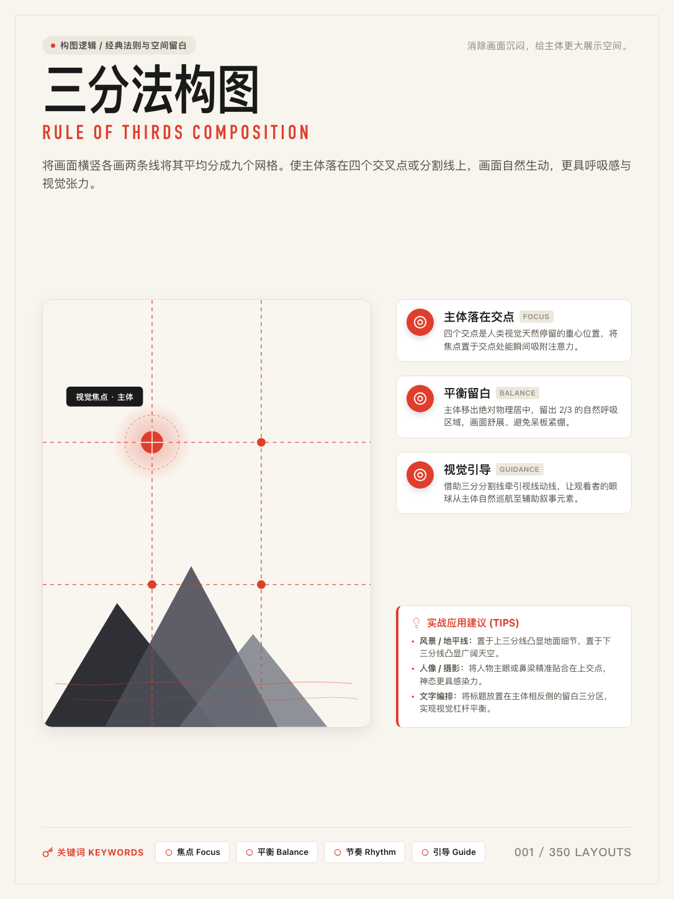
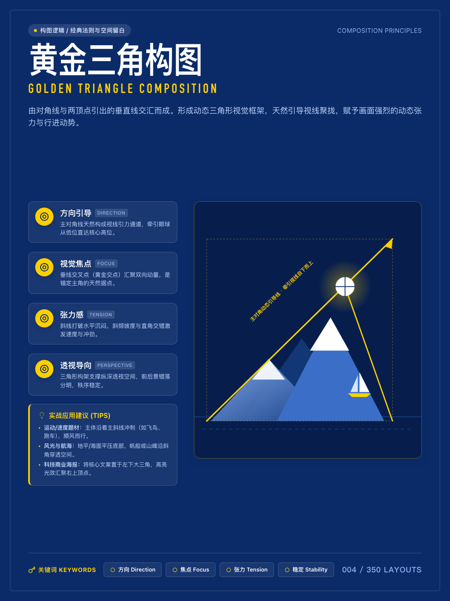

# 350 Layout Architect · 视觉构图与排版全能 Agent 技能

`350-layout-skill` 是一套专为 AI Agent（如 Claude Code, OpenClaw, OpenAI Codex, Cursor 等）打造的**生产级全媒介构图与视觉排版系统**。

基于开源著名的「350 种排版」体系，本项目将其从“静态图鉴”升级为**可计算、可编译、可执行的标准化 Agent 技能**：支持智能构图推荐、AI生图构图约束编译 (Midjourney/Flux)、前端响应式网格生成，并能**离线秒级渲染出 1086 × 1448 印刷级瑞士设计排版海报**。

---

## 一键安装与使用

把下面这段话发给支持 Skills 的 AI Agent：

```text
请安装这个仓库里的全部 Skills：https://github.com/yww520/350-layout-compositions
```

安装后即可直接调用：

```text
Use $layout-350 ...
```

---

## 核心效果展示 (1:1 离线渲染还原)

本技能内置参数化矢量排版引擎与工业级字体排版体系，**无需调用昂贵的外部生图 API，0.5 秒即可在本地导出 1086 × 1448 绝对平直、零乱码的高清海报**：

| 001 三分法构图 (米纸暖红) | 004 黄金三角构图 (深海明黄) |
| :---: | :---: |
|  |  |
| 经典空间留白 · 矢量山峦与焦点雷达 | 动态向量张力 · 折纸雪山与航海帆船 |

---

## 核心能力与工作流

### 1. 智能排版推荐 (Smart Recommendation Gate)
提供文章、文案或主题，Agent 会自动分析信息密度与情绪，**并严格推荐前 3 种最优构图解**供用户选择：
```text
Use $layout-350 recommend layout for this article:
[粘贴你的文章、主题草稿或设计需求]
```

### 2. 秒级渲染排版图鉴卡片 (CLI & Agent Tool)
指定编号秒级生成对应的高清图鉴海报（支持 `warm-ivory`, `forest-green`, `obsidian-black`, `cobalt-blue` 4 种主色盘）：
```bash
# 命令行快速生成
python3 scripts/render-card.py --id 001
python3 scripts/render-card.py --id 004 --theme cobalt-blue
```

### 3. 生图构图约束编译 (AI Image Prompt Directive)
将抽象构图几何直接编译为 Midjourney / Flux.1 的高阶控制提示词，精准锁定主体坐标与负空间：
```text
Use $layout-350 compile prompt for 003 黄金螺旋, 主题: AI 时代的技术奇点
```

### 4. 前端网格代码生成 (Web / UI Code Generation)
将 350 中的现代网格（如 148 Bento Grid）直接编译为响应式 Tailwind CSS 或 CSS Grid 代码：
```text
Use $layout-350 code layout for 148 便当盒网格
```

---

## 覆盖完整的 8 大一级分类体系 (350 种全量索引)

1. **`01 · 构图逻辑 (86 种)`**：经典法则、重心线条、几何形态、空间层叠、前中后景与透视；
2. **`02 · 视觉原则与阅读模式 (45 种)`**：格式塔心理学、层级比例、视线动势、F型/Z型扫描路径；
3. **`03 · 平面、出版与广告 (36 种)`**：分栏网格、跨页对齐、出血线控制、表现型图文排布；
4. **`04 · 字体、网格与东亚文字 (54 种)`**：基线网格、成组分栏、东亚 CJK 汉字排版规范、标点避头尾；
5. **`05 · 网页与 UI 布局 (79 种)`**：Hero 区块、Bento Grid 便当盒、流式卡片、仪表盘、响应式重排；
6. **`06 · 影视画面构图 (14 种)`**：电影画幅比、过肩镜头、机位覆盖、景深调度；
7. **`07 · 中国传统构图 (20 种)`**：三远法（高远、深远、平远）、散点透视、计白当黑留白韵味；
8. **`08 · 演示文稿页面 (16 种)`**：商业发布会与 Keynote/PPT 核心信息骨架。

---

## 仓库工程结构

```text
350-layout-skill/
├── SKILL.md                          # 标准 Agent Skill 描述与执行 SOP
├── agents/openai.yaml                # 接口元数据配置
├── templates/
│   └── card-master.html              # 生产级通用海报渲染母版（支持 4 套主色盘）
├── data/
│   ├── catalog.json                  # 350 个构图索引库（分类、编号、中英名称、标签）
│   └── layouts/                      # 350 个结构化数据 JSON (001.json ~ 350.json)
├── references/
│   ├── intent-router.md              # 智能意图路由字典（根据场景匹配最佳排版）
│   └── blueprints/
│       ├── image-prompt-blueprint.md # 编译给生图模型的构图指令骨架
│       └── web-layout-blueprint.md   # 编译给前端的 CSS Grid 骨架
├── scripts/
│   ├── render-card.py                # 核心渲染 CLI：传入编号秒级导出 PNG/HTML
│   ├── pipeline-extractor.py         # 数据抓取与格式转换管道
│   └── validate-skill.py             # 静态工程完整性校验脚本
└── screenshots/                      # 高清复刻样例效果图
```

---

---

## 350 种构图与排版全量视觉画廊 (Full Visual Gallery)

> 涵盖 8 个一级分类与 33 个二级主题。点击任意示意图可直接打开对应的原生高清大图。

<details open>
<summary><h3>📌 构图逻辑 (86 种)</h3></summary>

#### 经典法则与空间留白 (15 种 · 编号 001–015)

| <a href="https://raw.githubusercontent.com/nevertoday/350-layout-compositions/main/v2/images/01-composition-logic/001-三分法构图.png"></a> | <a href="https://raw.githubusercontent.com/nevertoday/350-layout-compositions/main/v2/images/01-composition-logic/002-黄金比例构图.png"></a> | <a href="https://raw.githubusercontent.com/nevertoday/350-layout-compositions/main/v2/images/01-composition-logic/003-黄金螺旋构图.png"></a> | <a href="https://raw.githubusercontent.com/nevertoday/350-layout-compositions/main/v2/images/01-composition-logic/004-黄金三角构图.png"></a> |
| :---: | :---: | :---: | :---: |
| **001**<br>三分法构图 | **002**<br>黄金比例构图 | **003**<br>黄金螺旋构图 | **004**<br>黄金三角构图 |

| <a href="https://raw.githubusercontent.com/nevertoday/350-layout-compositions/main/v2/images/01-composition-logic/005-对角线法构图.png"></a> | <a href="https://raw.githubusercontent.com/nevertoday/350-layout-compositions/main/v2/images/01-composition-logic/006-矩形折入法构图.png"></a> | <a href="https://raw.githubusercontent.com/nevertoday/350-layout-compositions/main/v2/images/01-composition-logic/007-奇数法则构图.png"></a> | <a href="https://raw.githubusercontent.com/nevertoday/350-layout-compositions/main/v2/images/01-composition-logic/008-空间法则构图.png"></a> |
| :---: | :---: | :---: | :---: |
| **005**<br>对角线法构图 | **006**<br>矩形折入法构图 | **007**<br>奇数法则构图 | **008**<br>空间法则构图 |

| <a href="https://raw.githubusercontent.com/nevertoday/350-layout-compositions/main/v2/images/01-composition-logic/009-视线空间构图.png"></a> | <a href="https://raw.githubusercontent.com/nevertoday/350-layout-compositions/main/v2/images/01-composition-logic/010-运动空间构图.png"></a> | <a href="https://raw.githubusercontent.com/nevertoday/350-layout-compositions/main/v2/images/01-composition-logic/011-头部空间构图.png"></a> | <a href="https://raw.githubusercontent.com/nevertoday/350-layout-compositions/main/v2/images/01-composition-logic/012-填满画面构图.png"></a> |
| :---: | :---: | :---: | :---: |
| **009**<br>视线空间构图 | **010**<br>运动空间构图 | **011**<br>头部空间构图 | **012**<br>填满画面构图 |

| <a href="https://raw.githubusercontent.com/nevertoday/350-layout-compositions/main/v2/images/01-composition-logic/013-负空间构图.png"></a> | <a href="https://raw.githubusercontent.com/nevertoday/350-layout-compositions/main/v2/images/01-composition-logic/014-框中框构图.png"></a> | <a href="https://raw.githubusercontent.com/nevertoday/350-layout-compositions/main/v2/images/01-composition-logic/015-引导线构图.png"></a> | &nbsp; |
| :---: | :---: | :---: | :---: |
| **013**<br>负空间构图 | **014**<br>框中框构图 | **015**<br>引导线构图 | &nbsp; |

#### 重心、线条与轴线 (15 种 · 编号 016–030)

| <a href="https://raw.githubusercontent.com/nevertoday/350-layout-compositions/main/v2/images/01-composition-logic/016-居中构图.png"></a> | <a href="https://raw.githubusercontent.com/nevertoday/350-layout-compositions/main/v2/images/01-composition-logic/017-偏心构图.png"></a> | <a href="https://raw.githubusercontent.com/nevertoday/350-layout-compositions/main/v2/images/01-composition-logic/018-对称构图.png"></a> | <a href="https://raw.githubusercontent.com/nevertoday/350-layout-compositions/main/v2/images/01-composition-logic/019-非对称构图.png"></a> |
| :---: | :---: | :---: | :---: |
| **016**<br>居中构图 | **017**<br>偏心构图 | **018**<br>对称构图 | **019**<br>非对称构图 |

| <a href="https://raw.githubusercontent.com/nevertoday/350-layout-compositions/main/v2/images/01-composition-logic/020-镜像构图.png"></a> | <a href="https://raw.githubusercontent.com/nevertoday/350-layout-compositions/main/v2/images/01-composition-logic/021-水平构图.png"></a> | <a href="https://raw.githubusercontent.com/nevertoday/350-layout-compositions/main/v2/images/01-composition-logic/022-垂直构图.png"></a> | <a href="https://raw.githubusercontent.com/nevertoday/350-layout-compositions/main/v2/images/01-composition-logic/023-对角线构图.png"></a> |
| :---: | :---: | :---: | :---: |
| **020**<br>镜像构图 | **021**<br>水平构图 | **022**<br>垂直构图 | **023**<br>对角线构图 |

| <a href="https://raw.githubusercontent.com/nevertoday/350-layout-compositions/main/v2/images/01-composition-logic/024-平行线构图.png"></a> | <a href="https://raw.githubusercontent.com/nevertoday/350-layout-compositions/main/v2/images/01-composition-logic/025-汇聚线构图.png"></a> | <a href="https://raw.githubusercontent.com/nevertoday/350-layout-compositions/main/v2/images/01-composition-logic/026-交叉线构图.png"></a> | <a href="https://raw.githubusercontent.com/nevertoday/350-layout-compositions/main/v2/images/01-composition-logic/027-中轴构图.png"></a> |
| :---: | :---: | :---: | :---: |
| **024**<br>平行线构图 | **025**<br>汇聚线构图 | **026**<br>交叉线构图 | **027**<br>中轴构图 |

| <a href="https://raw.githubusercontent.com/nevertoday/350-layout-compositions/main/v2/images/01-composition-logic/028-偏轴构图.png"></a> | <a href="https://raw.githubusercontent.com/nevertoday/350-layout-compositions/main/v2/images/01-composition-logic/029-双轴构图.png"></a> | <a href="https://raw.githubusercontent.com/nevertoday/350-layout-compositions/main/v2/images/01-composition-logic/030-十字构图.png"></a> | &nbsp; |
| :---: | :---: | :---: | :---: |
| **028**<br>偏轴构图 | **029**<br>双轴构图 | **030**<br>十字构图 | &nbsp; |

#### 字母形与曲线 (10 种 · 编号 031–040)

| <a href="https://raw.githubusercontent.com/nevertoday/350-layout-compositions/main/v2/images/01-composition-logic/031-X 形构图.png"></a> | <a href="https://raw.githubusercontent.com/nevertoday/350-layout-compositions/main/v2/images/01-composition-logic/032-T 形构图.png"></a> | <a href="https://raw.githubusercontent.com/nevertoday/350-layout-compositions/main/v2/images/01-composition-logic/033-L 形构图.png"></a> | <a href="https://raw.githubusercontent.com/nevertoday/350-layout-compositions/main/v2/images/01-composition-logic/034-V 形构图.png"></a> |
| :---: | :---: | :---: | :---: |
| **031**<br>X 形构图 | **032**<br>T 形构图 | **033**<br>L 形构图 | **034**<br>V 形构图 |

| <a href="https://raw.githubusercontent.com/nevertoday/350-layout-compositions/main/v2/images/01-composition-logic/035-Z 形构图.png"></a> | <a href="https://raw.githubusercontent.com/nevertoday/350-layout-compositions/main/v2/images/01-composition-logic/036-C 形构图.png"></a> | <a href="https://raw.githubusercontent.com/nevertoday/350-layout-compositions/main/v2/images/01-composition-logic/037-S 形构图.png"></a> | <a href="https://raw.githubusercontent.com/nevertoday/350-layout-compositions/main/v2/images/01-composition-logic/038-曲线构图.png"></a> |
| :---: | :---: | :---: | :---: |
| **035**<br>Z 形构图 | **036**<br>C 形构图 | **037**<br>S 形构图 | **038**<br>曲线构图 |

| <a href="https://raw.githubusercontent.com/nevertoday/350-layout-compositions/main/v2/images/01-composition-logic/039-波浪形构图.png"></a> | <a href="https://raw.githubusercontent.com/nevertoday/350-layout-compositions/main/v2/images/01-composition-logic/040-锯齿形构图.png"></a> | &nbsp; | &nbsp; |
| :---: | :---: | :---: | :---: |
| **039**<br>波浪形构图 | **040**<br>锯齿形构图 | &nbsp; | &nbsp; |

#### 几何形与放射结构 (16 种 · 编号 041–056)

| <a href="https://raw.githubusercontent.com/nevertoday/350-layout-compositions/main/v2/images/01-composition-logic/041-三角构图.png"></a> | <a href="https://raw.githubusercontent.com/nevertoday/350-layout-compositions/main/v2/images/01-composition-logic/042-金字塔构图.png"></a> | <a href="https://raw.githubusercontent.com/nevertoday/350-layout-compositions/main/v2/images/01-composition-logic/043-倒三角构图.png"></a> | <a href="https://raw.githubusercontent.com/nevertoday/350-layout-compositions/main/v2/images/01-composition-logic/044-菱形构图.png"></a> |
| :---: | :---: | :---: | :---: |
| **041**<br>三角构图 | **042**<br>金字塔构图 | **043**<br>倒三角构图 | **044**<br>菱形构图 |

| <a href="https://raw.githubusercontent.com/nevertoday/350-layout-compositions/main/v2/images/01-composition-logic/045-方形构图.png"></a> | <a href="https://raw.githubusercontent.com/nevertoday/350-layout-compositions/main/v2/images/01-composition-logic/046-矩形构图.png"></a> | <a href="https://raw.githubusercontent.com/nevertoday/350-layout-compositions/main/v2/images/01-composition-logic/047-圆形构图.png"></a> | <a href="https://raw.githubusercontent.com/nevertoday/350-layout-compositions/main/v2/images/01-composition-logic/048-椭圆构图.png"></a> |
| :---: | :---: | :---: | :---: |
| **045**<br>方形构图 | **046**<br>矩形构图 | **047**<br>圆形构图 | **048**<br>椭圆构图 |

| <a href="https://raw.githubusercontent.com/nevertoday/350-layout-compositions/main/v2/images/01-composition-logic/049-弧形构图.png"></a> | <a href="https://raw.githubusercontent.com/nevertoday/350-layout-compositions/main/v2/images/01-composition-logic/050-环形构图.png"></a> | <a href="https://raw.githubusercontent.com/nevertoday/350-layout-compositions/main/v2/images/01-composition-logic/051-螺旋构图.png"></a> | <a href="https://raw.githubusercontent.com/nevertoday/350-layout-compositions/main/v2/images/01-composition-logic/052-放射式构图.png"></a> |
| :---: | :---: | :---: | :---: |
| **049**<br>弧形构图 | **050**<br>环形构图 | **051**<br>螺旋构图 | **052**<br>放射式构图 |

| <a href="https://raw.githubusercontent.com/nevertoday/350-layout-compositions/main/v2/images/01-composition-logic/053-向心式构图.png"></a> | <a href="https://raw.githubusercontent.com/nevertoday/350-layout-compositions/main/v2/images/01-composition-logic/054-离心式构图.png"></a> | <a href="https://raw.githubusercontent.com/nevertoday/350-layout-compositions/main/v2/images/01-composition-logic/055-同心式构图.png"></a> | <a href="https://raw.githubusercontent.com/nevertoday/350-layout-compositions/main/v2/images/01-composition-logic/056-四象限构图.png"></a> |
| :---: | :---: | :---: | :---: |
| **053**<br>向心式构图 | **054**<br>离心式构图 | **055**<br>同心式构图 | **056**<br>四象限构图 |

#### 阵列、层叠与组群 (8 种 · 编号 057–064)

| <a href="https://raw.githubusercontent.com/nevertoday/350-layout-compositions/main/v2/images/01-composition-logic/057-棋盘构图.png"></a> | <a href="https://raw.githubusercontent.com/nevertoday/350-layout-compositions/main/v2/images/01-composition-logic/058-阶梯构图.png"></a> | <a href="https://raw.githubusercontent.com/nevertoday/350-layout-compositions/main/v2/images/01-composition-logic/059-层叠构图.png"></a> | <a href="https://raw.githubusercontent.com/nevertoday/350-layout-compositions/main/v2/images/01-composition-logic/060-级联构图.png"></a> |
| :---: | :---: | :---: | :---: |
| **057**<br>棋盘构图 | **058**<br>阶梯构图 | **059**<br>层叠构图 | **060**<br>级联构图 |

| <a href="https://raw.githubusercontent.com/nevertoday/350-layout-compositions/main/v2/images/01-composition-logic/061-聚类构图.png"></a> | <a href="https://raw.githubusercontent.com/nevertoday/350-layout-compositions/main/v2/images/01-composition-logic/062-分散构图.png"></a> | <a href="https://raw.githubusercontent.com/nevertoday/350-layout-compositions/main/v2/images/01-composition-logic/063-分支构图.png"></a> | <a href="https://raw.githubusercontent.com/nevertoday/350-layout-compositions/main/v2/images/01-composition-logic/064-网络构图.png"></a> |
| :---: | :---: | :---: | :---: |
| **061**<br>聚类构图 | **062**<br>分散构图 | **063**<br>分支构图 | **064**<br>网络构图 |

#### 空间层次与投影 (12 种 · 编号 065–076)

| <a href="https://raw.githubusercontent.com/nevertoday/350-layout-compositions/main/v2/images/01-composition-logic/065-前中后景构图.png"></a> | <a href="https://raw.githubusercontent.com/nevertoday/350-layout-compositions/main/v2/images/01-composition-logic/066-前景框架构图.png"></a> | <a href="https://raw.githubusercontent.com/nevertoday/350-layout-compositions/main/v2/images/01-composition-logic/067-重叠空间构图.png"></a> | <a href="https://raw.githubusercontent.com/nevertoday/350-layout-compositions/main/v2/images/01-composition-logic/068-尺度递减构图.png"></a> |
| :---: | :---: | :---: | :---: |
| **065**<br>前中后景构图 | **066**<br>前景框架构图 | **067**<br>重叠空间构图 | **068**<br>尺度递减构图 |

| <a href="https://raw.githubusercontent.com/nevertoday/350-layout-compositions/main/v2/images/01-composition-logic/069-线性透视.png"></a> | <a href="https://raw.githubusercontent.com/nevertoday/350-layout-compositions/main/v2/images/01-composition-logic/070-一点透视.png"></a> | <a href="https://raw.githubusercontent.com/nevertoday/350-layout-compositions/main/v2/images/01-composition-logic/071-两点透视.png"></a> | <a href="https://raw.githubusercontent.com/nevertoday/350-layout-compositions/main/v2/images/01-composition-logic/072-三点透视.png"></a> |
| :---: | :---: | :---: | :---: |
| **069**<br>线性透视 | **070**<br>一点透视 | **071**<br>两点透视 | **072**<br>三点透视 |

| <a href="https://raw.githubusercontent.com/nevertoday/350-layout-compositions/main/v2/images/01-composition-logic/073-平行透视构图.png"></a> | <a href="https://raw.githubusercontent.com/nevertoday/350-layout-compositions/main/v2/images/01-composition-logic/074-斜投影构图.png"></a> | <a href="https://raw.githubusercontent.com/nevertoday/350-layout-compositions/main/v2/images/01-composition-logic/075-等距构图.png"></a> | <a href="https://raw.githubusercontent.com/nevertoday/350-layout-compositions/main/v2/images/01-composition-logic/076-轴测构图.png"></a> |
| :---: | :---: | :---: | :---: |
| **073**<br>平行透视构图 | **074**<br>斜投影构图 | **075**<br>等距构图 | **076**<br>轴测构图 |

#### 视点、景深与空间感 (10 种 · 编号 077–086)

| <a href="https://raw.githubusercontent.com/nevertoday/350-layout-compositions/main/v2/images/01-composition-logic/077-鸟瞰构图.png"></a> | <a href="https://raw.githubusercontent.com/nevertoday/350-layout-compositions/main/v2/images/01-composition-logic/078-虫视构图.png"></a> | <a href="https://raw.githubusercontent.com/nevertoday/350-layout-compositions/main/v2/images/01-composition-logic/079-顶视构图.png"></a> | <a href="https://raw.githubusercontent.com/nevertoday/350-layout-compositions/main/v2/images/01-composition-logic/080-平视构图.png"></a> |
| :---: | :---: | :---: | :---: |
| **077**<br>鸟瞰构图 | **078**<br>虫视构图 | **079**<br>顶视构图 | **080**<br>平视构图 |

| <a href="https://raw.githubusercontent.com/nevertoday/350-layout-compositions/main/v2/images/01-composition-logic/081-强制透视构图.png"></a> | <a href="https://raw.githubusercontent.com/nevertoday/350-layout-compositions/main/v2/images/01-composition-logic/082-空气透视构图.png"></a> | <a href="https://raw.githubusercontent.com/nevertoday/350-layout-compositions/main/v2/images/01-composition-logic/083-浅景深构图.png"></a> | <a href="https://raw.githubusercontent.com/nevertoday/350-layout-compositions/main/v2/images/01-composition-logic/084-深焦构图.png"></a> |
| :---: | :---: | :---: | :---: |
| **081**<br>强制透视构图 | **082**<br>空气透视构图 | **083**<br>浅景深构图 | **084**<br>深焦构图 |

| <a href="https://raw.githubusercontent.com/nevertoday/350-layout-compositions/main/v2/images/01-composition-logic/085-平面化构图.png"></a> | <a href="https://raw.githubusercontent.com/nevertoday/350-layout-compositions/main/v2/images/01-composition-logic/086-深空间构图.png"></a> | &nbsp; | &nbsp; |
| :---: | :---: | :---: | :---: |
| **085**<br>平面化构图 | **086**<br>深空间构图 | &nbsp; | &nbsp; |

</details>
<br>

<details open>
<summary><h3>📌 视觉原则与阅读模式 (45 种)</h3></summary>

#### 平衡、动势与焦点 (8 种 · 编号 087–094)

| <a href="https://raw.githubusercontent.com/nevertoday/350-layout-compositions/main/v2/images/02-visual-principles/087-放射平衡原则.png"></a> | <a href="https://raw.githubusercontent.com/nevertoday/350-layout-compositions/main/v2/images/02-visual-principles/088-晶体式平衡原则.png"></a> | <a href="https://raw.githubusercontent.com/nevertoday/350-layout-compositions/main/v2/images/02-visual-principles/089-静态构图.png"></a> | <a href="https://raw.githubusercontent.com/nevertoday/350-layout-compositions/main/v2/images/02-visual-principles/090-动态构图.png"></a> |
| :---: | :---: | :---: | :---: |
| **087**<br>放射平衡原则 | **088**<br>晶体式平衡原则 | **089**<br>静态构图 | **090**<br>动态构图 |

| <a href="https://raw.githubusercontent.com/nevertoday/350-layout-compositions/main/v2/images/02-visual-principles/091-开放式构图.png"></a> | <a href="https://raw.githubusercontent.com/nevertoday/350-layout-compositions/main/v2/images/02-visual-principles/092-封闭式构图.png"></a> | <a href="https://raw.githubusercontent.com/nevertoday/350-layout-compositions/main/v2/images/02-visual-principles/093-单一焦点构图.png"></a> | <a href="https://raw.githubusercontent.com/nevertoday/350-layout-compositions/main/v2/images/02-visual-principles/094-多重焦点构图.png"></a> |
| :---: | :---: | :---: | :---: |
| **091**<br>开放式构图 | **092**<br>封闭式构图 | **093**<br>单一焦点构图 | **094**<br>多重焦点构图 |

#### 层级、比例与对比 (12 种 · 编号 095–106)

| <a href="https://raw.githubusercontent.com/nevertoday/350-layout-compositions/main/v2/images/02-visual-principles/095-视觉层级原则.png"></a> | <a href="https://raw.githubusercontent.com/nevertoday/350-layout-compositions/main/v2/images/02-visual-principles/096-主次关系原则.png"></a> | <a href="https://raw.githubusercontent.com/nevertoday/350-layout-compositions/main/v2/images/02-visual-principles/097-平衡原则.png"></a> | <a href="https://raw.githubusercontent.com/nevertoday/350-layout-compositions/main/v2/images/02-visual-principles/098-比例原则.png"></a> |
| :---: | :---: | :---: | :---: |
| **095**<br>视觉层级原则 | **096**<br>主次关系原则 | **097**<br>平衡原则 | **098**<br>比例原则 |

| <a href="https://raw.githubusercontent.com/nevertoday/350-layout-compositions/main/v2/images/02-visual-principles/099-尺度对比原则.png"></a> | <a href="https://raw.githubusercontent.com/nevertoday/350-layout-compositions/main/v2/images/02-visual-principles/100-明暗对比原则.png"></a> | <a href="https://raw.githubusercontent.com/nevertoday/350-layout-compositions/main/v2/images/02-visual-principles/101-色彩对比原则.png"></a> | <a href="https://raw.githubusercontent.com/nevertoday/350-layout-compositions/main/v2/images/02-visual-principles/102-形状对比原则.png"></a> |
| :---: | :---: | :---: | :---: |
| **099**<br>尺度对比原则 | **100**<br>明暗对比原则 | **101**<br>色彩对比原则 | **102**<br>形状对比原则 |

| <a href="https://raw.githubusercontent.com/nevertoday/350-layout-compositions/main/v2/images/02-visual-principles/103-质感对比原则.png"></a> | <a href="https://raw.githubusercontent.com/nevertoday/350-layout-compositions/main/v2/images/02-visual-principles/104-动静对比原则.png"></a> | <a href="https://raw.githubusercontent.com/nevertoday/350-layout-compositions/main/v2/images/02-visual-principles/105-并置原则.png"></a> | <a href="https://raw.githubusercontent.com/nevertoday/350-layout-compositions/main/v2/images/02-visual-principles/106-隔离原则.png"></a> |
| :---: | :---: | :---: | :---: |
| **103**<br>质感对比原则 | **104**<br>动静对比原则 | **105**<br>并置原则 | **106**<br>隔离原则 |

#### 重复、图案与节奏 (8 种 · 编号 107–114)

| <a href="https://raw.githubusercontent.com/nevertoday/350-layout-compositions/main/v2/images/02-visual-principles/107-重复原则.png"></a> | <a href="https://raw.githubusercontent.com/nevertoday/350-layout-compositions/main/v2/images/02-visual-principles/108-图案组织.png"></a> | <a href="https://raw.githubusercontent.com/nevertoday/350-layout-compositions/main/v2/images/02-visual-principles/109-节奏组织.png"></a> | <a href="https://raw.githubusercontent.com/nevertoday/350-layout-compositions/main/v2/images/02-visual-principles/110-渐变组织.png"></a> |
| :---: | :---: | :---: | :---: |
| **107**<br>重复原则 | **108**<br>图案组织 | **109**<br>节奏组织 | **110**<br>渐变组织 |

| <a href="https://raw.githubusercontent.com/nevertoday/350-layout-compositions/main/v2/images/02-visual-principles/111-交替节奏组织.png"></a> | <a href="https://raw.githubusercontent.com/nevertoday/350-layout-compositions/main/v2/images/02-visual-principles/112-渐进节奏组织.png"></a> | <a href="https://raw.githubusercontent.com/nevertoday/350-layout-compositions/main/v2/images/02-visual-principles/113-流动节奏组织.png"></a> | <a href="https://raw.githubusercontent.com/nevertoday/350-layout-compositions/main/v2/images/02-visual-principles/114-随机节奏组织.png"></a> |
| :---: | :---: | :---: | :---: |
| **111**<br>交替节奏组织 | **112**<br>渐进节奏组织 | **113**<br>流动节奏组织 | **114**<br>随机节奏组织 |

#### 格式塔与组群 (12 种 · 编号 115–126)

| <a href="https://raw.githubusercontent.com/nevertoday/350-layout-compositions/main/v2/images/02-visual-principles/115-相似性原则.png"></a> | <a href="https://raw.githubusercontent.com/nevertoday/350-layout-compositions/main/v2/images/02-visual-principles/116-邻近性原则.png"></a> | <a href="https://raw.githubusercontent.com/nevertoday/350-layout-compositions/main/v2/images/02-visual-principles/117-连续性原则.png"></a> | <a href="https://raw.githubusercontent.com/nevertoday/350-layout-compositions/main/v2/images/02-visual-principles/118-闭合性原则.png"></a> |
| :---: | :---: | :---: | :---: |
| **115**<br>相似性原则 | **116**<br>邻近性原则 | **117**<br>连续性原则 | **118**<br>闭合性原则 |

| <a href="https://raw.githubusercontent.com/nevertoday/350-layout-compositions/main/v2/images/02-visual-principles/119-图底关系原则.png"></a> | <a href="https://raw.githubusercontent.com/nevertoday/350-layout-compositions/main/v2/images/02-visual-principles/120-共同区域原则.png"></a> | <a href="https://raw.githubusercontent.com/nevertoday/350-layout-compositions/main/v2/images/02-visual-principles/121-共同命运原则.png"></a> | <a href="https://raw.githubusercontent.com/nevertoday/350-layout-compositions/main/v2/images/02-visual-principles/122-简化构图原则.png"></a> |
| :---: | :---: | :---: | :---: |
| **119**<br>图底关系原则 | **120**<br>共同区域原则 | **121**<br>共同命运原则 | **122**<br>简化构图原则 |

| <a href="https://raw.githubusercontent.com/nevertoday/350-layout-compositions/main/v2/images/02-visual-principles/123-裁切构图.png"></a> | <a href="https://raw.githubusercontent.com/nevertoday/350-layout-compositions/main/v2/images/02-visual-principles/124-满幅构图.png"></a> | <a href="https://raw.githubusercontent.com/nevertoday/350-layout-compositions/main/v2/images/02-visual-principles/125-疏密对比原则.png"></a> | <a href="https://raw.githubusercontent.com/nevertoday/350-layout-compositions/main/v2/images/02-visual-principles/126-群组构图.png"></a> |
| :---: | :---: | :---: | :---: |
| **123**<br>裁切构图 | **124**<br>满幅构图 | **125**<br>疏密对比原则 | **126**<br>群组构图 |

#### 页面阅读模式 (5 种 · 编号 127–131)

| <a href="https://raw.githubusercontent.com/nevertoday/350-layout-compositions/main/v2/images/02-visual-principles/127-F 型扫描模式.png"></a> | <a href="https://raw.githubusercontent.com/nevertoday/350-layout-compositions/main/v2/images/02-visual-principles/128-Z 型扫描模式.png"></a> | <a href="https://raw.githubusercontent.com/nevertoday/350-layout-compositions/main/v2/images/02-visual-principles/129-古腾堡图式.png"></a> | <a href="https://raw.githubusercontent.com/nevertoday/350-layout-compositions/main/v2/images/02-visual-principles/130-层蛋糕扫描模式.png"></a> |
| :---: | :---: | :---: | :---: |
| **127**<br>F 型扫描模式 | **128**<br>Z 型扫描模式 | **129**<br>古腾堡图式 | **130**<br>层蛋糕扫描模式 |

| <a href="https://raw.githubusercontent.com/nevertoday/350-layout-compositions/main/v2/images/02-visual-principles/131-斑点扫描模式.png"></a> | &nbsp; | &nbsp; | &nbsp; |
| :---: | :---: | :---: | :---: |
| **131**<br>斑点扫描模式 | &nbsp; | &nbsp; | &nbsp; |

</details>
<br>

<details open>
<summary><h3>📌 平面、出版与广告 (36 种)</h3></summary>

#### 分栏、跨页与出血 (8 种 · 编号 132–139)

| <a href="https://raw.githubusercontent.com/nevertoday/350-layout-compositions/main/v2/images/03-editorial-advertising/132-单栏版式.png"></a> | <a href="https://raw.githubusercontent.com/nevertoday/350-layout-compositions/main/v2/images/03-editorial-advertising/133-双栏版式.png"></a> | <a href="https://raw.githubusercontent.com/nevertoday/350-layout-compositions/main/v2/images/03-editorial-advertising/134-多栏版式.png"></a> | <a href="https://raw.githubusercontent.com/nevertoday/350-layout-compositions/main/v2/images/03-editorial-advertising/135-对称跨页.png"></a> |
| :---: | :---: | :---: | :---: |
| **132**<br>单栏版式 | **133**<br>双栏版式 | **134**<br>多栏版式 | **135**<br>对称跨页 |

| <a href="https://raw.githubusercontent.com/nevertoday/350-layout-compositions/main/v2/images/03-editorial-advertising/136-非对称跨页.png"></a> | <a href="https://raw.githubusercontent.com/nevertoday/350-layout-compositions/main/v2/images/03-editorial-advertising/137-通版跨页.png"></a> | <a href="https://raw.githubusercontent.com/nevertoday/350-layout-compositions/main/v2/images/03-editorial-advertising/138-满出血版式.png"></a> | <a href="https://raw.githubusercontent.com/nevertoday/350-layout-compositions/main/v2/images/03-editorial-advertising/139-无出血版式.png"></a> |
| :---: | :---: | :---: | :---: |
| **136**<br>非对称跨页 | **137**<br>通版跨页 | **138**<br>满出血版式 | **139**<br>无出血版式 |

#### 图文主导与表现型版式 (13 种 · 编号 140–152)

| <a href="https://raw.githubusercontent.com/nevertoday/350-layout-compositions/main/v2/images/03-editorial-advertising/140-图片主导版式.png"></a> | <a href="https://raw.githubusercontent.com/nevertoday/350-layout-compositions/main/v2/images/03-editorial-advertising/141-文字主导版式.png"></a> | <a href="https://raw.githubusercontent.com/nevertoday/350-layout-compositions/main/v2/images/03-editorial-advertising/142-大标题版式.png"></a> | <a href="https://raw.githubusercontent.com/nevertoday/350-layout-compositions/main/v2/images/03-editorial-advertising/143-图片窗口版式.png"></a> |
| :---: | :---: | :---: | :---: |
| **140**<br>图片主导版式 | **141**<br>文字主导版式 | **142**<br>大标题版式 | **143**<br>图片窗口版式 |

| <a href="https://raw.githubusercontent.com/nevertoday/350-layout-compositions/main/v2/images/03-editorial-advertising/144-框架版式.png"></a> | <a href="https://raw.githubusercontent.com/nevertoday/350-layout-compositions/main/v2/images/03-editorial-advertising/145-多面板版式.png"></a> | <a href="https://raw.githubusercontent.com/nevertoday/350-layout-compositions/main/v2/images/03-editorial-advertising/146-蒙德里安版式.png"></a> | <a href="https://raw.githubusercontent.com/nevertoday/350-layout-compositions/main/v2/images/03-editorial-advertising/147-马戏团版式.png"></a> |
| :---: | :---: | :---: | :---: |
| **144**<br>框架版式 | **145**<br>多面板版式 | **146**<br>蒙德里安版式 | **147**<br>马戏团版式 |

| <a href="https://raw.githubusercontent.com/nevertoday/350-layout-compositions/main/v2/images/03-editorial-advertising/148-剪影版式.png"></a> | <a href="https://raw.githubusercontent.com/nevertoday/350-layout-compositions/main/v2/images/03-editorial-advertising/149-字母造型版式.png"></a> | <a href="https://raw.githubusercontent.com/nevertoday/350-layout-compositions/main/v2/images/03-editorial-advertising/150-图文谜语版式.png"></a> | <a href="https://raw.githubusercontent.com/nevertoday/350-layout-compositions/main/v2/images/03-editorial-advertising/151-拼贴版式.png"></a> |
| :---: | :---: | :---: | :---: |
| **148**<br>剪影版式 | **149**<br>字母造型版式 | **150**<br>图文谜语版式 | **151**<br>拼贴版式 |

| <a href="https://raw.githubusercontent.com/nevertoday/350-layout-compositions/main/v2/images/03-editorial-advertising/152-蒙太奇版式.png"></a> | &nbsp; | &nbsp; | &nbsp; |
| :---: | :---: | :---: | :---: |
| **152**<br>蒙太奇版式 | &nbsp; | &nbsp; | &nbsp; |

#### 模块、侧栏与图文关系 (7 种 · 编号 153–159)

| <a href="https://raw.githubusercontent.com/nevertoday/350-layout-compositions/main/v2/images/03-editorial-advertising/153-模块化页面.png"></a> | <a href="https://raw.githubusercontent.com/nevertoday/350-layout-compositions/main/v2/images/03-editorial-advertising/154-区块式版式.png"></a> | <a href="https://raw.githubusercontent.com/nevertoday/350-layout-compositions/main/v2/images/03-editorial-advertising/155-插页式版式.png"></a> | <a href="https://raw.githubusercontent.com/nevertoday/350-layout-compositions/main/v2/images/03-editorial-advertising/156-侧栏版式.png"></a> |
| :---: | :---: | :---: | :---: |
| **153**<br>模块化页面 | **154**<br>区块式版式 | **155**<br>插页式版式 | **156**<br>侧栏版式 |

| <a href="https://raw.githubusercontent.com/nevertoday/350-layout-compositions/main/v2/images/03-editorial-advertising/157-边注版式.png"></a> | <a href="https://raw.githubusercontent.com/nevertoday/350-layout-compositions/main/v2/images/03-editorial-advertising/158-环绕图版式.png"></a> | <a href="https://raw.githubusercontent.com/nevertoday/350-layout-compositions/main/v2/images/03-editorial-advertising/159-浮动块版式.png"></a> | &nbsp; |
| :---: | :---: | :---: | :---: |
| **157**<br>边注版式 | **158**<br>环绕图版式 | **159**<br>浮动块版式 | &nbsp; |

#### 出版功能页面 (8 种 · 编号 160–167)

| <a href="https://raw.githubusercontent.com/nevertoday/350-layout-compositions/main/v2/images/03-editorial-advertising/160-封面版式.png"></a> | <a href="https://raw.githubusercontent.com/nevertoday/350-layout-compositions/main/v2/images/03-editorial-advertising/161-章节扉页.png"></a> | <a href="https://raw.githubusercontent.com/nevertoday/350-layout-compositions/main/v2/images/03-editorial-advertising/162-栏目开启页.png"></a> | <a href="https://raw.githubusercontent.com/nevertoday/350-layout-compositions/main/v2/images/03-editorial-advertising/163-特写跨页.png"></a> |
| :---: | :---: | :---: | :---: |
| **160**<br>封面版式 | **161**<br>章节扉页 | **162**<br>栏目开启页 | **163**<br>特写跨页 |

| <a href="https://raw.githubusercontent.com/nevertoday/350-layout-compositions/main/v2/images/03-editorial-advertising/164-目录版式.png"></a> | <a href="https://raw.githubusercontent.com/nevertoday/350-layout-compositions/main/v2/images/03-editorial-advertising/165-索引版式.png"></a> | <a href="https://raw.githubusercontent.com/nevertoday/350-layout-compositions/main/v2/images/03-editorial-advertising/166-图录版式.png"></a> | <a href="https://raw.githubusercontent.com/nevertoday/350-layout-compositions/main/v2/images/03-editorial-advertising/167-引语主导版式.png"></a> |
| :---: | :---: | :---: | :---: |
| **164**<br>目录版式 | **165**<br>索引版式 | **166**<br>图录版式 | **167**<br>引语主导版式 |

</details>
<br>

<details open>
<summary><h3>📌 字体、网格与东亚文字 (54 种)</h3></summary>

#### 字体组织系统 (8 种 · 编号 168–175)

| <a href="https://raw.githubusercontent.com/nevertoday/350-layout-compositions/main/v2/images/04-type-grid-cjk/168-轴线系统.png"></a> | <a href="https://raw.githubusercontent.com/nevertoday/350-layout-compositions/main/v2/images/04-type-grid-cjk/169-放射系统.png"></a> | <a href="https://raw.githubusercontent.com/nevertoday/350-layout-compositions/main/v2/images/04-type-grid-cjk/170-扩张系统.png"></a> | <a href="https://raw.githubusercontent.com/nevertoday/350-layout-compositions/main/v2/images/04-type-grid-cjk/171-随机系统.png"></a> |
| :---: | :---: | :---: | :---: |
| **168**<br>轴线系统 | **169**<br>放射系统 | **170**<br>扩张系统 | **171**<br>随机系统 |

| <a href="https://raw.githubusercontent.com/nevertoday/350-layout-compositions/main/v2/images/04-type-grid-cjk/172-网格系统.png"></a> | <a href="https://raw.githubusercontent.com/nevertoday/350-layout-compositions/main/v2/images/04-type-grid-cjk/173-模块系统.png"></a> | <a href="https://raw.githubusercontent.com/nevertoday/350-layout-compositions/main/v2/images/04-type-grid-cjk/174-过渡系统.png"></a> | <a href="https://raw.githubusercontent.com/nevertoday/350-layout-compositions/main/v2/images/04-type-grid-cjk/175-双边系统.png"></a> |
| :---: | :---: | :---: | :---: |
| **172**<br>网格系统 | **173**<br>模块系统 | **174**<br>过渡系统 | **175**<br>双边系统 |

#### 对齐、缩进与文字造型 (18 种 · 编号 176–193)

| <a href="https://raw.githubusercontent.com/nevertoday/350-layout-compositions/main/v2/images/04-type-grid-cjk/176-左对齐右参差.png"></a> | <a href="https://raw.githubusercontent.com/nevertoday/350-layout-compositions/main/v2/images/04-type-grid-cjk/177-右对齐左参差.png"></a> | <a href="https://raw.githubusercontent.com/nevertoday/350-layout-compositions/main/v2/images/04-type-grid-cjk/178-居中排版.png"></a> | <a href="https://raw.githubusercontent.com/nevertoday/350-layout-compositions/main/v2/images/04-type-grid-cjk/179-两端对齐.png"></a> |
| :---: | :---: | :---: | :---: |
| **176**<br>左对齐右参差 | **177**<br>右对齐左参差 | **178**<br>居中排版 | **179**<br>两端对齐 |

| <a href="https://raw.githubusercontent.com/nevertoday/350-layout-compositions/main/v2/images/04-type-grid-cjk/180-强制两端对齐.png"></a> | <a href="https://raw.githubusercontent.com/nevertoday/350-layout-compositions/main/v2/images/04-type-grid-cjk/181-非对称字体排版.png"></a> | <a href="https://raw.githubusercontent.com/nevertoday/350-layout-compositions/main/v2/images/04-type-grid-cjk/182-轮廓绕排.png"></a> | <a href="https://raw.githubusercontent.com/nevertoday/350-layout-compositions/main/v2/images/04-type-grid-cjk/183-矩形绕排.png"></a> |
| :---: | :---: | :---: | :---: |
| **180**<br>强制两端对齐 | **181**<br>非对称字体排版 | **182**<br>轮廓绕排 | **183**<br>矩形绕排 |

| <a href="https://raw.githubusercontent.com/nevertoday/350-layout-compositions/main/v2/images/04-type-grid-cjk/184-跨栏标题.png"></a> | <a href="https://raw.githubusercontent.com/nevertoday/350-layout-compositions/main/v2/images/04-type-grid-cjk/185-悬挂缩进.png"></a> | <a href="https://raw.githubusercontent.com/nevertoday/350-layout-compositions/main/v2/images/04-type-grid-cjk/186-首行缩进.png"></a> | <a href="https://raw.githubusercontent.com/nevertoday/350-layout-compositions/main/v2/images/04-type-grid-cjk/187-凸排标点.png"></a> |
| :---: | :---: | :---: | :---: |
| **184**<br>跨栏标题 | **185**<br>悬挂缩进 | **186**<br>首行缩进 | **187**<br>凸排标点 |

| <a href="https://raw.githubusercontent.com/nevertoday/350-layout-compositions/main/v2/images/04-type-grid-cjk/188-基线对齐.png"></a> | <a href="https://raw.githubusercontent.com/nevertoday/350-layout-compositions/main/v2/images/04-type-grid-cjk/189-形状文字.png"></a> | <a href="https://raw.githubusercontent.com/nevertoday/350-layout-compositions/main/v2/images/04-type-grid-cjk/190-图形诗排版.png"></a> | <a href="https://raw.githubusercontent.com/nevertoday/350-layout-compositions/main/v2/images/04-type-grid-cjk/191-路径文字.png"></a> |
| :---: | :---: | :---: | :---: |
| **188**<br>基线对齐 | **189**<br>形状文字 | **190**<br>图形诗排版 | **191**<br>路径文字 |

| <a href="https://raw.githubusercontent.com/nevertoday/350-layout-compositions/main/v2/images/04-type-grid-cjk/192-垂直文字排版.png"></a> | <a href="https://raw.githubusercontent.com/nevertoday/350-layout-compositions/main/v2/images/04-type-grid-cjk/193-水平文字排版.png"></a> | &nbsp; | &nbsp; |
| :---: | :---: | :---: | :---: |
| **192**<br>垂直文字排版 | **193**<br>水平文字排版 | &nbsp; | &nbsp; |

#### 网格系统 (18 种 · 编号 194–211)

| <a href="https://raw.githubusercontent.com/nevertoday/350-layout-compositions/main/v2/images/04-type-grid-cjk/194-手稿网格.png"></a> | <a href="https://raw.githubusercontent.com/nevertoday/350-layout-compositions/main/v2/images/04-type-grid-cjk/195-分栏网格.png"></a> | <a href="https://raw.githubusercontent.com/nevertoday/350-layout-compositions/main/v2/images/04-type-grid-cjk/196-模块化网格.png"></a> | <a href="https://raw.githubusercontent.com/nevertoday/350-layout-compositions/main/v2/images/04-type-grid-cjk/197-层级网格.png"></a> |
| :---: | :---: | :---: | :---: |
| **194**<br>手稿网格 | **195**<br>分栏网格 | **196**<br>模块化网格 | **197**<br>层级网格 |

| <a href="https://raw.githubusercontent.com/nevertoday/350-layout-compositions/main/v2/images/04-type-grid-cjk/198-基线网格.png"></a> | <a href="https://raw.githubusercontent.com/nevertoday/350-layout-compositions/main/v2/images/04-type-grid-cjk/199-复合网格.png"></a> | <a href="https://raw.githubusercontent.com/nevertoday/350-layout-compositions/main/v2/images/04-type-grid-cjk/200-非对称网格.png"></a> | <a href="https://raw.githubusercontent.com/nevertoday/350-layout-compositions/main/v2/images/04-type-grid-cjk/201-方格网格.png"></a> |
| :---: | :---: | :---: | :---: |
| **198**<br>基线网格 | **199**<br>复合网格 | **200**<br>非对称网格 | **201**<br>方格网格 |

| <a href="https://raw.githubusercontent.com/nevertoday/350-layout-compositions/main/v2/images/04-type-grid-cjk/202-等距网格.png"></a> | <a href="https://raw.githubusercontent.com/nevertoday/350-layout-compositions/main/v2/images/04-type-grid-cjk/203-放射网格.png"></a> | <a href="https://raw.githubusercontent.com/nevertoday/350-layout-compositions/main/v2/images/04-type-grid-cjk/204-极坐标网格.png"></a> | <a href="https://raw.githubusercontent.com/nevertoday/350-layout-compositions/main/v2/images/04-type-grid-cjk/205-嵌套网格.png"></a> |
| :---: | :---: | :---: | :---: |
| **202**<br>等距网格 | **203**<br>放射网格 | **204**<br>极坐标网格 | **205**<br>嵌套网格 |

| <a href="https://raw.githubusercontent.com/nevertoday/350-layout-compositions/main/v2/images/04-type-grid-cjk/206-子网格.png"></a> | <a href="https://raw.githubusercontent.com/nevertoday/350-layout-compositions/main/v2/images/04-type-grid-cjk/207-固定网格.png"></a> | <a href="https://raw.githubusercontent.com/nevertoday/350-layout-compositions/main/v2/images/04-type-grid-cjk/208-流体网格.png"></a> | <a href="https://raw.githubusercontent.com/nevertoday/350-layout-compositions/main/v2/images/04-type-grid-cjk/209-响应式网格.png"></a> |
| :---: | :---: | :---: | :---: |
| **206**<br>子网格 | **207**<br>固定网格 | **208**<br>流体网格 | **209**<br>响应式网格 |

| <a href="https://raw.githubusercontent.com/nevertoday/350-layout-compositions/main/v2/images/04-type-grid-cjk/210-破格网格.png"></a> | <a href="https://raw.githubusercontent.com/nevertoday/350-layout-compositions/main/v2/images/04-type-grid-cjk/211-解构网格.png"></a> | &nbsp; | &nbsp; |
| :---: | :---: | :---: | :---: |
| **210**<br>破格网格 | **211**<br>解构网格 | &nbsp; | &nbsp; |

#### 东亚文字与混排 (10 种 · 编号 212–221)

| <a href="https://raw.githubusercontent.com/nevertoday/350-layout-compositions/main/v2/images/04-type-grid-cjk/212-横排左起.png"></a> | <a href="https://raw.githubusercontent.com/nevertoday/350-layout-compositions/main/v2/images/04-type-grid-cjk/213-横排右起.png"></a> | <a href="https://raw.githubusercontent.com/nevertoday/350-layout-compositions/main/v2/images/04-type-grid-cjk/214-直排右起.png"></a> | <a href="https://raw.githubusercontent.com/nevertoday/350-layout-compositions/main/v2/images/04-type-grid-cjk/215-直排左起.png"></a> |
| :---: | :---: | :---: | :---: |
| **212**<br>横排左起 | **213**<br>横排右起 | **214**<br>直排右起 | **215**<br>直排左起 |

| <a href="https://raw.githubusercontent.com/nevertoday/350-layout-compositions/main/v2/images/04-type-grid-cjk/216-横直混排.png"></a> | <a href="https://raw.githubusercontent.com/nevertoday/350-layout-compositions/main/v2/images/04-type-grid-cjk/217-纵中横排.png"></a> | <a href="https://raw.githubusercontent.com/nevertoday/350-layout-compositions/main/v2/images/04-type-grid-cjk/218-直排中西文转向.png"></a> | <a href="https://raw.githubusercontent.com/nevertoday/350-layout-compositions/main/v2/images/04-type-grid-cjk/219-直排中西文直立.png"></a> |
| :---: | :---: | :---: | :---: |
| **216**<br>横直混排 | **217**<br>纵中横排 | **218**<br>直排中西文转向 | **219**<br>直排中西文直立 |

| <a href="https://raw.githubusercontent.com/nevertoday/350-layout-compositions/main/v2/images/04-type-grid-cjk/220-双向文字排版.png"></a> | <a href="https://raw.githubusercontent.com/nevertoday/350-layout-compositions/main/v2/images/04-type-grid-cjk/221-旁注（Ruby）排版.png"></a> | &nbsp; | &nbsp; |
| :---: | :---: | :---: | :---: |
| **220**<br>双向文字排版 | **221**<br>旁注（Ruby）排版 | &nbsp; | &nbsp; |

</details>
<br>

<details open>
<summary><h3>📌 网页与 UI (79 种)</h3></summary>

#### CSS 流、定位与响应 (21 种 · 编号 222–242)

| <a href="https://raw.githubusercontent.com/nevertoday/350-layout-compositions/main/v2/images/05-web-ui/222-普通流布局.png"></a> | <a href="https://raw.githubusercontent.com/nevertoday/350-layout-compositions/main/v2/images/05-web-ui/223-块级布局.png"></a> | <a href="https://raw.githubusercontent.com/nevertoday/350-layout-compositions/main/v2/images/05-web-ui/224-行内布局.png"></a> | <a href="https://raw.githubusercontent.com/nevertoday/350-layout-compositions/main/v2/images/05-web-ui/225-流根布局.png"></a> |
| :---: | :---: | :---: | :---: |
| **222**<br>普通流布局 | **223**<br>块级布局 | **224**<br>行内布局 | **225**<br>流根布局 |

| <a href="https://raw.githubusercontent.com/nevertoday/350-layout-compositions/main/v2/images/05-web-ui/226-弹性盒布局.png"></a> | <a href="https://raw.githubusercontent.com/nevertoday/350-layout-compositions/main/v2/images/05-web-ui/227-网格布局.png"></a> | <a href="https://raw.githubusercontent.com/nevertoday/350-layout-compositions/main/v2/images/05-web-ui/228-子网格布局.png"></a> | <a href="https://raw.githubusercontent.com/nevertoday/350-layout-compositions/main/v2/images/05-web-ui/229-多栏布局.png"></a> |
| :---: | :---: | :---: | :---: |
| **226**<br>弹性盒布局 | **227**<br>网格布局 | **228**<br>子网格布局 | **229**<br>多栏布局 |

| <a href="https://raw.githubusercontent.com/nevertoday/350-layout-compositions/main/v2/images/05-web-ui/230-表格布局.png"></a> | <a href="https://raw.githubusercontent.com/nevertoday/350-layout-compositions/main/v2/images/05-web-ui/231-浮动布局.png"></a> | <a href="https://raw.githubusercontent.com/nevertoday/350-layout-compositions/main/v2/images/05-web-ui/232-相对定位布局.png"></a> | <a href="https://raw.githubusercontent.com/nevertoday/350-layout-compositions/main/v2/images/05-web-ui/233-绝对定位布局.png"></a> |
| :---: | :---: | :---: | :---: |
| **230**<br>表格布局 | **231**<br>浮动布局 | **232**<br>相对定位布局 | **233**<br>绝对定位布局 |

| <a href="https://raw.githubusercontent.com/nevertoday/350-layout-compositions/main/v2/images/05-web-ui/234-固定定位布局.png"></a> | <a href="https://raw.githubusercontent.com/nevertoday/350-layout-compositions/main/v2/images/05-web-ui/235-粘性定位布局.png"></a> | <a href="https://raw.githubusercontent.com/nevertoday/350-layout-compositions/main/v2/images/05-web-ui/236-瀑布流布局.png"></a> | <a href="https://raw.githubusercontent.com/nevertoday/350-layout-compositions/main/v2/images/05-web-ui/237-覆盖布局.png"></a> |
| :---: | :---: | :---: | :---: |
| **234**<br>固定定位布局 | **235**<br>粘性定位布局 | **236**<br>瀑布流布局 | **237**<br>覆盖布局 |

| <a href="https://raw.githubusercontent.com/nevertoday/350-layout-compositions/main/v2/images/05-web-ui/238-固定宽度布局.png"></a> | <a href="https://raw.githubusercontent.com/nevertoday/350-layout-compositions/main/v2/images/05-web-ui/239-流体布局.png"></a> | <a href="https://raw.githubusercontent.com/nevertoday/350-layout-compositions/main/v2/images/05-web-ui/240-响应式布局.png"></a> | <a href="https://raw.githubusercontent.com/nevertoday/350-layout-compositions/main/v2/images/05-web-ui/241-自适应布局.png"></a> |
| :---: | :---: | :---: | :---: |
| **238**<br>固定宽度布局 | **239**<br>流体布局 | **240**<br>响应式布局 | **241**<br>自适应布局 |

| <a href="https://raw.githubusercontent.com/nevertoday/350-layout-compositions/main/v2/images/05-web-ui/242-容器查询布局.png"></a> | &nbsp; | &nbsp; | &nbsp; |
| :---: | :---: | :---: | :---: |
| **242**<br>容器查询布局 | &nbsp; | &nbsp; | &nbsp; |

#### 布局原语 (12 种 · 编号 243–254)

| <a href="https://raw.githubusercontent.com/nevertoday/350-layout-compositions/main/v2/images/05-web-ui/243-堆栈.png"></a> | <a href="https://raw.githubusercontent.com/nevertoday/350-layout-compositions/main/v2/images/05-web-ui/244-盒子.png"></a> | <a href="https://raw.githubusercontent.com/nevertoday/350-layout-compositions/main/v2/images/05-web-ui/245-居中器.png"></a> | <a href="https://raw.githubusercontent.com/nevertoday/350-layout-compositions/main/v2/images/05-web-ui/246-簇群.png"></a> |
| :---: | :---: | :---: | :---: |
| **243**<br>堆栈 | **244**<br>盒子 | **245**<br>居中器 | **246**<br>簇群 |

| <a href="https://raw.githubusercontent.com/nevertoday/350-layout-compositions/main/v2/images/05-web-ui/247-侧栏原语.png"></a> | <a href="https://raw.githubusercontent.com/nevertoday/350-layout-compositions/main/v2/images/05-web-ui/248-切换器.png"></a> | <a href="https://raw.githubusercontent.com/nevertoday/350-layout-compositions/main/v2/images/05-web-ui/249-封面原语.png"></a> | <a href="https://raw.githubusercontent.com/nevertoday/350-layout-compositions/main/v2/images/05-web-ui/250-自适应网格原语.png"></a> |
| :---: | :---: | :---: | :---: |
| **247**<br>侧栏原语 | **248**<br>切换器 | **249**<br>封面原语 | **250**<br>自适应网格原语 |

| <a href="https://raw.githubusercontent.com/nevertoday/350-layout-compositions/main/v2/images/05-web-ui/251-比例框.png"></a> | <a href="https://raw.githubusercontent.com/nevertoday/350-layout-compositions/main/v2/images/05-web-ui/252-横向卷轴.png"></a> | <a href="https://raw.githubusercontent.com/nevertoday/350-layout-compositions/main/v2/images/05-web-ui/253-悬浮层.png"></a> | <a href="https://raw.githubusercontent.com/nevertoday/350-layout-compositions/main/v2/images/05-web-ui/254-图标文字组合.png"></a> |
| :---: | :---: | :---: | :---: |
| **251**<br>比例框 | **252**<br>横向卷轴 | **253**<br>悬浮层 | **254**<br>图标文字组合 |

#### 页面框架与导航 (14 种 · 编号 255–268)

| <a href="https://raw.githubusercontent.com/nevertoday/350-layout-compositions/main/v2/images/05-web-ui/255-单列页面.png"></a> | <a href="https://raw.githubusercontent.com/nevertoday/350-layout-compositions/main/v2/images/05-web-ui/256-双列页面.png"></a> | <a href="https://raw.githubusercontent.com/nevertoday/350-layout-compositions/main/v2/images/05-web-ui/257-三列页面.png"></a> | <a href="https://raw.githubusercontent.com/nevertoday/350-layout-compositions/main/v2/images/05-web-ui/258-侧边栏页面.png"></a> |
| :---: | :---: | :---: | :---: |
| **255**<br>单列页面 | **256**<br>双列页面 | **257**<br>三列页面 | **258**<br>侧边栏页面 |

| <a href="https://raw.githubusercontent.com/nevertoday/350-layout-compositions/main/v2/images/05-web-ui/259-分屏布局.png"></a> | <a href="https://raw.githubusercontent.com/nevertoday/350-layout-compositions/main/v2/images/05-web-ui/260-圣杯布局.png"></a> | <a href="https://raw.githubusercontent.com/nevertoday/350-layout-compositions/main/v2/images/05-web-ui/261-页眉—主体—页脚.png"></a> | <a href="https://raw.githubusercontent.com/nevertoday/350-layout-compositions/main/v2/images/05-web-ui/262-顶部导航布局.png"></a> |
| :---: | :---: | :---: | :---: |
| **259**<br>分屏布局 | **260**<br>圣杯布局 | **261**<br>页眉—主体—页脚 | **262**<br>顶部导航布局 |

| <a href="https://raw.githubusercontent.com/nevertoday/350-layout-compositions/main/v2/images/05-web-ui/263-导航抽屉布局.png"></a> | <a href="https://raw.githubusercontent.com/nevertoday/350-layout-compositions/main/v2/images/05-web-ui/264-底部导航布局.png"></a> | <a href="https://raw.githubusercontent.com/nevertoday/350-layout-compositions/main/v2/images/05-web-ui/265-标签页布局.png"></a> | <a href="https://raw.githubusercontent.com/nevertoday/350-layout-compositions/main/v2/images/05-web-ui/266-手风琴布局.png"></a> |
| :---: | :---: | :---: | :---: |
| **263**<br>导航抽屉布局 | **264**<br>底部导航布局 | **265**<br>标签页布局 | **266**<br>手风琴布局 |

| <a href="https://raw.githubusercontent.com/nevertoday/350-layout-compositions/main/v2/images/05-web-ui/267-列表—详情布局.png"></a> | <a href="https://raw.githubusercontent.com/nevertoday/350-layout-compositions/main/v2/images/05-web-ui/268-辅助窗格布局.png"></a> | &nbsp; | &nbsp; |
| :---: | :---: | :---: | :---: |
| **267**<br>列表—详情布局 | **268**<br>辅助窗格布局 | &nbsp; | &nbsp; |

#### 内容与产品模式 (22 种 · 编号 269–290)

| <a href="https://raw.githubusercontent.com/nevertoday/350-layout-compositions/main/v2/images/05-web-ui/269-信息流布局.png"></a> | <a href="https://raw.githubusercontent.com/nevertoday/350-layout-compositions/main/v2/images/05-web-ui/270-卡片网格布局.png"></a> | <a href="https://raw.githubusercontent.com/nevertoday/350-layout-compositions/main/v2/images/05-web-ui/271-瀑布流页面.png"></a> | <a href="https://raw.githubusercontent.com/nevertoday/350-layout-compositions/main/v2/images/05-web-ui/272-便当盒布局.png"></a> |
| :---: | :---: | :---: | :---: |
| **269**<br>信息流布局 | **270**<br>卡片网格布局 | **271**<br>瀑布流页面 | **272**<br>便当盒布局 |

| <a href="https://raw.githubusercontent.com/nevertoday/350-layout-compositions/main/v2/images/05-web-ui/273-仪表盘布局.png"></a> | <a href="https://raw.githubusercontent.com/nevertoday/350-layout-compositions/main/v2/images/05-web-ui/274-数据表格布局.png"></a> | <a href="https://raw.githubusercontent.com/nevertoday/350-layout-compositions/main/v2/images/05-web-ui/275-画廊布局.png"></a> | <a href="https://raw.githubusercontent.com/nevertoday/350-layout-compositions/main/v2/images/05-web-ui/276-轮播布局.png"></a> |
| :---: | :---: | :---: | :---: |
| **273**<br>仪表盘布局 | **274**<br>数据表格布局 | **275**<br>画廊布局 | **276**<br>轮播布局 |

| <a href="https://raw.githubusercontent.com/nevertoday/350-layout-compositions/main/v2/images/05-web-ui/277-时间线布局.png"></a> | <a href="https://raw.githubusercontent.com/nevertoday/350-layout-compositions/main/v2/images/05-web-ui/278-看板布局.png"></a> | <a href="https://raw.githubusercontent.com/nevertoday/350-layout-compositions/main/v2/images/05-web-ui/279-日历布局.png"></a> | <a href="https://raw.githubusercontent.com/nevertoday/350-layout-compositions/main/v2/images/05-web-ui/280-树形浏览布局.png"></a> |
| :---: | :---: | :---: | :---: |
| **277**<br>时间线布局 | **278**<br>看板布局 | **279**<br>日历布局 | **280**<br>树形浏览布局 |

| <a href="https://raw.githubusercontent.com/nevertoday/350-layout-compositions/main/v2/images/05-web-ui/281-对话布局.png"></a> | <a href="https://raw.githubusercontent.com/nevertoday/350-layout-compositions/main/v2/images/05-web-ui/282-地图主导布局.png"></a> | <a href="https://raw.githubusercontent.com/nevertoday/350-layout-compositions/main/v2/images/05-web-ui/283-画布工作区布局.png"></a> | <a href="https://raw.githubusercontent.com/nevertoday/350-layout-compositions/main/v2/images/05-web-ui/284-表单布局.png"></a> |
| :---: | :---: | :---: | :---: |
| **281**<br>对话布局 | **282**<br>地图主导布局 | **283**<br>画布工作区布局 | **284**<br>表单布局 |

| <a href="https://raw.githubusercontent.com/nevertoday/350-layout-compositions/main/v2/images/05-web-ui/285-分步表单.png"></a> | <a href="https://raw.githubusercontent.com/nevertoday/350-layout-compositions/main/v2/images/05-web-ui/286-搜索结果布局.png"></a> | <a href="https://raw.githubusercontent.com/nevertoday/350-layout-compositions/main/v2/images/05-web-ui/287-设置页面布局.png"></a> | <a href="https://raw.githubusercontent.com/nevertoday/350-layout-compositions/main/v2/images/05-web-ui/288-媒体对象布局.png"></a> |
| :---: | :---: | :---: | :---: |
| **285**<br>分步表单 | **286**<br>搜索结果布局 | **287**<br>设置页面布局 | **288**<br>媒体对象布局 |

| <a href="https://raw.githubusercontent.com/nevertoday/350-layout-compositions/main/v2/images/05-web-ui/289-Hero 主视觉布局.png"></a> | <a href="https://raw.githubusercontent.com/nevertoday/350-layout-compositions/main/v2/images/05-web-ui/290-分层导航布局.png"></a> | &nbsp; | &nbsp; |
| :---: | :---: | :---: | :---: |
| **289**<br>Hero 主视觉布局 | **290**<br>分层导航布局 | &nbsp; | &nbsp; |

#### 响应式重排模式 (10 种 · 编号 291–300)

| <a href="https://raw.githubusercontent.com/nevertoday/350-layout-compositions/main/v2/images/05-web-ui/291-大体流动模式.png"></a> | <a href="https://raw.githubusercontent.com/nevertoday/350-layout-compositions/main/v2/images/05-web-ui/292-列下落模式.png"></a> | <a href="https://raw.githubusercontent.com/nevertoday/350-layout-compositions/main/v2/images/05-web-ui/293-布局切换模式.png"></a> | <a href="https://raw.githubusercontent.com/nevertoday/350-layout-compositions/main/v2/images/05-web-ui/294-微调模式.png"></a> |
| :---: | :---: | :---: | :---: |
| **291**<br>大体流动模式 | **292**<br>列下落模式 | **293**<br>布局切换模式 | **294**<br>微调模式 |

| <a href="https://raw.githubusercontent.com/nevertoday/350-layout-compositions/main/v2/images/05-web-ui/295-画布外模式.png"></a> | <a href="https://raw.githubusercontent.com/nevertoday/350-layout-compositions/main/v2/images/05-web-ui/296-堆叠重排.png"></a> | <a href="https://raw.githubusercontent.com/nevertoday/350-layout-compositions/main/v2/images/05-web-ui/297-顺序重排.png"></a> | <a href="https://raw.githubusercontent.com/nevertoday/350-layout-compositions/main/v2/images/05-web-ui/298-折叠双窗格.png"></a> |
| :---: | :---: | :---: | :---: |
| **295**<br>画布外模式 | **296**<br>堆叠重排 | **297**<br>顺序重排 | **298**<br>折叠双窗格 |

| <a href="https://raw.githubusercontent.com/nevertoday/350-layout-compositions/main/v2/images/05-web-ui/299-自适应网格.png"></a> | <a href="https://raw.githubusercontent.com/nevertoday/350-layout-compositions/main/v2/images/05-web-ui/300-组件级响应布局.png"></a> | &nbsp; | &nbsp; |
| :---: | :---: | :---: | :---: |
| **299**<br>自适应网格 | **300**<br>组件级响应布局 | &nbsp; | &nbsp; |

</details>
<br>

<details open>
<summary><h3>📌 影视画面构图 (14 种)</h3></summary>

#### 人物数量与群像 (4 种 · 编号 301–304)

| <a href="https://raw.githubusercontent.com/nevertoday/350-layout-compositions/main/v2/images/06-film-frame/301-单人构图.png"></a> | <a href="https://raw.githubusercontent.com/nevertoday/350-layout-compositions/main/v2/images/06-film-frame/302-双人构图.png"></a> | <a href="https://raw.githubusercontent.com/nevertoday/350-layout-compositions/main/v2/images/06-film-frame/303-三人构图.png"></a> | <a href="https://raw.githubusercontent.com/nevertoday/350-layout-compositions/main/v2/images/06-film-frame/304-群像构图.png"></a> |
| :---: | :---: | :---: | :---: |
| **301**<br>单人构图 | **302**<br>双人构图 | **303**<br>三人构图 | **304**<br>群像构图 |

#### 视角与镜头覆盖 (5 种 · 编号 305–309)

| <a href="https://raw.githubusercontent.com/nevertoday/350-layout-compositions/main/v2/images/06-film-frame/305-过肩构图.png"></a> | <a href="https://raw.githubusercontent.com/nevertoday/350-layout-compositions/main/v2/images/06-film-frame/306-主观视角构图.png"></a> | <a href="https://raw.githubusercontent.com/nevertoday/350-layout-compositions/main/v2/images/06-film-frame/307-客观视角构图.png"></a> | <a href="https://raw.githubusercontent.com/nevertoday/350-layout-compositions/main/v2/images/06-film-frame/308-净单人镜头.png"></a> |
| :---: | :---: | :---: | :---: |
| **305**<br>过肩构图 | **306**<br>主观视角构图 | **307**<br>客观视角构图 | **308**<br>净单人镜头 |

| <a href="https://raw.githubusercontent.com/nevertoday/350-layout-compositions/main/v2/images/06-film-frame/309-脏单人镜头.png"></a> | &nbsp; | &nbsp; | &nbsp; |
| :---: | :---: | :---: | :---: |
| **309**<br>脏单人镜头 | &nbsp; | &nbsp; | &nbsp; |

#### 场面调度与景深 (5 种 · 编号 310–314)

| <a href="https://raw.githubusercontent.com/nevertoday/350-layout-compositions/main/v2/images/06-film-frame/310-深度调度.png"></a> | <a href="https://raw.githubusercontent.com/nevertoday/350-layout-compositions/main/v2/images/06-film-frame/311-平面调度.png"></a> | <a href="https://raw.githubusercontent.com/nevertoday/350-layout-compositions/main/v2/images/06-film-frame/312-三角调度.png"></a> | <a href="https://raw.githubusercontent.com/nevertoday/350-layout-compositions/main/v2/images/06-film-frame/313-横向调度.png"></a> |
| :---: | :---: | :---: | :---: |
| **310**<br>深度调度 | **311**<br>平面调度 | **312**<br>三角调度 | **313**<br>横向调度 |

| <a href="https://raw.githubusercontent.com/nevertoday/350-layout-compositions/main/v2/images/06-film-frame/314-多层前景调度.png"></a> | &nbsp; | &nbsp; | &nbsp; |
| :---: | :---: | :---: | :---: |
| **314**<br>多层前景调度 | &nbsp; | &nbsp; | &nbsp; |

</details>
<br>

<details open>
<summary><h3>📌 中国传统构图 (20 种)</h3></summary>

#### 三远、透视与游观 (6 种 · 编号 315–320)

| <a href="https://raw.githubusercontent.com/nevertoday/350-layout-compositions/main/v2/images/07-chinese-composition/315-高远法.png"></a> | <a href="https://raw.githubusercontent.com/nevertoday/350-layout-compositions/main/v2/images/07-chinese-composition/316-深远法.png"></a> | <a href="https://raw.githubusercontent.com/nevertoday/350-layout-compositions/main/v2/images/07-chinese-composition/317-平远法.png"></a> | <a href="https://raw.githubusercontent.com/nevertoday/350-layout-compositions/main/v2/images/07-chinese-composition/318-三远综合构图.png"></a> |
| :---: | :---: | :---: | :---: |
| **315**<br>高远法 | **316**<br>深远法 | **317**<br>平远法 | **318**<br>三远综合构图 |

| <a href="https://raw.githubusercontent.com/nevertoday/350-layout-compositions/main/v2/images/07-chinese-composition/319-散点透视.png"></a> | <a href="https://raw.githubusercontent.com/nevertoday/350-layout-compositions/main/v2/images/07-chinese-composition/320-游观式构图.png"></a> | &nbsp; | &nbsp; |
| :---: | :---: | :---: | :---: |
| **319**<br>散点透视 | **320**<br>游观式构图 | &nbsp; | &nbsp; |

#### 取景与景式 (5 种 · 编号 321–325)

| <a href="https://raw.githubusercontent.com/nevertoday/350-layout-compositions/main/v2/images/07-chinese-composition/321-全景式构图.png"></a> | <a href="https://raw.githubusercontent.com/nevertoday/350-layout-compositions/main/v2/images/07-chinese-composition/322-一河两岸式.png"></a> | <a href="https://raw.githubusercontent.com/nevertoday/350-layout-compositions/main/v2/images/07-chinese-composition/323-边角式构图.png"></a> | <a href="https://raw.githubusercontent.com/nevertoday/350-layout-compositions/main/v2/images/07-chinese-composition/324-截景式构图.png"></a> |
| :---: | :---: | :---: | :---: |
| **321**<br>全景式构图 | **322**<br>一河两岸式 | **323**<br>边角式构图 | **324**<br>截景式构图 |

| <a href="https://raw.githubusercontent.com/nevertoday/350-layout-compositions/main/v2/images/07-chinese-composition/325-折枝式构图.png"></a> | &nbsp; | &nbsp; | &nbsp; |
| :---: | :---: | :---: | :---: |
| **325**<br>折枝式构图 | &nbsp; | &nbsp; | &nbsp; |

#### 留白、虚实与章法 (9 种 · 编号 326–334)

| <a href="https://raw.githubusercontent.com/nevertoday/350-layout-compositions/main/v2/images/07-chinese-composition/326-留白构图.png"></a> | <a href="https://raw.githubusercontent.com/nevertoday/350-layout-compositions/main/v2/images/07-chinese-composition/327-计白当黑构图.png"></a> | <a href="https://raw.githubusercontent.com/nevertoday/350-layout-compositions/main/v2/images/07-chinese-composition/328-虚实相生构图.png"></a> | <a href="https://raw.githubusercontent.com/nevertoday/350-layout-compositions/main/v2/images/07-chinese-composition/329-疏密相间构图.png"></a> |
| :---: | :---: | :---: | :---: |
| **326**<br>留白构图 | **327**<br>计白当黑构图 | **328**<br>虚实相生构图 | **329**<br>疏密相间构图 |

| <a href="https://raw.githubusercontent.com/nevertoday/350-layout-compositions/main/v2/images/07-chinese-composition/330-主宾关系构图.png"></a> | <a href="https://raw.githubusercontent.com/nevertoday/350-layout-compositions/main/v2/images/07-chinese-composition/331-开合构图.png"></a> | <a href="https://raw.githubusercontent.com/nevertoday/350-layout-compositions/main/v2/images/07-chinese-composition/332-起承转合构图.png"></a> | <a href="https://raw.githubusercontent.com/nevertoday/350-layout-compositions/main/v2/images/07-chinese-composition/333-藏露关系构图.png"></a> |
| :---: | :---: | :---: | :---: |
| **330**<br>主宾关系构图 | **331**<br>开合构图 | **332**<br>起承转合构图 | **333**<br>藏露关系构图 |

| <a href="https://raw.githubusercontent.com/nevertoday/350-layout-compositions/main/v2/images/07-chinese-composition/334-欹正关系构图.png"></a> | &nbsp; | &nbsp; | &nbsp; |
| :---: | :---: | :---: | :---: |
| **334**<br>欹正关系构图 | &nbsp; | &nbsp; | &nbsp; |

</details>
<br>

<details open>
<summary><h3>📌 演示文稿页面 (16 种)</h3></summary>

#### 基础幻灯片 (9 种 · 编号 335–343)

| <a href="https://raw.githubusercontent.com/nevertoday/350-layout-compositions/main/v2/images/08-presentation/335-标题幻灯片幻灯片版式.png"></a> | <a href="https://raw.githubusercontent.com/nevertoday/350-layout-compositions/main/v2/images/08-presentation/336-标题和内容幻灯片版式.png"></a> | <a href="https://raw.githubusercontent.com/nevertoday/350-layout-compositions/main/v2/images/08-presentation/337-节标题幻灯片版式.png"></a> | <a href="https://raw.githubusercontent.com/nevertoday/350-layout-compositions/main/v2/images/08-presentation/338-两项内容幻灯片版式.png"></a> |
| :---: | :---: | :---: | :---: |
| **335**<br>标题幻灯片幻灯片版式 | **336**<br>标题和内容幻灯片版式 | **337**<br>节标题幻灯片版式 | **338**<br>两项内容幻灯片版式 |

| <a href="https://raw.githubusercontent.com/nevertoday/350-layout-compositions/main/v2/images/08-presentation/339-比较幻灯片版式.png"></a> | <a href="https://raw.githubusercontent.com/nevertoday/350-layout-compositions/main/v2/images/08-presentation/340-仅标题幻灯片版式.png"></a> | <a href="https://raw.githubusercontent.com/nevertoday/350-layout-compositions/main/v2/images/08-presentation/341-空白幻灯片版式.png"></a> | <a href="https://raw.githubusercontent.com/nevertoday/350-layout-compositions/main/v2/images/08-presentation/342-内容与标题说明幻灯片版式.png"></a> |
| :---: | :---: | :---: | :---: |
| **339**<br>比较幻灯片版式 | **340**<br>仅标题幻灯片版式 | **341**<br>空白幻灯片版式 | **342**<br>内容与标题说明幻灯片版式 |

| <a href="https://raw.githubusercontent.com/nevertoday/350-layout-compositions/main/v2/images/08-presentation/343-图片与标题说明幻灯片版式.png"></a> | &nbsp; | &nbsp; | &nbsp; |
| :---: | :---: | :---: | :---: |
| **343**<br>图片与标题说明幻灯片版式 | &nbsp; | &nbsp; | &nbsp; |

#### 叙事与数据页面 (7 种 · 编号 344–350)

| <a href="https://raw.githubusercontent.com/nevertoday/350-layout-compositions/main/v2/images/08-presentation/344-大数字页幻灯片版式.png"></a> | <a href="https://raw.githubusercontent.com/nevertoday/350-layout-compositions/main/v2/images/08-presentation/345-引语页幻灯片版式.png"></a> | <a href="https://raw.githubusercontent.com/nevertoday/350-layout-compositions/main/v2/images/08-presentation/346-时间线页幻灯片版式.png"></a> | <a href="https://raw.githubusercontent.com/nevertoday/350-layout-compositions/main/v2/images/08-presentation/347-流程页幻灯片版式.png"></a> |
| :---: | :---: | :---: | :---: |
| **344**<br>大数字页幻灯片版式 | **345**<br>引语页幻灯片版式 | **346**<br>时间线页幻灯片版式 | **347**<br>流程页幻灯片版式 |

| <a href="https://raw.githubusercontent.com/nevertoday/350-layout-compositions/main/v2/images/08-presentation/348-矩阵页幻灯片版式.png"></a> | <a href="https://raw.githubusercontent.com/nevertoday/350-layout-compositions/main/v2/images/08-presentation/349-数据图表页幻灯片版式.png"></a> | <a href="https://raw.githubusercontent.com/nevertoday/350-layout-compositions/main/v2/images/08-presentation/350-全图页幻灯片版式.png"></a> | &nbsp; |
| :---: | :---: | :---: | :---: |
| **348**<br>矩阵页幻灯片版式 | **349**<br>数据图表页幻灯片版式 | **350**<br>全图页幻灯片版式 | &nbsp; |

</details>
<br>


---

## 致敬与致谢

- 视觉构图与排版理论图鉴：[nevertoday/350-layout-compositions](https://github.com/nevertoday/350-layout-compositions)
- Agent Skill 架构与设计启发：[adrianpunk/Punk-Skill](https://github.com/adrianpunk/Punk-Skill)
